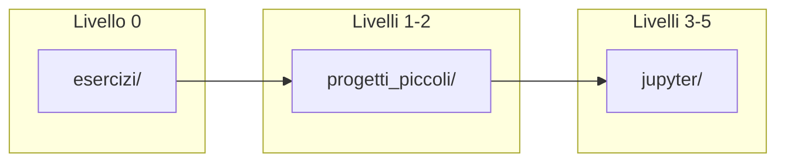

# Lab 2 – VS Code, coding assistito e percorso fino a Jupyter

**Fondamenti di Informatica per Ingegneria Biomedica** – UniMe – A.A. 2025/26 – **Luca D’Agati**

Secondo laboratorio: uso di **Visual Studio Code** (o editor equivalente) con assistente in **modalità agentica** (es. Cursor Agent, GitHub Copilot Chat su più file), e percorso graduale **da script semplici a notebook Jupyter** con dati tabellari.

**Repository del corso:** [github.com/lucadagati/Lab_Fondamenti_di_Informatica_25_26](https://github.com/lucadagati/Lab_Fondamenti_di_Informatica_25_26)

---

## Cosa trovi in questa cartella

| Elemento | Descrizione |
|----------|-------------|
| [`laboratorio_vscode_agentic.md`](laboratorio_vscode_agentic.md) | Guida completa: obiettivi, livelli 0→5, Jupyter, consegna |
| `esercizi/` | Livello 0 – esercizi su singolo file `.py` |
| `progetti_piccoli/` | Livelli 1–2 – micro-progetti e modulo multi-file |
| `jupyter/` | Livelli 3–5 – notebook `.ipynb` |
| `data/` | CSV di esempio per pandas |
| `requirements-jupyter.txt` | Dipendenze opzionali per i notebook (pandas, matplotlib, …) |

---

## Flusso consigliato



Apri in VS Code / Cursor **questa cartella** (`02-vscode-agentic-coding`) come workspace e segui il file [`laboratorio_vscode_agentic.md`](laboratorio_vscode_agentic.md) dall’inizio, oppure il sottoinsieme di livelli assegnato dal docente.

---

## Installazione rapida (solo parte Jupyter)

Dalla root di **questa cartella** (`02-vscode-agentic-coding`):

```bash
python3 -m venv .venv
source .venv/bin/activate
pip install -r requirements-jupyter.txt
```

Su Windows: `.venv\Scripts\activate` al posto di `source .venv/bin/activate`.

In VS Code: estensione **Jupyter** (Microsoft), poi apri i file in `jupyter/`.

---

## Collegamento al Lab 1

Il [Lab 1](../01-crittografia-chiavi/README.md) usa principalmente **OpenSSL** da terminale. Il Lab 2 introduce **Python**, editor con AI e (opzionalmente) **Jupyter**: strumenti diversi, stessa attenzione a **non eseguire comandi** che non capisci e a **verificare** quanto suggerito dagli assistenti automatici.

---

## Per aggiornare il README principale del repository

Nel file `README.md` alla radice del repo [Lab_Fondamenti_di_Informatica_25_26](https://github.com/lucadagati/Lab_Fondamenti_di_Informatica_25_26):

1. Sostituire il placeholder `02-README.md` con la cartella `02-vscode-agentic-coding/` nel diagramma e nell’albero dei file.
2. Nella tabella “Elenco laboratori”, aggiungere la riga del Lab 2 con link a questa guida.
3. Rimuovere o archiviare `02-README.md` se non serve più.

---

*Materiale didattico – Fondamenti di Informatica per Ingegneria Biomedica – Università degli Studi di Messina – A.A. 2025/26 – Docente: Luca D’Agati*
