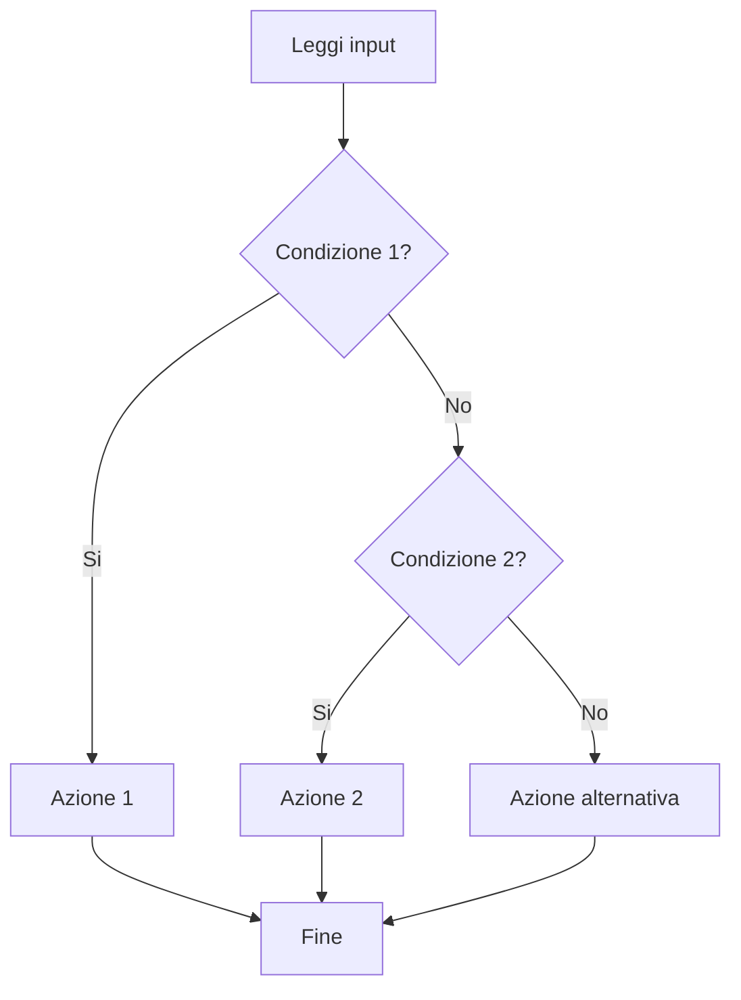
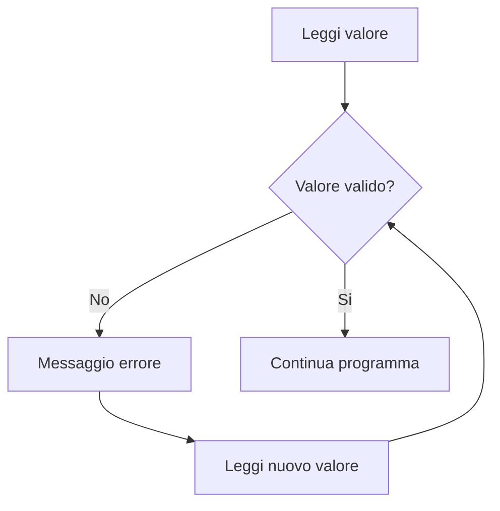
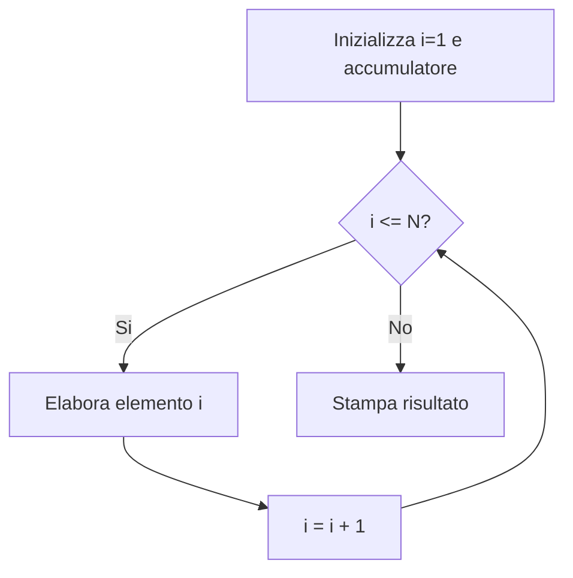
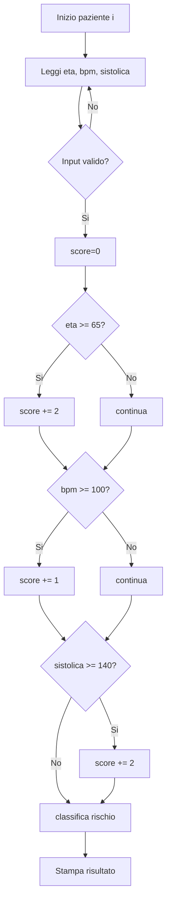

# Lab 3 - MATLAB: strutture di controllo con difficolta progressiva

**Fondamenti di Informatica per Ingegneria Biomedica** - UniMe - A.A. 2025/26 - **Luca D'Agati**

Questo laboratorio e pensato per essere svolto in autonomia dagli studenti, con una progressione:
- esercizio,
- hint graduali,
- confronto con soluzione.

---

## 1) Obiettivi didattici

Alla fine del lab dovresti saper:
1. usare `if / elseif / else` per decisioni condizionali,
2. usare `for` e `while` per iterare su dati e validare input,
3. usare `switch / case` per selezione multipla,
4. combinare strutture (annidamenti) in mini-problemi biomedici.

---

## 2) Setup rapido (MATLAB o Octave)

### MATLAB
1. Installa MATLAB (licenza universitaria o trial).
2. Apri MATLAB.
3. Imposta `Current Folder` su `03-matlab-strutture-controllo`.

### GNU Octave (alternativa)
1. Installa Octave.
2. Apri Octave.
3. Vai nella cartella `03-matlab-strutture-controllo`.

---

## 3) Come eseguire

Dalla Command Window:

```matlab
cd esercizi
es01_bmi_classificazione
```

Per vedere la soluzione corrispondente:

```matlab
cd ../soluzioni
es01_bmi_classificazione_sol
```

---

## 4) Mappa difficolta (progressiva)

| Livello | Esercizi | Focus | Difficolta |
|---|---|---|---|
| Base | 1-3 | `if`, `for`, `while` | Bassa |
| Intermedio | 4-7 | `switch`, annidamenti, pattern numerici | Media |
| Avanzato | 8-10 | combinazioni di controlli su dati biomedici | Medio-alta |

---

## 5) Diagrammi di flusso (Mermaid)

### 5.1 Struttura condizionale (`if / elseif / else`)



### 5.2 Ciclo di validazione (`while`)



### 5.3 Ciclo su vettore (`for`)



---

## 6) Esercizi guidati (testo + hint + soluzione)

## Esercizio 1 - Classificazione BMI (`if/elseif/else`)
- **File:** `esercizi/es01_bmi_classificazione.m`
- **Richiesta:** calcola BMI e stampa categoria.
- **Hint 1:** leggi `peso` e `altezza` con `input`.
- **Hint 2:** `bmi = peso / (altezza^2)`.
- **Hint 3:** soglie in ordine: 18.5, 25, 30.
- **Soluzione:** `soluzioni/es01_bmi_classificazione_sol.m`

## Esercizio 2 - Media e massimo BPM (`for`)
- **File:** `esercizi/es02_media_bpm_for.m`
- **Richiesta:** su un vettore BPM, calcola media e massimo.
- **Hint 1:** usa `somma = 0`, `massimo = -inf`.
- **Hint 2:** `for i = 1:length(bpm)`.
- **Hint 3:** aggiorna massimo con un `if`.
- **Soluzione:** `soluzioni/es02_media_bpm_for_sol.m`

## Esercizio 3 - Validazione SpO2 (`while`)
- **File:** `esercizi/es03_input_valido_while.m`
- **Richiesta:** accetta input solo tra 0 e 100.
- **Hint 1:** leggi valore iniziale prima del `while`.
- **Hint 2:** condizione: `spo2 < 0 || spo2 > 100`.
- **Hint 3:** nel ciclo, richiedi nuovo valore.
- **Soluzione:** `soluzioni/es03_input_valido_while_sol.m`

## Esercizio 4 - Priorita triage (`switch`)
- **File:** `esercizi/es04_priorita_switch.m`
- **Richiesta:** mappa codici 1/2/3 in Alta/Media/Bassa.
- **Hint 1:** usa `switch codice`.
- **Hint 2:** aggiungi sempre `otherwise`.
- **Soluzione:** `soluzioni/es04_priorita_switch_sol.m`

## Esercizio 5 - Conteggio ipertensione (for annidati)
- **File:** `esercizi/es05_conta_ipertensione.m`
- **Richiesta:** conta valori sistolici `>= 140` in una matrice.
- **Hint 1:** doppio ciclo su righe/colonne.
- **Hint 2:** incrementa contatore con `if`.
- **Soluzione:** `soluzioni/es05_conta_ipertensione_sol.m`

## Esercizio 6 - Istogramma categorie BMI (for + if)
- **File:** `esercizi/es06_istogramma_bmi.m`
- **Richiesta:** dato un vettore di BMI, conta quanti pazienti per categoria.
- **Hint 1:** quattro contatori separati.
- **Hint 2:** usa `if/elseif/else` in un ciclo `for`.
- **Soluzione:** `soluzioni/es06_istogramma_bmi_sol.m`

## Esercizio 7 - Giorno stabile FC (while + condizione composta)
- **File:** `esercizi/es07_stabilita_fc.m`
- **Richiesta:** trova il primo indice dove 3 valori consecutivi di FC sono tra 60 e 100.
- **Hint 1:** usa `while i <= length(fc)-2`.
- **Hint 2:** condizione composta su `fc(i)`, `fc(i+1)`, `fc(i+2)`.
- **Soluzione:** `soluzioni/es07_stabilita_fc_sol.m`

## Esercizio 8 - Alert pressione per paziente (for annidato + switch)
- **File:** `esercizi/es08_alert_pressione.m`
- **Richiesta:** per ogni paziente calcola quante misure fuori range e stampa livello alert.
- **Hint 1:** prima conta le anomalie per paziente.
- **Hint 2:** converti conteggio in livello (0,1,>=2) con `switch true` o `if`.
- **Soluzione:** `soluzioni/es08_alert_pressione_sol.m`

## Esercizio 9 - Rilevazione picchi ECG semplificata (for)
- **File:** `esercizi/es09_picchi_ecg.m`
- **Richiesta:** conta picchi locali in un segnale (valore maggiore dei vicini e sopra soglia).
- **Hint 1:** scorri da `2` a `length(x)-1`.
- **Hint 2:** condizione: `x(i)>x(i-1) && x(i)>x(i+1) && x(i)>soglia`.
- **Soluzione:** `soluzioni/es09_picchi_ecg_sol.m`

## Esercizio 10 - Mini score rischio combinato (if + for + while)
- **File:** `esercizi/es10_score_rischio_combinato.m`
- **Richiesta:** valida input per n pazienti, calcola score e stampa classe rischio per ciascuno.
- **Hint 1:** usa `while` per validare età non negativa.
- **Hint 2:** score con regole incrementali (`if` multipli).
- **Hint 3:** ciclo `for` su pazienti.
- **Soluzione:** `soluzioni/es10_score_rischio_combinato_sol.m`

---

## 7) Diagramma flusso esempio (Esercizio 10)



---

## 8) Consegna studenti

Consegna:
1. file completati in `esercizi/`,
2. output (screenshot o testo) di almeno 6 esercizi, includendo almeno 2 tra 8-10,
3. breve riflessione (8-10 righe): differenza pratica tra `for` e `while` in questo lab.

---

## 9) Supporto AI (facoltativo)

Prompt consigliato:

```text
Completa il file MATLAB corrente rispettando i TODO.
Vincoli:
- usa solo le strutture richieste dall'esercizio
- non cambiare nomi variabili gia presenti
- non usare toolbox esterni
Alla fine indica:
1) come eseguire il file
2) un input di test
3) output atteso
```

