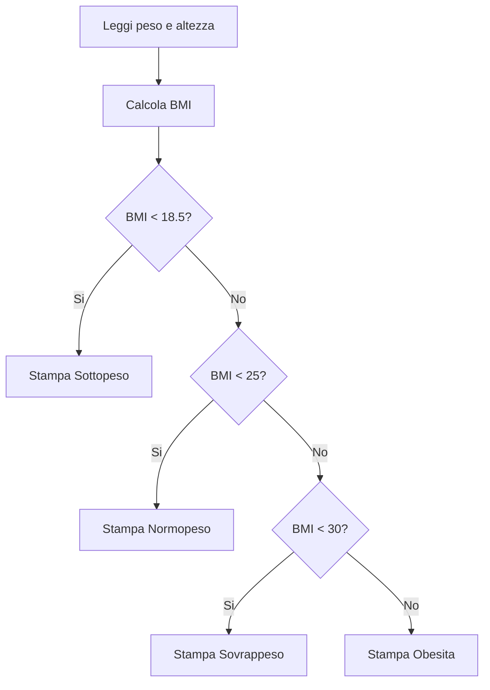
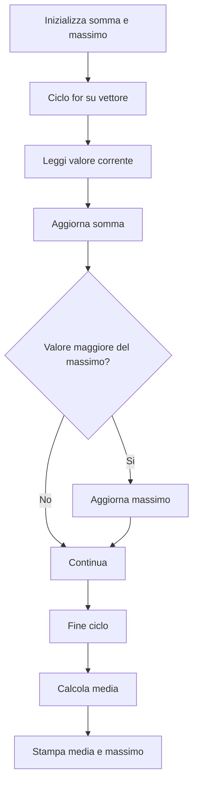
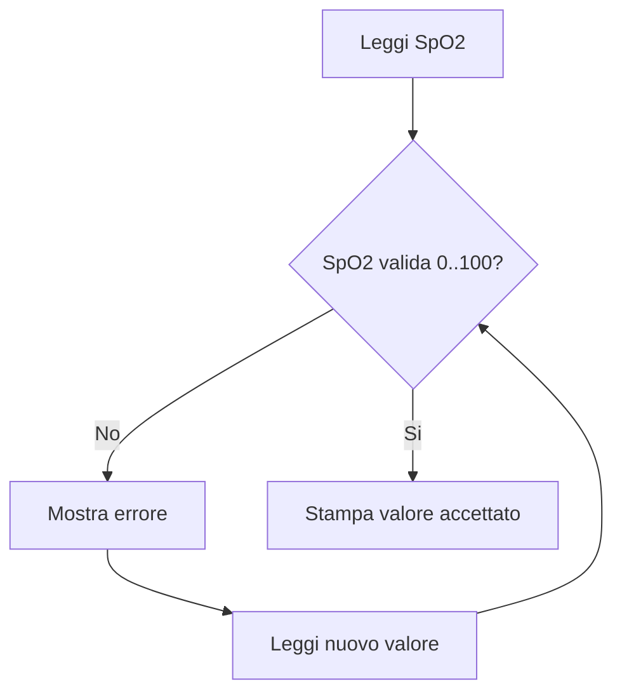
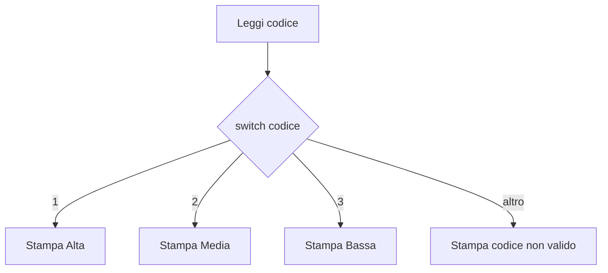
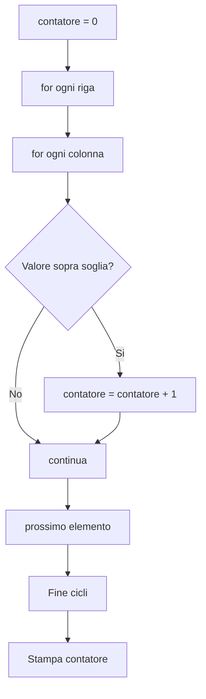
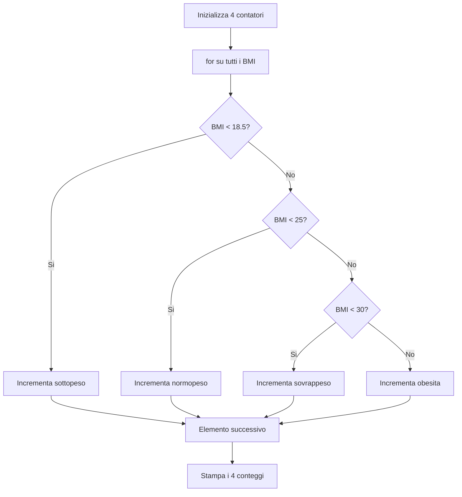
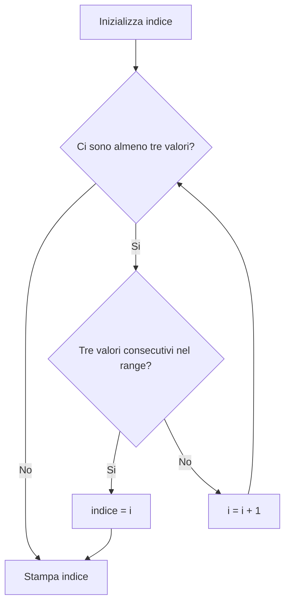
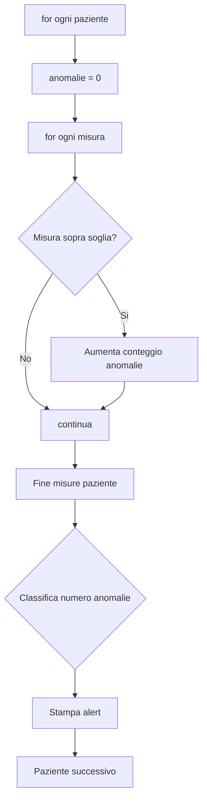
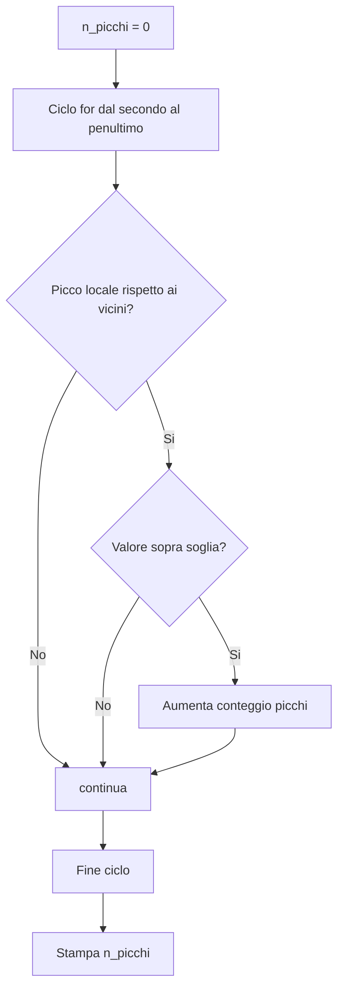
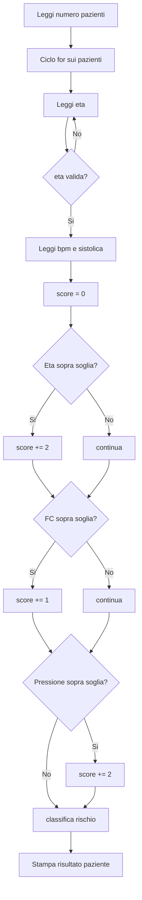

# Lab 3 - MATLAB: strutture di controllo

**Fondamenti di Informatica per Ingegneria Biomedica** - UniMe - A.A. 2025/26

Questo laboratorio e pronto per gli studenti: ogni esercizio include:
- consegna,
- hint,
- diagramma di flusso (Mermaid),
- file soluzione.

---

## 1) Setup MATLAB

1. Installa MATLAB (licenza universitaria o trial).
2. Apri MATLAB.
3. Imposta `Current Folder` su `03-matlab-strutture-controllo`.

---

## 2) Come eseguire i file

Esempio (esercizio 1):

```matlab
cd esercizi
es01_bmi_classificazione
```

Per vedere la soluzione:

```matlab
cd ../soluzioni
es01_bmi_classificazione_sol
```

---

## 3) Struttura cartelle

- `esercizi/` -> file con `TODO`
- `soluzioni/` -> soluzioni complete

---

## 4) Esercizi

## Esercizio 1 - Classificazione BMI (`if/elseif/else`)

- **File:** `esercizi/es01_bmi_classificazione.m`
- **Consegna:** leggere peso/altezza, calcolare BMI e stampare categoria.
- **Hint:** soglie in ordine (`18.5`, `25`, `30`) con `if/elseif/else`.
- **Soluzione:** `soluzioni/es01_bmi_classificazione_sol.m`



---

## Esercizio 2 - Media e massimo BPM (`for`)

- **File:** `esercizi/es02_media_bpm_for.m`
- **Consegna:** su un vettore BPM, calcolare media e massimo.
- **Hint:** usa `somma`, `massimo`, ciclo `for`.
- **Soluzione:** `soluzioni/es02_media_bpm_for_sol.m`



---

## Esercizio 3 - Validazione SpO2 (`while`)

- **File:** `esercizi/es03_input_valido_while.m`
- **Consegna:** accettare input solo tra `0` e `100`.
- **Hint:** `while spo2 < 0 || spo2 > 100`.
- **Soluzione:** `soluzioni/es03_input_valido_while_sol.m`



---

## Esercizio 4 - Codice priorita (`switch`)

- **File:** `esercizi/es04_priorita_switch.m`
- **Consegna:** mappare `1/2/3` in `Alta/Media/Bassa`.
- **Hint:** usa `switch` e `otherwise`.
- **Soluzione:** `soluzioni/es04_priorita_switch_sol.m`



---

## Esercizio 5 - Conteggio ipertensione (for annidati)

- **File:** `esercizi/es05_conta_ipertensione.m`
- **Consegna:** in una matrice, contare i valori `>= 140`.
- **Hint:** due cicli `for` e contatore.
- **Soluzione:** `soluzioni/es05_conta_ipertensione_sol.m`



---

## Esercizio 6 - Istogramma categorie BMI

- **File:** `esercizi/es06_istogramma_bmi.m`
- **Consegna:** contare quanti BMI in ogni categoria.
- **Hint:** 4 contatori e `if/elseif/else` nel `for`.
- **Soluzione:** `soluzioni/es06_istogramma_bmi_sol.m`



---

## Esercizio 7 - Primo tratto stabile FC

- **File:** `esercizi/es07_stabilita_fc.m`
- **Consegna:** trovare il primo indice con 3 valori consecutivi in range `60..100`.
- **Hint:** `while` con indice e `break` quando trovi la prima tripla valida.
- **Soluzione:** `soluzioni/es07_stabilita_fc_sol.m`



---

## Esercizio 8 - Alert pressione per paziente

- **File:** `esercizi/es08_alert_pressione.m`
- **Consegna:** per ogni paziente contare le misure `>= 140` e stampare livello alert.
- **Hint:** annida due `for`; poi mappa anomalie in `Basso/Medio/Alto`.
- **Soluzione:** `soluzioni/es08_alert_pressione_sol.m`



---

## Esercizio 9 - Picchi ECG semplificati

- **File:** `esercizi/es09_picchi_ecg.m`
- **Consegna:** contare picchi locali sopra soglia.
- **Hint:** ciclo da `2` a `N-1`; confronta con vicini.
- **Soluzione:** `soluzioni/es09_picchi_ecg_sol.m`



---

## Esercizio 10 - Score rischio combinato

- **File:** `esercizi/es10_score_rischio_combinato.m`
- **Consegna:** per `n` pazienti, validare input, calcolare score e classe rischio.
- **Hint:** `while` per età valida, `if` per score incrementale, `for` sui pazienti.
- **Soluzione:** `soluzioni/es10_score_rischio_combinato_sol.m`



---

## 5) Consegna studenti

Consegna:
1. file completati in `esercizi/`,
2. output (screenshot o testo) di almeno 6 esercizi,
3. breve riflessione (8-10 righe): differenza pratica tra `for` e `while`.

