# Lab 4 - Programmazione Python con Jupyter e script

Laboratorio orientato a:
- strutture di controllo (`if`, `for`, `while`)
- stringhe
- liste
- tuple
- dizionari
- funzioni

Ogni esercizio e disponibile in doppio formato:
- notebook in `jupyter/`
- script in `esercizi/`

Sono presenti anche le soluzioni:
- `jupyter_soluzioni/`
- `soluzioni/`

---

## 1) Setup ambiente

```bash
cd 02-vscode-agentic-coding
python3 -m venv .venv
source .venv/bin/activate
pip install -r requirements-jupyter.txt
cd ../04-python-jupyter-analisi-biomedica
```

Su Windows: `.venv\\Scripts\\activate`.

---

## 2) Esecuzione

Notebook:

```bash
jupyter lab
```

Script esempio:

```bash
python3 esercizi/es01_filtra_rischio.py
```

---

## 3) Mappa esercizi (notebook + script + soluzione)

| Esercizio | Notebook | Script | Soluzione notebook | Soluzione script |
|---|---|---|---|---|
| 1 | `jupyter/es01_filtra_rischio.ipynb` | `esercizi/es01_filtra_rischio.py` | `jupyter_soluzioni/es01_filtra_rischio_sol.ipynb` | `soluzioni/es01_filtra_rischio_sol.py` |
| 2 | `jupyter/es02_score_clinico.ipynb` | `esercizi/es02_score_clinico.py` | `jupyter_soluzioni/es02_score_clinico_sol.ipynb` | `soluzioni/es02_score_clinico_sol.py` |
| 3 | `jupyter/es03_medie_parametri.ipynb` | `esercizi/es03_media_parametri.py` | `jupyter_soluzioni/es03_medie_parametri_sol.ipynb` | `soluzioni/es03_media_parametri_sol.py` |
| 4 | `jupyter/es04_conta_ipertesi.ipynb` | `esercizi/es04_conta_ipertesi.py` | `jupyter_soluzioni/es04_conta_ipertesi_sol.ipynb` | `soluzioni/es04_conta_ipertesi_sol.py` |
| 5 | `jupyter/es05_top3_score.ipynb` | `esercizi/es05_ordinamento_score.py` | `jupyter_soluzioni/es05_top3_score_sol.ipynb` | `soluzioni/es05_ordinamento_score_sol.py` |
| 6 | `jupyter/es06_febbre_ipossia.ipynb` | `esercizi/es06_flag_febbre_ipossia.py` | `jupyter_soluzioni/es06_febbre_ipossia_sol.ipynb` | `soluzioni/es06_flag_febbre_ipossia_sol.py` |
| 7 | `jupyter/es07_fascia_eta.ipynb` | `esercizi/es07_filtra_eta_range.py` | `jupyter_soluzioni/es07_fascia_eta_sol.ipynb` | `soluzioni/es07_filtra_eta_range_sol.py` |
| 8 | `jupyter/es08_classi_pressione.ipynb` | `esercizi/es08_classifica_pressione.py` | `jupyter_soluzioni/es08_classi_pressione_sol.ipynb` | `soluzioni/es08_classifica_pressione_sol.py` |
| 9 | `jupyter/es09_menu_interattivo.ipynb` | `esercizi/es09_controllo_input_menu.py` | `jupyter_soluzioni/es09_menu_interattivo_sol.ipynb` | `soluzioni/es09_controllo_input_menu_sol.py` |
| 10 | `jupyter/es10_report_finale.ipynb` | `esercizi/es10_report_finale.py` | `jupyter_soluzioni/es10_report_finale_sol.ipynb` | `soluzioni/es10_report_finale_sol.py` |

---

## 4) Esercizi e diagrammi di flusso

Ogni esercizio ha due diagrammi:
- **Jupyter**: flusso tipico in celle
- **Python script**: flusso tipico in `main()`/funzioni

## Esercizio 1 - Classifica voto
**Jupyter**
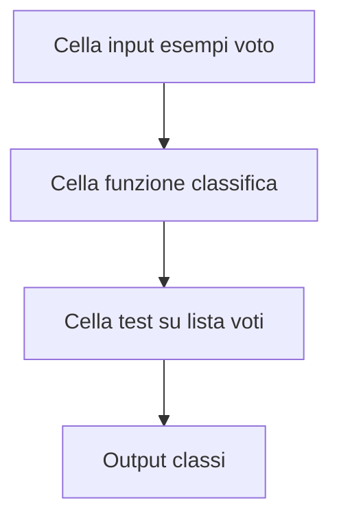
**Python script**
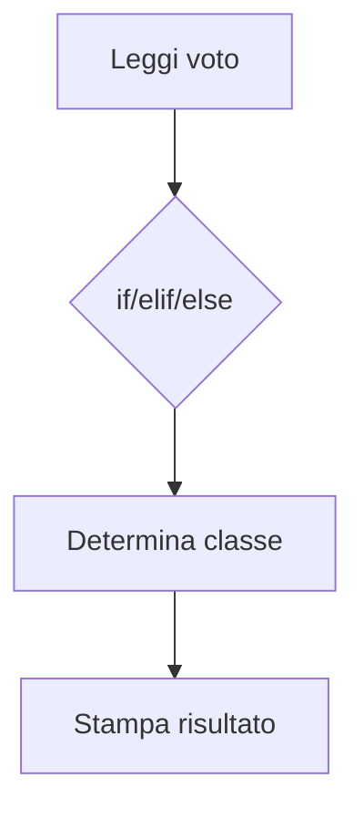

## Esercizio 2 - Somma, media, massimo
**Jupyter**
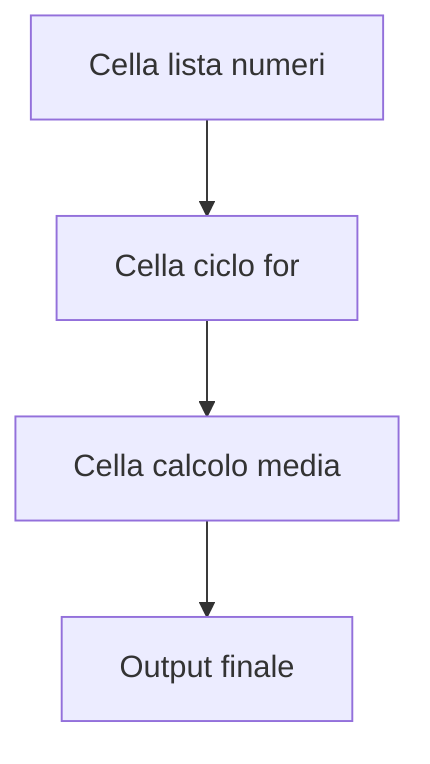
**Python script**
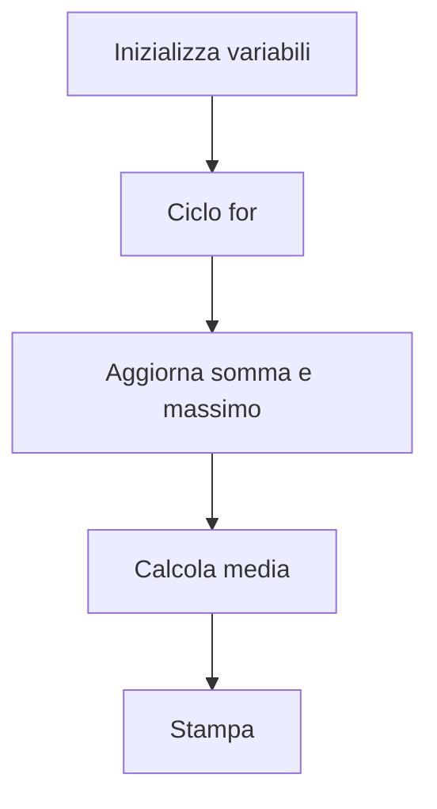

## Esercizio 3 - While e validazione
**Jupyter**
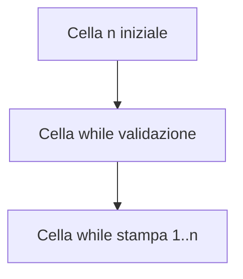
**Python script**
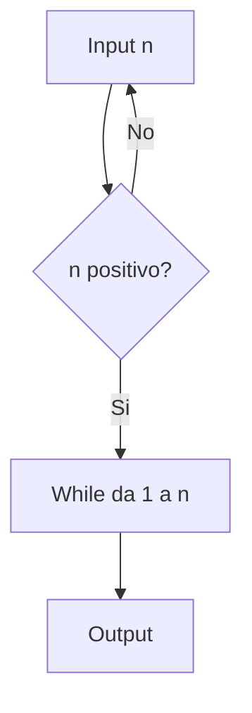

## Esercizio 4 - Stringhe e vocali
**Jupyter**
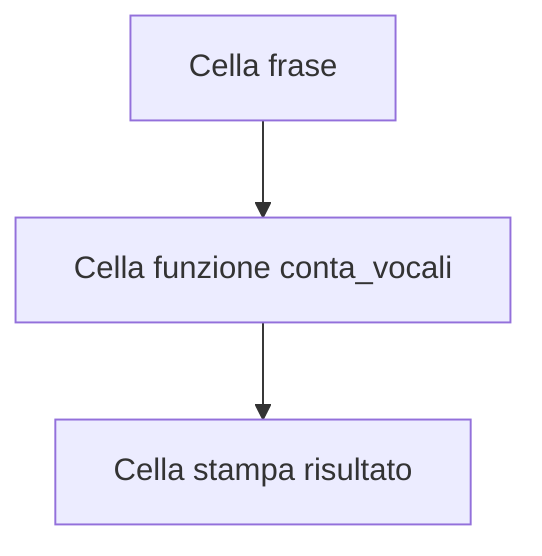
**Python script**
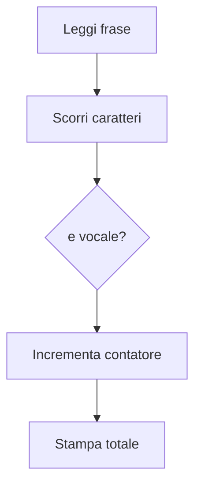

## Esercizio 5 - Tuple e ordinamento
**Jupyter**
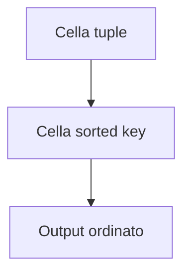
**Python script**
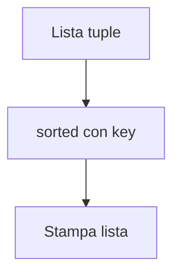

## Esercizio 6 - Dizionari frequenze
**Jupyter**
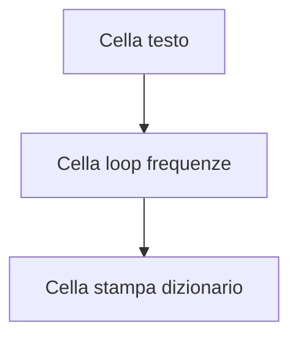
**Python script**
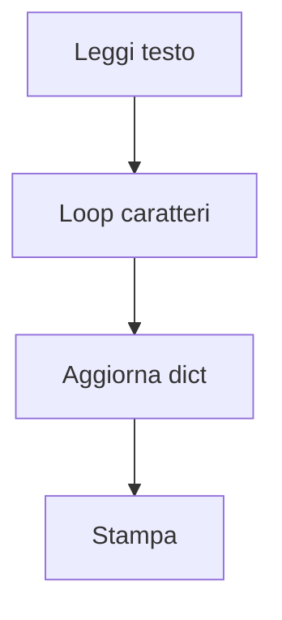

## Esercizio 7 - List comprehension
**Jupyter**
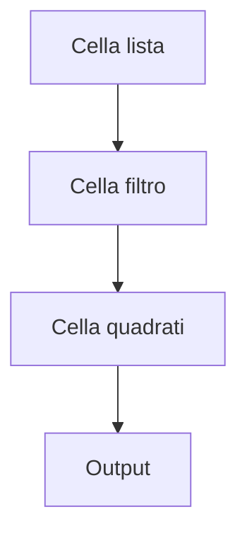
**Python script**
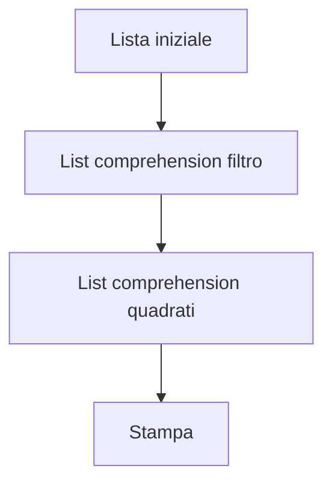

## Esercizio 8 - Funzione con tuple return
**Jupyter**
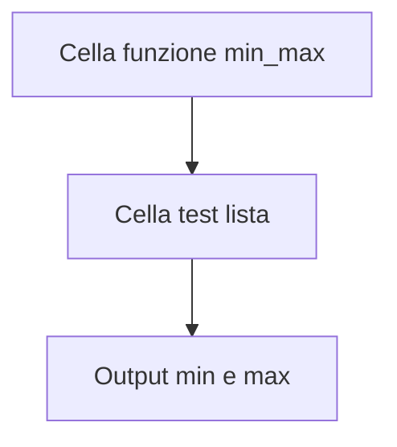
**Python script**
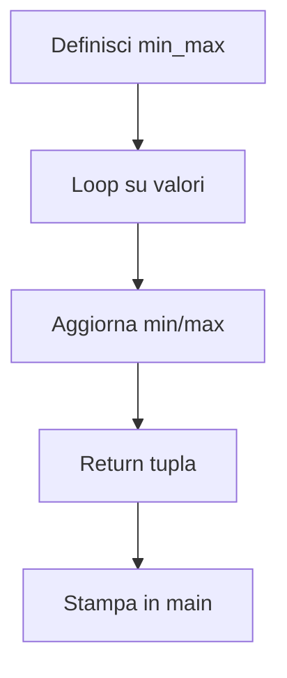

## Esercizio 9 - Menu while
**Jupyter**
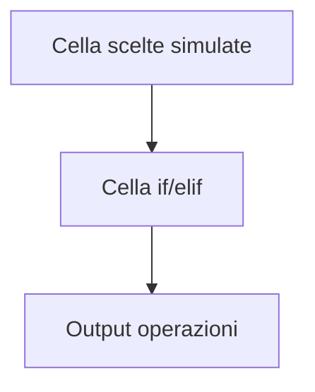
**Python script**
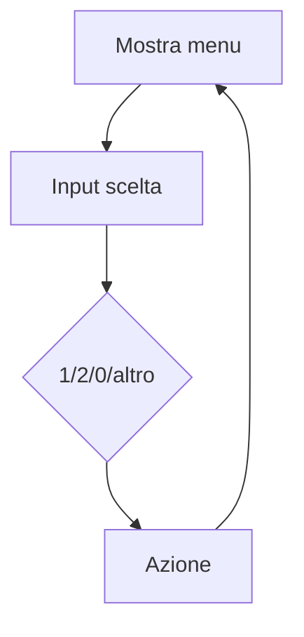

## Esercizio 10 - Analisi parole
**Jupyter**
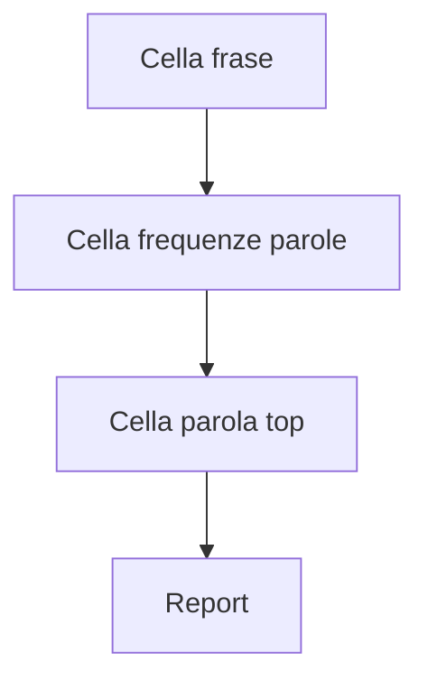
**Python script**
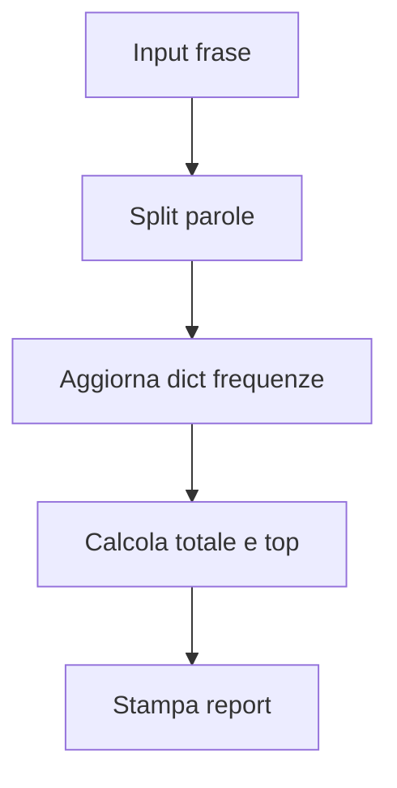

---

## 5) Dataset

`data/vitali_pazienti.csv` e presente per continuita con i laboratori precedenti.

