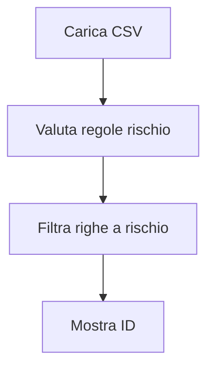
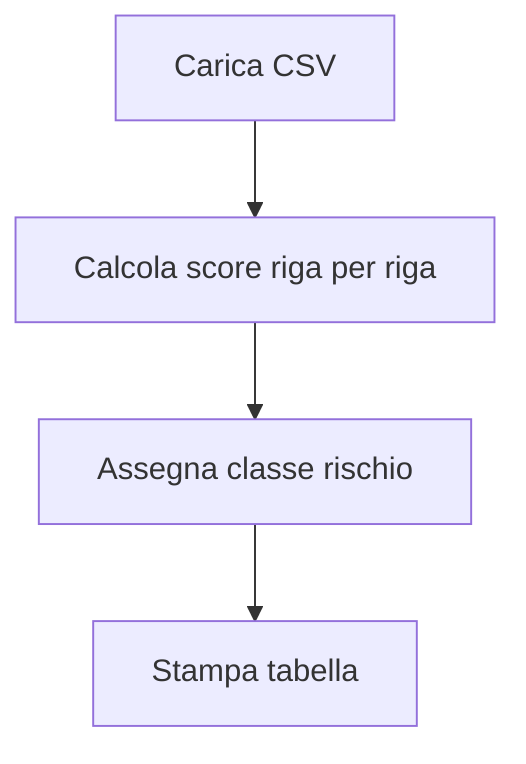
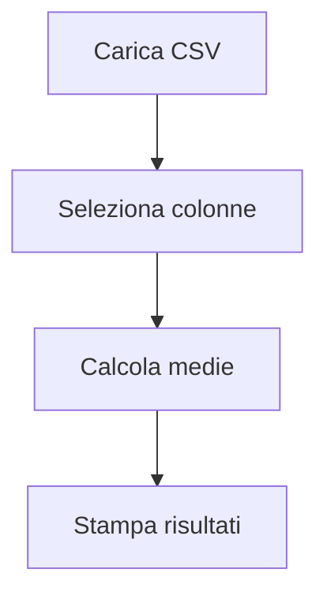
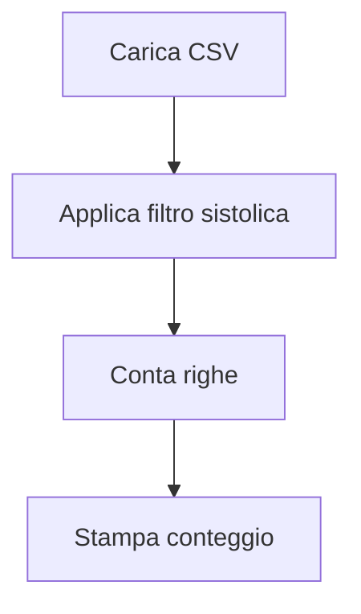
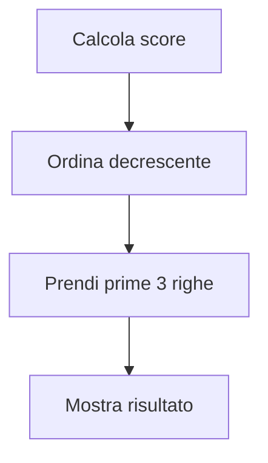
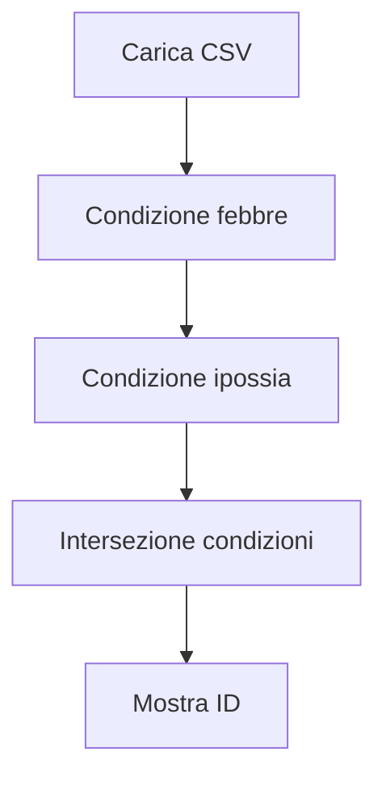
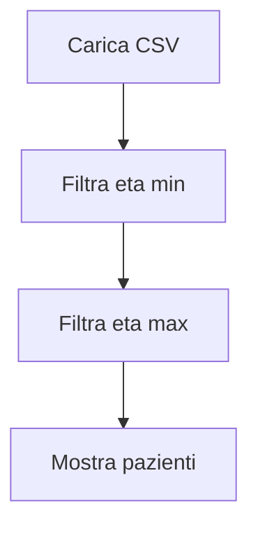
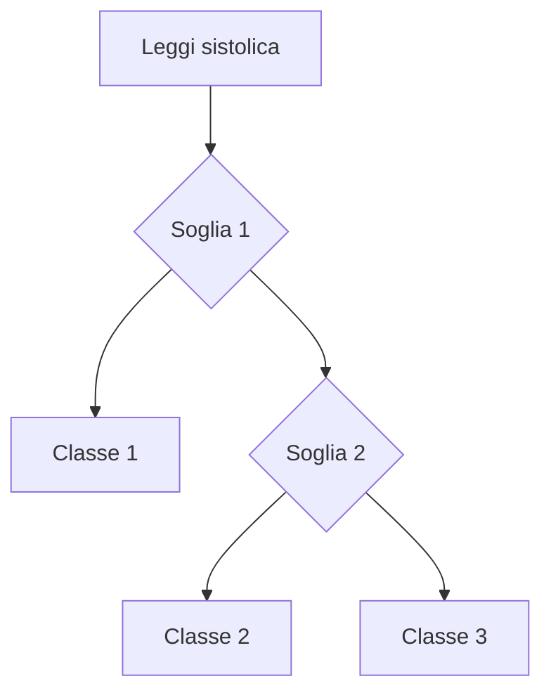
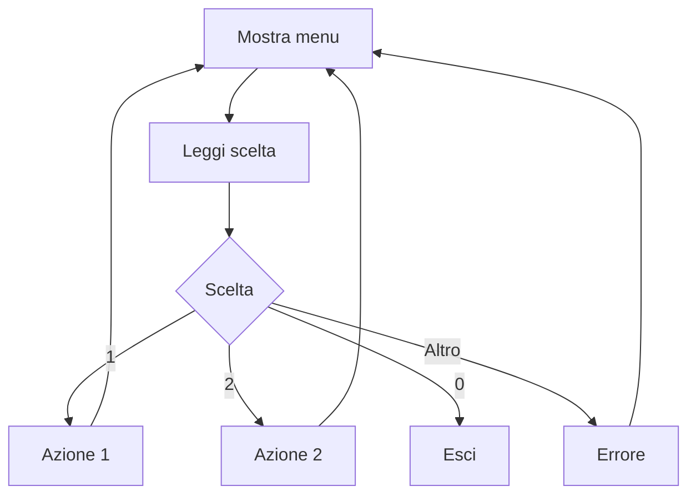
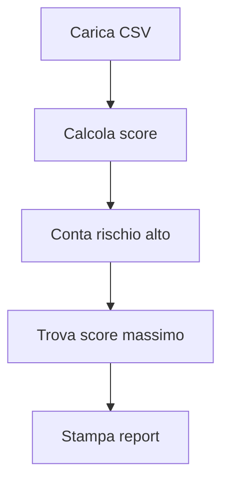

# Lab 4 - Python in Jupyter (ambiente del Lab 2)

Questo laboratorio e **interamente basato su Jupyter** e riusa l'ambiente del Lab 2.

Contiene 10 esercizi, ciascuno in un notebook dedicato.

---

## 1) Setup (stesso ambiente del Lab 2)

```bash
cd 02-vscode-agentic-coding
python3 -m venv .venv
source .venv/bin/activate
pip install -r requirements-jupyter.txt
cd ../04-python-jupyter-analisi-biomedica
```

Su Windows: `.venv\\Scripts\\activate`.

---

## 2) Avvio Jupyter

```bash
jupyter lab
```

Apri la cartella `jupyter/` e completa i notebook `es01` ... `es10`.

Le soluzioni complete in formato notebook sono in `jupyter_soluzioni/`.

---

## 3) Dataset

- `data/vitali_pazienti.csv`

Campi principali:
- `eta`, `bpm`, `spo2`, `sistolica`, `diastolica`, `temperatura`

---

## 4) Esercizi Jupyter

## Esercizio 1 - Filtro pazienti a rischio
- **Notebook:** `jupyter/es01_filtra_rischio.ipynb`
- **Consegna:** identificare pazienti a rischio.
- **Hint:** crea `flag_rischio` con condizione OR.



## Esercizio 2 - Score clinico
- **Notebook:** `jupyter/es02_score_clinico.ipynb`
- **Consegna:** calcolare score per ogni paziente.
- **Hint:** somma punti per ogni regola clinica.



## Esercizio 3 - Medie dei parametri vitali
- **Notebook:** `jupyter/es03_medie_parametri.ipynb`
- **Consegna:** calcolare medie di bpm, spo2, sistolica.
- **Hint:** usa media di colonna (`mean`).



## Esercizio 4 - Conteggio ipertesi
- **Notebook:** `jupyter/es04_conta_ipertesi.ipynb`
- **Consegna:** contare pazienti con sistolica alta.
- **Hint:** filtro booleano su soglia.



## Esercizio 5 - Top 3 score rischio
- **Notebook:** `jupyter/es05_top3_score.ipynb`
- **Consegna:** ordinare pazienti per score e mostrare top 3.
- **Hint:** `sort_values` su colonna score.



## Esercizio 6 - Febbre + ipossia
- **Notebook:** `jupyter/es06_febbre_ipossia.ipynb`
- **Consegna:** trovare pazienti con febbre e spo2 bassa.
- **Hint:** usa condizione con AND.



## Esercizio 7 - Fascia eta 50-75
- **Notebook:** `jupyter/es07_fascia_eta.ipynb`
- **Consegna:** filtrare pazienti con eta nel range richiesto.
- **Hint:** confronto doppio su colonna eta.



## Esercizio 8 - Classificazione pressione
- **Notebook:** `jupyter/es08_classi_pressione.ipynb`
- **Consegna:** assegnare classe pressione a ogni paziente.
- **Hint:** funzione di mapping su `sistolica`.



## Esercizio 9 - Menu interattivo notebook
- **Notebook:** `jupyter/es09_menu_interattivo.ipynb`
- **Consegna:** creare mini menu con input utente.
- **Hint:** ciclo `while` con scelta `1/2/0`.



## Esercizio 10 - Report clinico finale
- **Notebook:** `jupyter/es10_report_finale.ipynb`
- **Consegna:** report con totale, rischio alto e paziente con score massimo.
- **Hint:** combina aggregazioni + ordinamento.



---

## 5) Notebook soluzioni

- `jupyter_soluzioni/es01_filtra_rischio_sol.ipynb`
- `jupyter_soluzioni/es02_score_clinico_sol.ipynb`
- `jupyter_soluzioni/es03_medie_parametri_sol.ipynb`
- `jupyter_soluzioni/es04_conta_ipertesi_sol.ipynb`
- `jupyter_soluzioni/es05_top3_score_sol.ipynb`
- `jupyter_soluzioni/es06_febbre_ipossia_sol.ipynb`
- `jupyter_soluzioni/es07_fascia_eta_sol.ipynb`
- `jupyter_soluzioni/es08_classi_pressione_sol.ipynb`
- `jupyter_soluzioni/es09_menu_interattivo_sol.ipynb`
- `jupyter_soluzioni/es10_report_finale_sol.ipynb`

