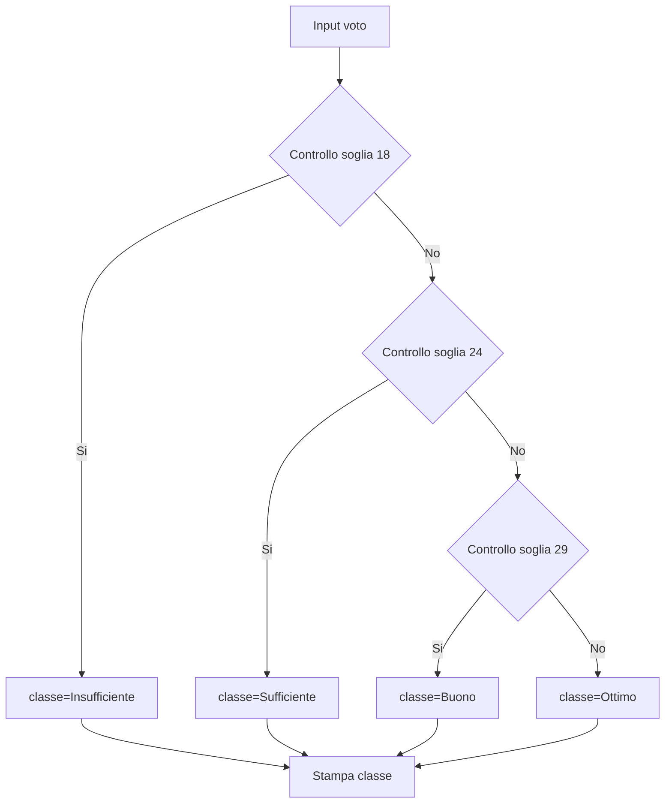
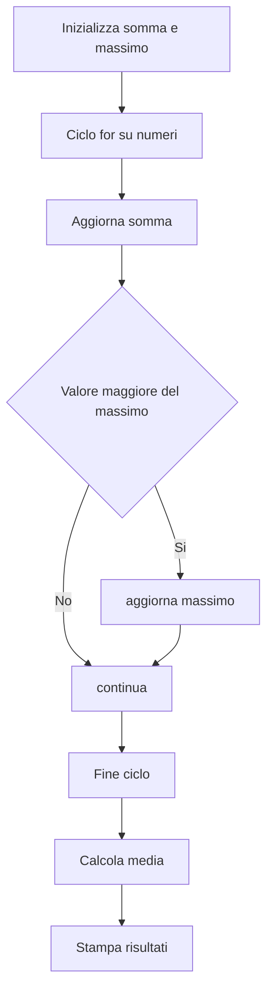
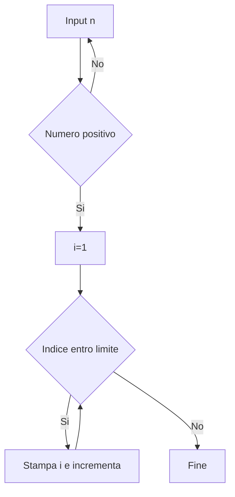
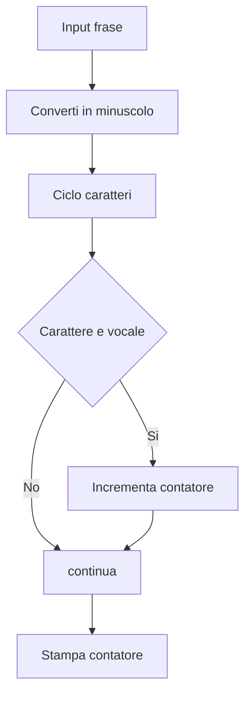
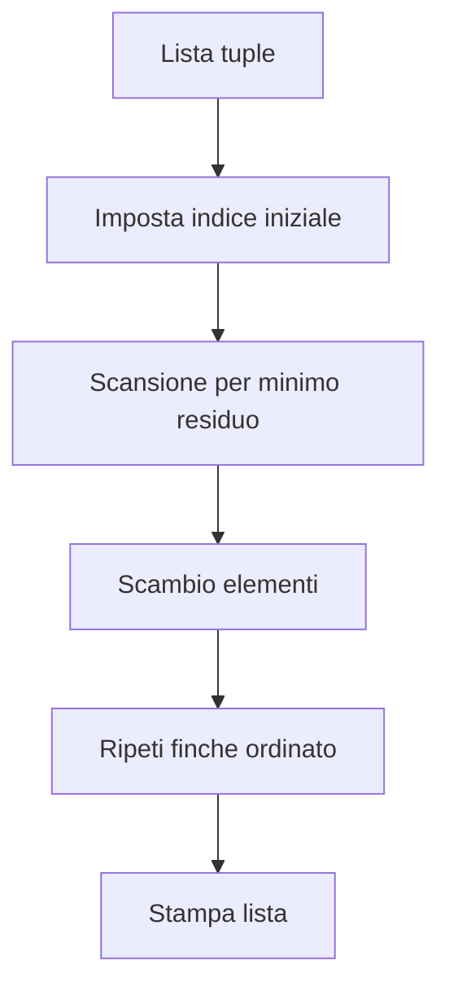
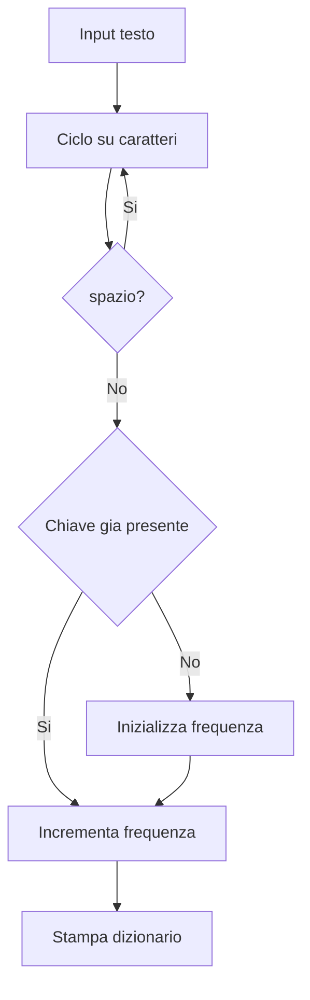
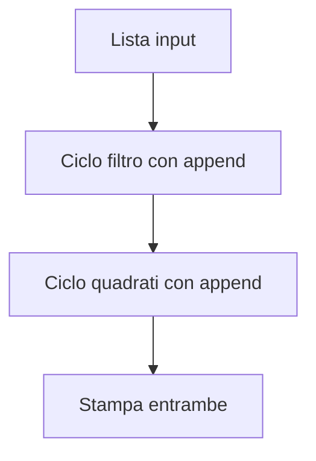
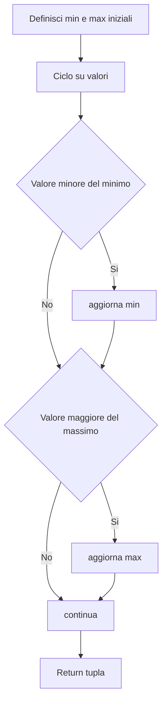
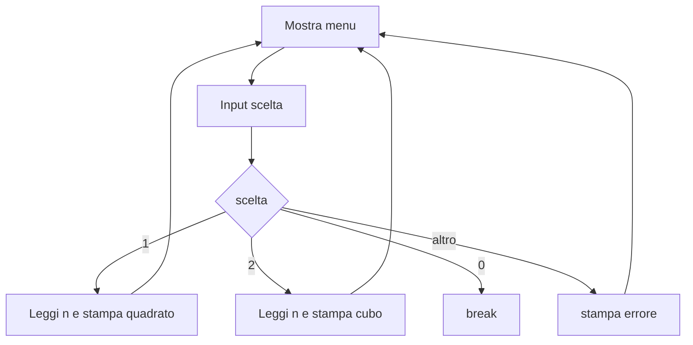
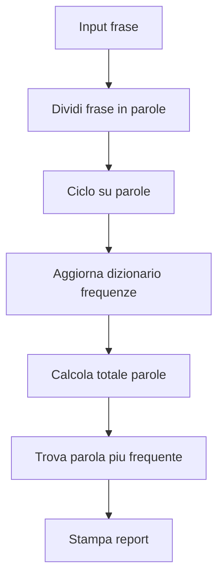

# Lab 4 - Programmazione Python con Jupyter e script

Laboratorio orientato a:
- strutture di controllo (`if`, `for`, `while`)
- stringhe
- liste
- tuple
- dizionari
- funzioni

Ogni esercizio e disponibile in doppio formato:
- notebook in `jupyter/`
- script in `esercizi/`

Sono presenti anche le soluzioni:
- `jupyter_soluzioni/`
- `soluzioni/`

---

## 1) Setup ambiente

```bash
cd 02-vscode-agentic-coding
python3 -m venv .venv
source .venv/bin/activate
pip install -r requirements-jupyter.txt
cd ../04-python-jupyter-analisi-biomedica
```

Su Windows: `.venv\\Scripts\\activate`.

---

## 2) Esecuzione

Notebook:

```bash
jupyter lab
```

Script esempio:

```bash
python3 esercizi/es01_filtra_rischio.py
```

---

## 3) Mappa esercizi (notebook + script + soluzione)

| Esercizio | Notebook | Script | Soluzione notebook | Soluzione script |
|---|---|---|---|---|
| 1 | `jupyter/es01_filtra_rischio.ipynb` | `esercizi/es01_filtra_rischio.py` | `jupyter_soluzioni/es01_filtra_rischio_sol.ipynb` | `soluzioni/es01_filtra_rischio_sol.py` |
| 2 | `jupyter/es02_score_clinico.ipynb` | `esercizi/es02_score_clinico.py` | `jupyter_soluzioni/es02_score_clinico_sol.ipynb` | `soluzioni/es02_score_clinico_sol.py` |
| 3 | `jupyter/es03_medie_parametri.ipynb` | `esercizi/es03_media_parametri.py` | `jupyter_soluzioni/es03_medie_parametri_sol.ipynb` | `soluzioni/es03_media_parametri_sol.py` |
| 4 | `jupyter/es04_conta_ipertesi.ipynb` | `esercizi/es04_conta_ipertesi.py` | `jupyter_soluzioni/es04_conta_ipertesi_sol.ipynb` | `soluzioni/es04_conta_ipertesi_sol.py` |
| 5 | `jupyter/es05_top3_score.ipynb` | `esercizi/es05_ordinamento_score.py` | `jupyter_soluzioni/es05_top3_score_sol.ipynb` | `soluzioni/es05_ordinamento_score_sol.py` |
| 6 | `jupyter/es06_febbre_ipossia.ipynb` | `esercizi/es06_flag_febbre_ipossia.py` | `jupyter_soluzioni/es06_febbre_ipossia_sol.ipynb` | `soluzioni/es06_flag_febbre_ipossia_sol.py` |
| 7 | `jupyter/es07_fascia_eta.ipynb` | `esercizi/es07_filtra_eta_range.py` | `jupyter_soluzioni/es07_fascia_eta_sol.ipynb` | `soluzioni/es07_filtra_eta_range_sol.py` |
| 8 | `jupyter/es08_classi_pressione.ipynb` | `esercizi/es08_classifica_pressione.py` | `jupyter_soluzioni/es08_classi_pressione_sol.ipynb` | `soluzioni/es08_classifica_pressione_sol.py` |
| 9 | `jupyter/es09_menu_interattivo.ipynb` | `esercizi/es09_controllo_input_menu.py` | `jupyter_soluzioni/es09_menu_interattivo_sol.ipynb` | `soluzioni/es09_controllo_input_menu_sol.py` |
| 10 | `jupyter/es10_report_finale.ipynb` | `esercizi/es10_report_finale.py` | `jupyter_soluzioni/es10_report_finale_sol.ipynb` | `soluzioni/es10_report_finale_sol.py` |

---

## 4) Esercizi e diagrammi di flusso

Per ogni esercizio trovi:
- testo consegna,
- hint di implementazione,
- diagramma di flusso dell'algoritmo.

## Esercizio 1 - Classifica voto
**Consegna:** dato un voto intero, stampa `Insufficiente`, `Sufficiente`, `Buono` o `Ottimo` in base agli intervalli.  
**Hint:** usa `if/elif/else` in ordine crescente di soglia.


## Esercizio 2 - Somma, media, massimo
**Consegna:** su una lista di numeri, calcola somma, media e massimo senza funzioni pronte per il massimo.  
**Hint:** inizializza `somma` e `massimo`, poi aggiorna nel `for`.


## Esercizio 3 - While e validazione
**Consegna:** chiedi un intero positivo; finché non è valido, richiedi input. Poi stampa da 1 a `n` con `while`.  
**Hint:** usa due `while`: uno per validare, uno per stampare.


## Esercizio 4 - Stringhe e vocali
**Consegna:** conta quante vocali contiene una frase (case-insensitive).  
**Hint:** converti in minuscolo e scorri i caratteri.


## Esercizio 5 - Tuple e ordinamento
**Consegna:** ordina una lista di tuple `(nome, punteggio)` per punteggio crescente.  
**Hint:** usa un ordinamento esplicito confrontando il secondo elemento delle tuple.


## Esercizio 6 - Dizionari frequenze
**Consegna:** dato un testo, costruisci dizionario `carattere -> frequenza` ignorando spazi.  
**Hint:** inizializza chiave a 0 quando non esiste.


## Esercizio 7 - Filtri su lista con ciclo
**Consegna:** da una lista numerica, crea lista filtrata (`>=10`) e lista dei quadrati dei filtrati.  
**Hint:** usa cicli `for` e `append`.


## Esercizio 8 - Funzione con tuple return
**Consegna:** implementa `min_max(lista)` che restituisce una tupla `(minimo, massimo)`.  
**Hint:** aggiorna min/max durante il ciclo.


## Esercizio 9 - Menu while
**Consegna:** crea menu con scelte `1 quadrato`, `2 cubo`, `0 esci`, gestione input non validi.  
**Hint:** loop infinito con `break` su uscita.


## Esercizio 10 - Analisi parole
**Consegna:** conta frequenze parole in una frase, poi stampa totale parole e parola più frequente.  
**Hint:** usa `split()`, dizionario e `max(freq, key=freq.get)`.


---

## 5) Dataset

`data/vitali_pazienti.csv` e presente per continuita con i laboratori precedenti.

