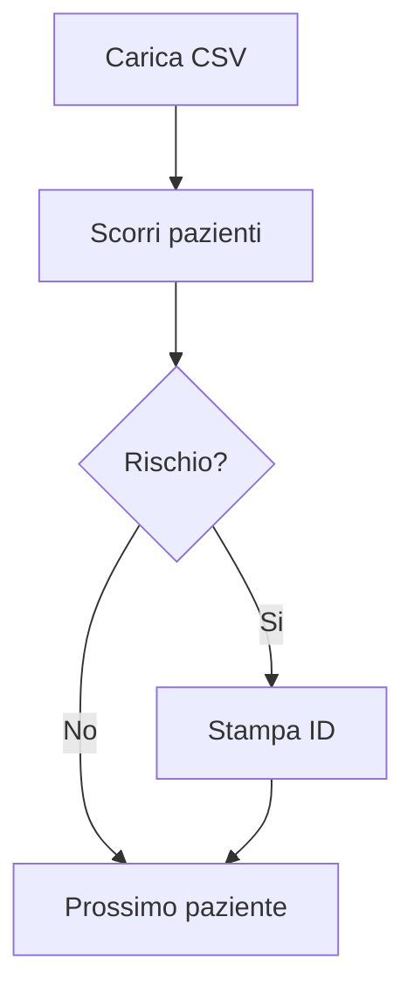
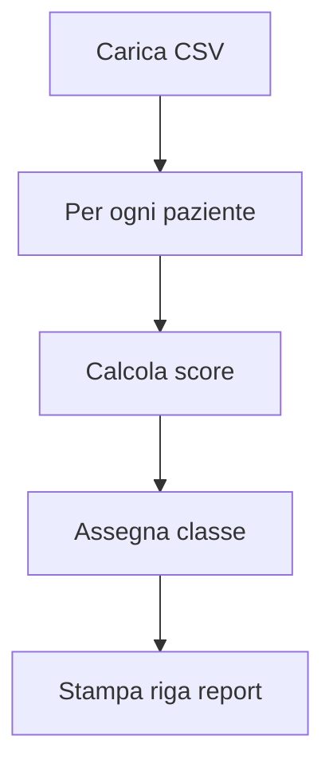
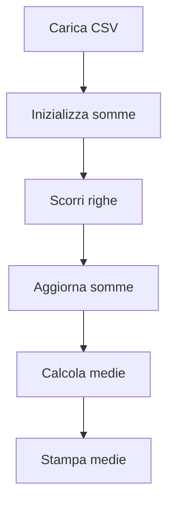
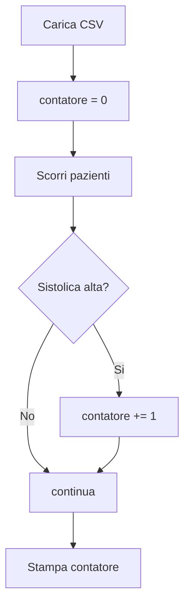
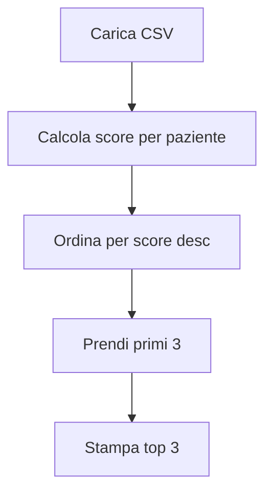
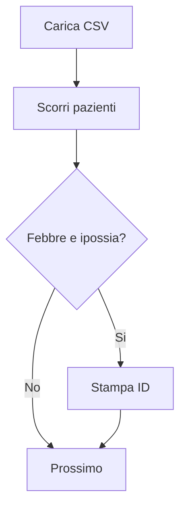
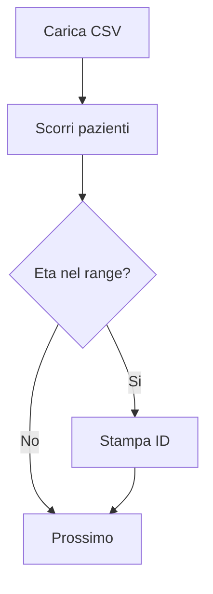
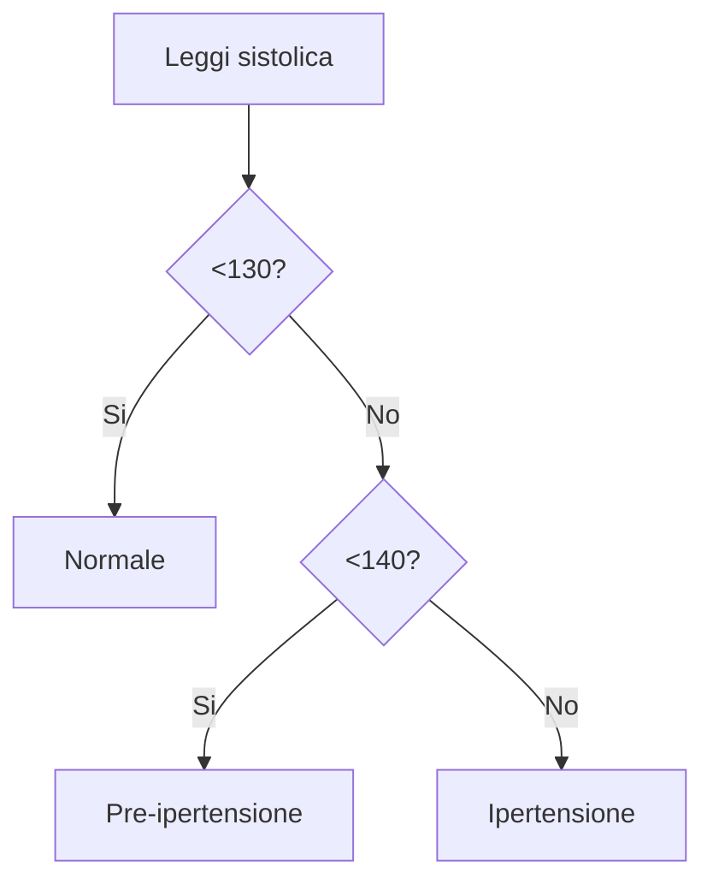
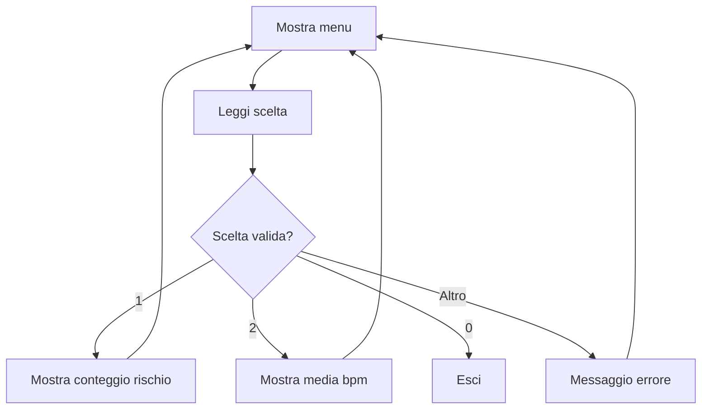
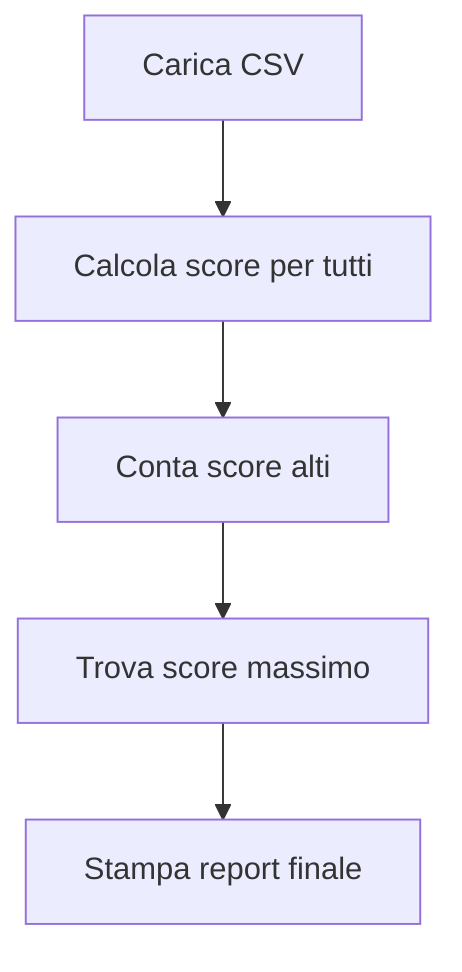

# Lab 4 - Python con Jupyter (ambiente del Lab 2)

Questo laboratorio riusa l'ambiente Python/Jupyter del Lab 2 e contiene **10 esercizi**.
Ogni esercizio include:
- consegna,
- hint,
- diagramma di flusso Mermaid,
- file soluzione.

---

## 1) Setup (stesso ambiente del Lab 2)

```bash
cd 02-vscode-agentic-coding
python3 -m venv .venv
source .venv/bin/activate
pip install -r requirements-jupyter.txt
cd ../04-python-jupyter-analisi-biomedica
```

Su Windows: `.venv\\Scripts\\activate`.

---

## 2) Struttura

- `data/vitali_pazienti.csv`
- `esercizi/`
- `soluzioni/`
- `jupyter/`

---

## 3) Esercizi Python

## Esercizio 1 - Filtro pazienti a rischio
- **File:** `esercizi/es01_filtra_rischio.py`
- **Consegna:** stampa gli ID dei pazienti a rischio.
- **Hint:** usa `csv.DictReader` + funzione booleana `paziente_a_rischio`.
- **Soluzione:** `soluzioni/es01_filtra_rischio_sol.py`



## Esercizio 2 - Score clinico e classe rischio
- **File:** `esercizi/es02_score_clinico.py`
- **Consegna:** calcola score e classe per ogni paziente.
- **Hint:** funzione `score_clinico` + `classe_rischio`.
- **Soluzione:** `soluzioni/es02_score_clinico_sol.py`



## Esercizio 3 - Medie parametri vitali
- **File:** `esercizi/es03_media_parametri.py`
- **Consegna:** calcola medie di `bpm`, `spo2`, `sistolica`.
- **Hint:** somma colonne e dividi per numero righe.
- **Soluzione:** `soluzioni/es03_media_parametri_sol.py`



## Esercizio 4 - Conteggio pazienti ipertesi
- **File:** `esercizi/es04_conta_ipertesi.py`
- **Consegna:** conta pazienti con `sistolica >= 140`.
- **Hint:** contatore + `if` nel ciclo.
- **Soluzione:** `soluzioni/es04_conta_ipertesi_sol.py`



## Esercizio 5 - Ordinamento per score
- **File:** `esercizi/es05_ordinamento_score.py`
- **Consegna:** ordina pazienti per score decrescente e stampa top 3.
- **Hint:** `sorted(..., key=..., reverse=True)`.
- **Soluzione:** `soluzioni/es05_ordinamento_score_sol.py`



## Esercizio 6 - Flag febbre + ipossia
- **File:** `esercizi/es06_flag_febbre_ipossia.py`
- **Consegna:** stampa ID con `temperatura >= 37.5` e `spo2 < 95`.
- **Hint:** condizione con `and`.
- **Soluzione:** `soluzioni/es06_flag_febbre_ipossia_sol.py`



## Esercizio 7 - Filtro fascia d'eta
- **File:** `esercizi/es07_filtra_eta_range.py`
- **Consegna:** stampa ID con `50 <= eta <= 75`.
- **Hint:** condizione composta con doppio confronto.
- **Soluzione:** `soluzioni/es07_filtra_eta_range_sol.py`



## Esercizio 8 - Classifica pressione sistolica
- **File:** `esercizi/es08_classifica_pressione.py`
- **Consegna:** classifica ogni paziente in `Normale`, `Pre-ipertensione`, `Ipertensione`.
- **Hint:** funzione separata `classe_pressione`.
- **Soluzione:** `soluzioni/es08_classifica_pressione_sol.py`



## Esercizio 9 - Menu testuale con controllo input
- **File:** `esercizi/es09_controllo_input_menu.py`
- **Consegna:** crea menu `1/2/0` con `while`.
- **Hint:** `while True` + `if/elif/else` + `break`.
- **Soluzione:** `soluzioni/es09_controllo_input_menu_sol.py`



## Esercizio 10 - Report clinico finale
- **File:** `esercizi/es10_report_finale.py`
- **Consegna:** stampa totale pazienti, numero rischio alto, ID con score massimo.
- **Hint:** funzione score + `max(..., key=...)`.
- **Soluzione:** `soluzioni/es10_report_finale_sol.py`



---

## 4) Notebook Jupyter

- `jupyter/01_esplorazione_vitali.ipynb`
- `jupyter/02_score_clinico.ipynb`

Avvio:

```bash
jupyter lab
```

---

## 5) Consegna studenti

Consegna:
1. almeno 8 script completati su 10,
2. notebook completati,
3. nota breve (6-8 righe) sulle differenze tra `.py` e `.ipynb`.

