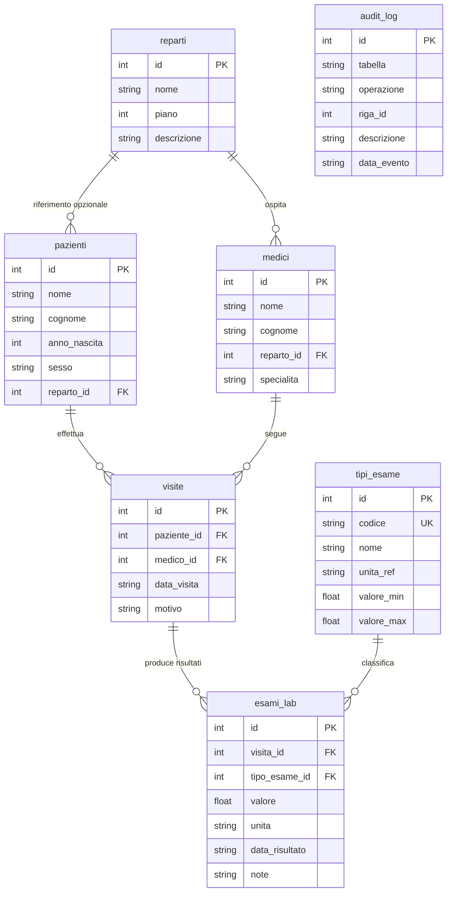

# Lab 7 — Database relazionali: SQLite e interfaccia MATLAB

Laboratorio su **modellazione dati tabellare**, **linguaggio SQL** e uso di **SQLite** (database file locale) da **MATLAB** tramite [Database Toolbox](https://www.mathworks.com/help/database/matlab-interface-to-sqlite.html). Collegamento ai temi del corso (LIS, dati clinici strutturati, integrazione con sistemi informativi) già introdotti nelle slide teoriche.

Repository del corso: [Lab_Fondamenti_di_Informatica_25_26](https://github.com/lucadagati/Lab_Fondamenti_di_Informatica_25_26).

---

## Cos'è SQLite e quali capacità offre

**SQLite** è un **motore di database relazionale incorporato** (*embedded*): non è un programma “server” separato a cui ci si connette in rete, ma una **libreria** che gira **nello stesso processo** dell’applicazione (MATLAB, browser, app mobile, firmware, ecc.). Il database è in pratica **uno o più file sul disco** (tipicamente estensione `.db` o `.sqlite`), facili da copiare, archiviare e versionare a parte (con le dovute cautele: il file va considerato come un *artefatto* generato, non sempre adatto al controllo versioni se contiene dati sensibili).

Documentazione di riferimento del progetto: [sqlite.org](https://www.sqlite.org/).

### Perché è diffuso in ambito applicativo (e spesso anche clinico-informatico)

- **Assenza di installazione server**: non serve installare PostgreSQL, MySQL o SQL Server per avere tabelle, chiavi e SQL; si crea un file e si interroga.
- **Transazioni [ACID](https://www.sqlite.org/transactional.html)** (Atomicità, Coerenza, Isolamento, Durabilità): operazioni multiple possono essere raggruppate in una transazione (`BEGIN` … `COMMIT` / `ROLLBACK`) così o tutte hanno effetto o nessuna, riducendo stati intermedi inconsistenti — importante quando si aggiornano più tabelle correlate (es. anagrafica + esami).
- **Linguaggio SQL** molto completo per un motore così compatto: `SELECT` con `JOIN`, aggregazioni (`COUNT`, `SUM`, …), `GROUP BY`, `HAVING`, sottoquery, viste (`VIEW`), indici (`CREATE INDEX`), vincoli di integrità referenziale (`FOREIGN KEY`, se abilitati con `PRAGMA foreign_keys`), trigger (`CREATE TRIGGER`) per regole automatiche o tracciamento.
- **Leggerezza e portabilità**: lo stesso file può essere spostato tra macchine diverse (stesso schema); utile per **prototipi**, **dataset didattici**, strumenti offline o integrazione in pipeline dove un server DB sarebbe eccessivo.
- **Affidabilità orientata alla persistenza su file**: SQLite è progettato per resistere a arresti improvvisi (crash, mancanza corrente) usando un diario di transazioni; è una scelta frequente dove serve affidabilità senza complessità operativa.

### Modello dei dati e “tipi” in SQLite

SQLite usa un modello **flessibile a tipi dinamici**: ogni valore ha un *tipo di storage* (NULL, INTEGER, REAL, TEXT, BLOB), ma la colonna può accettare valori di tipo diverso da quello dichiarato (a differenza di molti database più rigidi). In pratica conviene **trattare lo schema come contratto progettuale** e validare i dati in applicazione o con vincoli `CHECK`, così le query restano prevedibili.

Funzionalità tipiche che userai o incontrerai:

| Area | Cosa consente SQLite (in sintesi) |
|------|-----------------------------------|
| **Schema** | `CREATE TABLE`, `ALTER TABLE`, chiavi primarie, `UNIQUE`, `NOT NULL`, `DEFAULT`, `CHECK`, chiavi esterne (`REFERENCES`) |
| **Query** | `SELECT`, filtri `WHERE`, ordinamenti `ORDER BY`, `LIMIT`, `OFFSET`, join multipli, espressioni, funzioni built-in (date, stringhe, matematica) |
| **Scrittura** | `INSERT`, `UPDATE`, `DELETE`, `REPLACE`; inserimenti massivi e transazioni per performance |
| **Indici** | Accelerare ricerche e join su colonne usate spesso nei filtri; indici parziali e espressioni in versioni recenti |
| **Viste** | `CREATE VIEW` per incapsulare query complesse dietro un nome tabella-like |
| **Trigger** | Automazioni su `INSERT`/`UPDATE`/`DELETE` (es. log di modifica, derivazione di campi) |
| **Estensioni** | Molte build includono estensioni come **JSON1** (manipolazione JSON via SQL) o **FTS5** (ricerca full-text); la disponibilità dipende da come SQLite è stato compilato nel prodotto che lo incorpora |

Versioni recenti di SQLite aggiungono anche costrutti SQL moderni (es. **funzioni di finestra** *window functions*, **CTE** ricorsive `WITH RECURSIVE` in scenari avanzati). Per il laboratorio ci si concentra sul nucleo: **DDL**, **SELECT** con filtri e join, **aggregazioni**, **INSERT**.

### Concorrenza e limiti da tenere a mente

- **Un writer alla volta**: in scenari con molte scritture simultanee da processi diversi, un server come PostgreSQL scala meglio. SQLite è ideale quando **pochi processi** scrivono (o una sola applicazione serializza le scritture) e molte letture possono procedere in parallelo (secondo modalità *journal* / WAL).
- **Dimensione e memoria**: database molto grandi richiedono progettazione (indici, batch); per dataset da laboratorio non è un problema.
- **Sicurezza**: il file `.db` **non è cifrato** di default; la protezione è a livello di file system (permessi, disco cifrato, backup controllati). Esistono estensioni come [SQLCipher](https://www.zetetic.net/sqlcipher/) per applicazioni che richiedono cifratura trasparente — fuori scope di questo lab.

### Ruolo nel contesto biomedico / LIS (collegamento al corso)

In sistemi complessi (HIS, LIS, RIS) i database server sono centrali. Tuttavia **SQLite** compare spesso come:

- **cache locale** o database di app strumenti/clinici;
- **formato di scambio** “queryabile” tra moduli (un file condiviso);
- **motore didattico** per imparare SQL e il modello relazionale senza infrastruttura.

In questo laboratorio SQLite è proprio questo: un **file relazionale** (`dati/lab07_biomed.db`) che MATLAB apre con il [Database Toolbox](https://www.mathworks.com/help/database/matlab-interface-to-sqlite.html), esegue SQL e scambia dati con le `table` del workspace — ponte naturale tra i concetti di **DBMS** visti a lezione e la **pratica in MATLAB**.

---

## 1) Obiettivi

- Capire **schema relazionale** esteso a più tabelle (chiavi, vincoli `FOREIGN KEY`, `CASCADE` / `RESTRICT`, tipi SQLite).
- Scrivere interrogazioni **SELECT** con **WHERE**, **JOIN**, **GROUP BY**.
- Eseguire **INSERT** con `execute` e inserimenti tabellari con `sqlwrite`.
- Applicare operazioni di modifica (`UPDATE`, `DELETE`) con controlli prima/dopo.
- Vedere oggetti SQL usati nella progettazione fisica e applicativa: `VIEW`, `INDEX`, `TRIGGER`.
- Aprire un file **`.db`**, leggere risultati come `table` MATLAB e chiudere la connessione in modo ordinato.

Collegamento con le slide in `slides/`: il lab riprende il percorso **requisiti → progettazione concettuale → progettazione logica → realizzazione SQL**, usando un esempio biomedico normalizzato. I file `es10`–`es12` coprono anche aspetti più operativi del linguaggio SQL: vincoli, interrogazioni avanzate, aggiornamenti, viste, indici e trigger.

---

## 2) Prerequisiti

1. **MATLAB** (release recente consigliata, es. R2022a o successiva per le API mostrate).
2. **[Database Toolbox](https://www.mathworks.com/help/database/index.html)** con interfaccia SQLite: funzioni `sqlite`, `sqlread`, `fetch`, `execute`, `sqlwrite`, `close` ([documentazione interfaccia SQLite](https://www.mathworks.com/help/database/matlab-interface-to-sqlite.html)).
3. (Opzionale) **sqlite3** da terminale per rigenerare il database dallo script SQL senza MATLAB — vedi sezione 7.

Verifica rapida in MATLAB:

```matlab
license('test', 'database_toolbox')
```

Se restituisce `0`, installare/abilitare il toolbox o usare il percorso alternativo con `sqlite3` + file CSV descritto in fondo al README.

---

## 3) Struttura della cartella

| Percorso | Contenuto |
|----------|-----------|
| `sql/lab07_schema.sql` | Script SQL portabile (stesso schema dei dati di esempio; utile con `sqlite3`) |
| `codice/lab07_create_fresh_database.m` | Script che **elimina e ricrea** `dati/lab07_biomed.db` (schema + dati di esempio) |
| `codice/init_lab07_database.m` | Punto di ingresso: esegue lo script sopra e stampa il path del file creato |
| `codice/demo_connessione_lettura.m` | Demo breve: `sqlread` + `fetch` con `JOIN` |
| `codice/demo_sqlwrite_inserimento.m` | Demo breve: `sqlwrite` + verifica |
| `esercizi/` | Dodici esercizi MATLAB (`es01`–`es12`); ogni esecuzione rigenera il database di esempio |
| `dati/` | Qui viene creato `lab07_biomed.db` (non versionato; vedi `.gitignore` del repo) |
| `slides/` | Slide di riferimento sulla progettazione e sull’uso dei database |

Ogni file in `esercizi/` e nelle `demo` ricava la cartella del lab dalla posizione del file `.m` avviato con **Run**, aggiunge `codice` al path MATLAB, esegue `run(fullfile(cartellaLab, 'codice', 'lab07_create_fresh_database.m'))`, poi usa `dbPath` e applica le operazioni descritte nello stesso file.

---

## 4) Come eseguire

1. Imposta la **Current Folder** su `07-matlab-sqlite-database` (radice del lab).
2. Esegui un qualsiasi file `.m` con il pulsante **Run** (oppure `run('esercizi/es01_apri_db_sqlread.m')`, ecc.).

Non serve un ordine obbligato: **ogni script ricrea da zero** `dati/lab07_biomed.db`, apre la connessione, esegue le operazioni e chiude.

Opzionale — solo creazione DB da prompt:

```matlab
run('codice/init_lab07_database.m')
```

---

## 5) Esercizi

La cartella `esercizi/` contiene dodici file MATLAB, da `es01_apri_db_sqlread.m` a `es12_view_index_trigger.m`. Ogni file può essere eseguito indipendentemente dagli altri e, all’avvio, ricrea il database di esempio, così i risultati sono riproducibili.

**Glossario nel codice (`PRAGMA`, `sqlite`, `fetch`, …)**  
Nel file **`esercizi/es01_apri_db_sqlread.m`** trovi all’inizio un blocco di commenti che spiega, punto per punto:

- **`PRAGMA foreign_keys=ON`** — in SQLite la parola *PRAGMA* indica un’istruzione speciale per **configurare il motore**, non una tabella. `foreign_keys=ON` **attiva il controllo** delle chiavi esterne su **questa** connessione; se restasse disattivato (comportamento storico di SQLite), potresti inserire `visita_id` o `tipo_esame_id` inesistenti senza errore.
- **`sqlite(percorso)`** — apre il file `.db` e restituisce l’oggetto connessione.
- **`execute(conn, sql)`** — invia al motore una stringa SQL che **non** deve restituire una tabella di risultato (es. `PRAGMA`, `INSERT`, `DELETE`, `SAVEPOINT`).
- **`fetch(conn, sql)`** — esegue un `SELECT` e restituisce una **table** MATLAB.
- **`sqlread(conn, nomeTabella)`** — scorciatoia per leggere tutta una tabella.
- **`close(conn)`** — chiude la connessione al file.

Dall’`es02` in poi si usano le stesse definizioni dell’`es01` e si introducono nel codice le tecniche aggiuntive (`JOIN`, `try/catch`, `SAVEPOINT`/`ROLLBACK TO`, `sprintf`, …). Anche `codice/lab07_create_fresh_database.m` include commenti sulle istruzioni `CREATE` e `INSERT`.

| File | Argomento |
|------|-----------|
| `esercizi/es01_apri_db_sqlread.m` | Connessione, `sqlread`, `close` |
| `esercizi/es02_fetch_where.m` | `fetch` e filtri `WHERE` |
| `esercizi/es03_join_groupby.m` | `JOIN` + `COUNT` / `GROUP BY` |
| `esercizi/es04_execute_insert.m` | `INSERT` con `execute` |
| `esercizi/es05_sqlwrite_bulk.m` | Inserimento multiplo con `sqlwrite` |
| `esercizi/es06_chiave_primaria.m` | **Chiave primaria**: perché `id` non può essere duplicato |
| `esercizi/es07_integrita_referenziale_fk.m` | **Foreign key**: niente risultati per `visita_id` inesistente |
| `esercizi/es08_delete_cascade.m` | **ON DELETE CASCADE**: coerenza dopo cancellazione paziente |
| `esercizi/es09_transazione_coerenza.m` | **Transazione + ROLLBACK**: modifiche annullate insieme |
| `esercizi/es10_query_avanzate.m` | Query avanzate: `DISTINCT`, `LIKE`, `IN`, `CASE`, `HAVING`, sottoquery |
| `esercizi/es11_update_delete.m` | `UPDATE` e `DELETE` controllati con verifiche prima/dopo |
| `esercizi/es12_view_index_trigger.m` | `VIEW`, `INDEX`, `EXPLAIN QUERY PLAN` e `TRIGGER` |

### Chiavi, integrità referenziale e coerenza

- **Chiave primaria** (es. `pazienti.id`, `visite.id`): identifica in modo univoco una riga e collega in modo stabile le altre tabelle.
- **Chiavi esterne**: ogni risultato in `esami_lab` punta a una **visita** reale (`visita_id` → `visite.id`) e a un **tipo di test** del catalogo (`tipo_esame_id` → `tipi_esame.id`). Le visite collegano **paziente** e **medico**. In SQLite il controllo FK è attivo solo con `PRAGMA foreign_keys=ON` (come in `lab07_create_fresh_database` e negli script del lab).
- **ON DELETE CASCADE** (catena paziente → visite → esami): eliminando un paziente, SQLite rimuove le sue visite e, grazie a un secondo `CASCADE` su `esami_lab`, anche tutti i risultati legati a quelle visite, evitando orfani.
- **ON DELETE RESTRICT** (es. `medici.reparto_id`): impedisce di cancellare un `reparti` se esistono medici ancora assegnati — modello realistico di vincolo “amministrativo”.
- **Transazioni** (`SAVEPOINT` / `ROLLBACK TO` / `RELEASE` nell’esercizio): raggruppano più comandi in un’unità logica; con `ROLLBACK TO` il database torna allo stato precedente, utile quando più tabelle devono aggiornarsi insieme. `SAVEPOINT` è usato perché è robusto anche se il driver MATLAB/SQLite ha già una transazione interna aperta.

Approfondimento ufficiale SQLite sulle foreign key: [Foreign Key Support](https://www.sqlite.org/foreignkeys.html).

### Schema logico del database di laboratorio

Il file `lab07_biomed.db` modella in modo semplificato un contesto **LIS / cartella clinica**: reparti e personale, pazienti, catalogo prestazioni, visite (contesto in cui si richiedono esami) e infine i **risultati numerici** collegati alla visita e al tipo di test.

### Dalla progettazione concettuale allo schema relazionale

Le slide sulla progettazione dei database insistono su un passaggio importante: non si parte subito dal codice SQL, ma prima si chiarisce **quali informazioni** vogliamo rappresentare e **come sono collegate**. Nel lab il dominio scelto è un piccolo sistema informativo biomedico, simile a un LIS semplificato.

**Requisiti informali del mini-sistema**

- L’ospedale è organizzato in `reparti`.
- Ogni `medico` appartiene a un reparto.
- Ogni `paziente` può essere associato a un reparto di riferimento.
- Un paziente può effettuare più `visite`.
- Ogni visita è seguita da un medico.
- Durante una visita possono essere prodotti più risultati di laboratorio.
- Ogni risultato fa riferimento a un tipo di esame del catalogo (`tipi_esame`), dove sono registrati nome, codice, unità di misura e range di riferimento.

**Entità principali**

- `reparti`: rappresenta le unità organizzative.
- `medici`: rappresenta il personale medico.
- `pazienti`: rappresenta l’anagrafica clinica minima.
- `visite`: rappresenta l’evento clinico che collega paziente e medico.
- `tipi_esame`: rappresenta il catalogo degli esami disponibili.
- `esami_lab`: rappresenta i risultati misurati.
- `audit_log`: tabella tecnica usata per mostrare i trigger.

**Perché non mettere tutto in una sola tabella?**  
Una tabella unica con paziente, medico, reparto, nome esame e valore ripeterebbe molte informazioni. Ad esempio, il nome del paziente e il nome dell’esame comparirebbero in tante righe. Questo genera ridondanza e possibili anomalie: se cambia il nome di un reparto dovresti correggerlo in molti punti. Separare le entità in tabelle collegate riduce duplicazioni e rende più chiaro il significato dei dati.

**Traduzione logica in tabelle**

- Ogni entità diventa una tabella.
- Ogni tabella ha una **chiave primaria** (`id`) per identificare in modo univoco ogni riga.
- Le relazioni uno-a-molti diventano **chiavi esterne**:
  - `medici.reparto_id` collega un medico al suo reparto.
  - `pazienti.reparto_id` collega un paziente a un reparto di riferimento.
  - `visite.paziente_id` collega la visita al paziente.
  - `visite.medico_id` collega la visita al medico.
  - `esami_lab.visita_id` collega un risultato alla visita.
  - `esami_lab.tipo_esame_id` collega il risultato al tipo di esame.

**Scelte sui vincoli**

- `ON DELETE CASCADE` tra `pazienti`, `visite` ed `esami_lab`: se elimino un paziente nel lab, elimino automaticamente anche visite e risultati collegati.
- `ON DELETE RESTRICT` su medici e tipi di esame: non è possibile eliminare un medico o un tipo di esame se esistono dati clinici collegati.
- `CHECK` su `pazienti.sesso`: accetta solo valori controllati (`M`, `F`, `X`).
- `UNIQUE` su `tipi_esame.codice`: due tipi di esame non possono avere lo stesso codice.

| Tabella | Ruolo |
|---------|--------|
| `reparti` | Unità organizzative (laboratorio, ematologia, medicina interna): contesto in cui lavorano medici e, opzionalmente, dove è seguito il paziente. |
| `medici` | Anagrafica minima; ogni medico appartiene a un reparto (`reparto_id` con `ON DELETE RESTRICT`). |
| `pazienti` | Anagrafica paziente; `reparto_id` opzionale (`SET NULL` se il reparto viene rimosso). |
| `tipi_esame` | Catalogo dei test (codice univoco, nome, unità di riferimento, range min/max didattici). |
| `visite` | Incontro **paziente–medico** in una data, con motivo della visita; è il “contenitore” logico delle richieste/risposte di laboratorio in questo esempio. |
| `esami_lab` | Una riga = un valore misurato: FK a `visite` (`CASCADE` alla cancellazione della visita o, a catena, del paziente) e a `tipi_esame` (`RESTRICT`: non si cancella un tipo se esistono ancora risultati). |
| `audit_log` | Tabella di log usata per mostrare il funzionamento di un `TRIGGER` sugli aggiornamenti. |



### Come lanciare gli esercizi

Per eseguire un esercizio in MATLAB:

1. Apri la cartella `07-matlab-sqlite-database` come **Current Folder**, oppure apri direttamente il file `.m` in `esercizi/`.
2. Premi **Run** sul file scelto, ad esempio `esercizi/es03_join_groupby.m`.
3. Ogni esercizio ricrea il database di esempio, apre una connessione `conn`, esegue la query o l’operazione prevista, stampa il risultato e chiude la connessione.

Questo comportamento rende gli esercizi indipendenti: se esegui prima `es11_update_delete.m` e poi `es02_fetch_where.m`, il secondo riparte comunque dal database iniziale.

### Cosa osservare durante gli esercizi

- `es01` mostra la lettura di una tabella intera con `sqlread`.
- `es02` introduce `SELECT`, `WHERE` e `JOIN` per filtrare le glicemie.
- `es03` usa `GROUP BY` e `COUNT` per contare i risultati per paziente.
- `es04` ed `es05` mostrano due modi di inserire righe: SQL testuale con `execute` e inserimento da `table` MATLAB con `sqlwrite`.
- `es06`, `es07` ed `es08` fanno vedere gli errori o gli effetti dei vincoli: chiave primaria, chiave esterna e `ON DELETE CASCADE`.
- `es09` mostra una transazione: `SAVEPOINT`, inserimenti temporanei e `ROLLBACK TO`.
- `es10` raccoglie query più ricche ma ancora leggibili: `DISTINCT`, `LIKE`, `IN`, `CASE`, `HAVING` e sottoquery.
- `es11` mostra `UPDATE` e `DELETE` con verifica prima/dopo.
- `es12` introduce `VIEW`, `INDEX`, `EXPLAIN QUERY PLAN` e `TRIGGER`.

---

## 6) Query da provare nella Command Window MATLAB

Questa sezione serve per sperimentare senza modificare gli esercizi. Imposta la **Current Folder** di MATLAB sulla cartella `07-matlab-sqlite-database`, poi copia i comandi nella Command Window.

### Preparazione

```matlab
run('codice/init_lab07_database.m')
```

Cosa fa questo comando:

- crea da zero il file `dati/lab07_biomed.db`;
- apre una connessione MATLAB nella variabile `conn`;
- attiva il controllo delle chiavi esterne con `PRAGMA foreign_keys=ON`;
- lascia disponibile anche `percorsoDb`, cioè il percorso del file `.db`.

### 1. Leggere una tabella intera

```matlab
pazienti = sqlread(conn, 'pazienti');
disp(pazienti)
```

- `sqlread(conn, 'pazienti')` equivale a leggere tutta la tabella `pazienti`.
- Il risultato è una `table` MATLAB.
- `disp(...)` visualizza la tabella nella Command Window.

### 2. Filtrare righe con `WHERE`

```matlab
query = "SELECT nome, cognome, anno_nascita FROM pazienti WHERE anno_nascita >= 1990";
risultato = fetch(conn, query);
disp(risultato)
```

- `SELECT` indica quali colonne vogliamo vedere.
- `FROM pazienti` indica la tabella sorgente.
- `WHERE anno_nascita >= 1990` tiene solo i pazienti nati dal 1990 in poi.
- `fetch(conn, query)` esegue la query e restituisce una `table`.

### 3. Ordinare con `ORDER BY`

```matlab
query = "SELECT cognome, nome, anno_nascita FROM pazienti ORDER BY cognome";
risultato = fetch(conn, query);
disp(risultato)
```

- `ORDER BY cognome` ordina le righe in base alla colonna `cognome`.
- L’ordinamento rende più leggibile il risultato.

### 4. Unire due tabelle con `JOIN`

```matlab
query = "SELECT p.cognome, p.nome, r.nome AS reparto FROM pazienti p LEFT JOIN reparti r ON r.id = p.reparto_id ORDER BY p.cognome";
risultato = fetch(conn, query);
disp(risultato)
```

- `pazienti p` assegna l’alias `p` alla tabella `pazienti`.
- `reparti r` assegna l’alias `r` alla tabella `reparti`.
- `LEFT JOIN` mantiene anche i pazienti senza reparto.
- `ON r.id = p.reparto_id` dice a SQLite come collegare le due tabelle.
- `AS reparto` rinomina la colonna nel risultato.

### 5. Usare una vista già pronta

```matlab
query = "SELECT cognome, codice, esame, valore, unita FROM v_esami_completi ORDER BY cognome, codice";
risultato = fetch(conn, query);
disp(risultato)
```

- `v_esami_completi` è una `VIEW`: contiene già i `JOIN` principali.
- Usarla permette di scrivere query più semplici.
- La vista non duplica i dati: è una query salvata con un nome.

### 6. Trovare valori sopra range

```matlab
query = "SELECT cognome, codice, valore, valore_max FROM v_esami_completi WHERE valore_max IS NOT NULL AND valore > valore_max";
risultato = fetch(conn, query);
disp(risultato)
```

- `valore_max IS NOT NULL` evita confronti con valori mancanti.
- `valore > valore_max` seleziona risultati sopra il range di riferimento.
- Questa query mostra un esempio semplice di controllo clinico sui dati.

### 7. Contare righe con `GROUP BY`

```matlab
query = "SELECT cognome, nome, COUNT(*) AS n_esami FROM v_esami_completi GROUP BY cognome, nome ORDER BY n_esami DESC";
risultato = fetch(conn, query);
disp(risultato)
```

- `COUNT(*)` conta quante righe ci sono in ogni gruppo.
- `GROUP BY cognome, nome` crea un gruppo per ogni paziente.
- `AS n_esami` assegna un nome leggibile alla colonna calcolata.
- `ORDER BY n_esami DESC` ordina dal numero più alto al più basso.

### 8. Filtrare gruppi con `HAVING`

```matlab
query = "SELECT cognome, nome, COUNT(*) AS n_esami FROM v_esami_completi GROUP BY cognome, nome HAVING COUNT(*) >= 4";
risultato = fetch(conn, query);
disp(risultato)
```

- `WHERE` filtra le singole righe prima del raggruppamento.
- `HAVING` filtra i gruppi dopo `GROUP BY`.
- Qui restano solo i pazienti con almeno 4 risultati.

### 9. Usare `CASE` per creare una colonna interpretativa

```matlab
query = "SELECT cognome, codice, valore, CASE WHEN valore_max IS NOT NULL AND valore > valore_max THEN 'alto' WHEN valore_min IS NOT NULL AND valore < valore_min THEN 'basso' ELSE 'nel range' END AS stato FROM v_esami_completi";
risultato = fetch(conn, query);
disp(risultato)
```

- `CASE` funziona come un piccolo `if` dentro SQL.
- `WHEN ... THEN ...` definisce le condizioni.
- `ELSE` definisce il valore se nessuna condizione precedente è vera.
- `END AS stato` chiude il `CASE` e assegna il nome `stato` alla nuova colonna.

### 10. Chiudere la connessione

```matlab
close(conn)
```

- `close(conn)` libera il file `.db`.
- È buona pratica chiudere la connessione alla fine delle prove.

---

## 7) Riferimenti MATLAB (ufficiali)

- [MATLAB Interface to SQLite](https://www.mathworks.com/help/database/matlab-interface-to-sqlite.html)
- [`sqlite`](https://www.mathworks.com/help/database/ref/sqlite.html) — connessione a file `.db`
- [`sqlread`](https://www.mathworks.com/help/database/ref/sqlite.sqlread.html) — tabella → `table`
- [`fetch`](https://www.mathworks.com/help/database/ref/sqlite.fetch.html) — `SELECT` arbitrario → `table`
- [`execute`](https://www.mathworks.com/help/database/ref/sqlite.execute.html) — DDL/DML senza risultato tabellare
- [`sqlwrite`](https://www.mathworks.com/help/database/ref/sqlite.sqlwrite.html) — `table` MATLAB → righe SQL

---

## 8) Opzionale: creare il DB con `sqlite3` (terminale)

Su macOS/Linux (con [SQLite](https://www.sqlite.org/) installato):

```bash
cd 07-matlab-sqlite-database
bash script_init_db.sh
```

Poi in MATLAB puoi aprire lo stesso file con `sqlite(fullfile('dati','lab07_biomed.db'))`.

---

## 9) Senza Database Toolbox (solo concettuale / alternativa)

- Eseguire query con `sqlite3` e reindirizzare l’output su **CSV**, poi `readtable` in MATLAB (perde l’obiettivo “live” SQL in sessione, ma utile in ambienti con licenza limitata).
- In alternativa didattica: usare **MATLAB Online** o laboratorio con toolbox abilitato.

---

*Materiale didattico — Fondamenti di Informatica per Ingegneria Biomedica — Università degli Studi di Messina — A.A. 2025/26*
