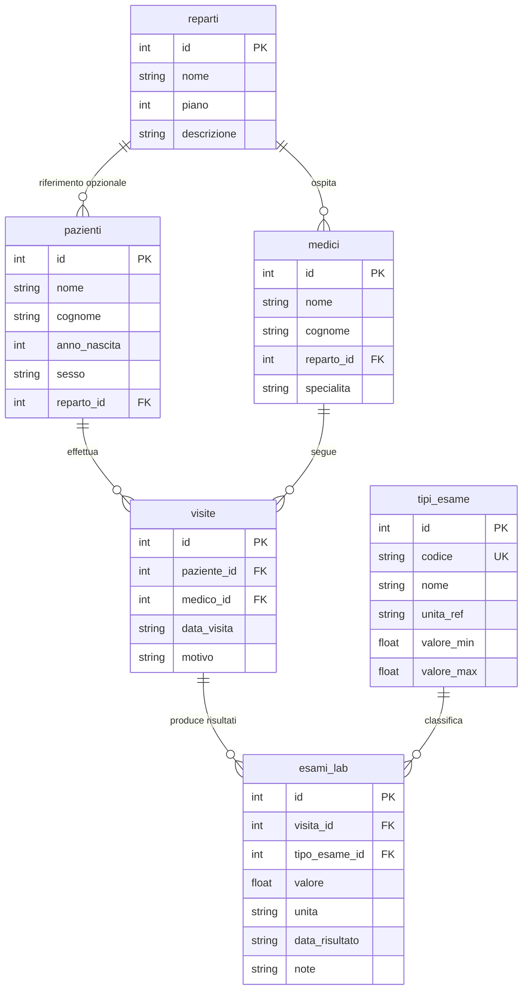
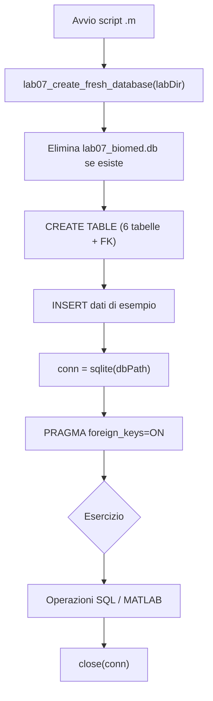
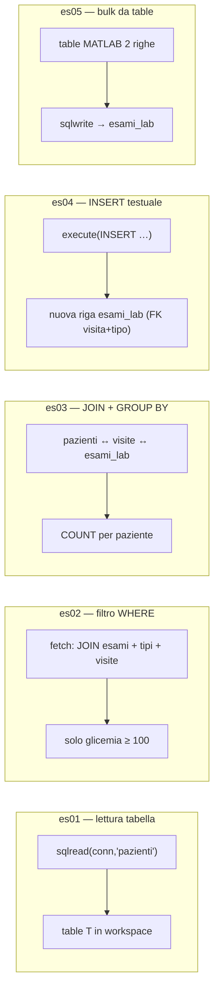
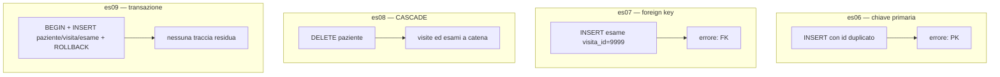
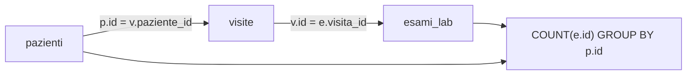
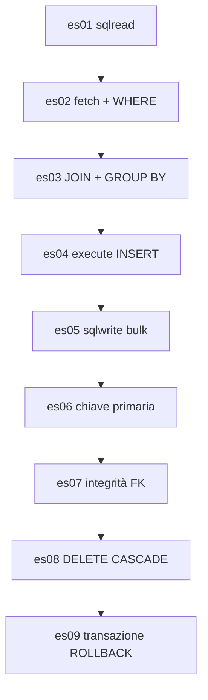

# Lab 7 — Database relazionali: SQLite e interfaccia MATLAB

Laboratorio su **modellazione dati tabellare**, **linguaggio SQL** e uso di **SQLite** (database file locale) da **MATLAB** tramite [Database Toolbox](https://www.mathworks.com/help/database/matlab-interface-to-sqlite.html). Collegamento ai temi del corso (LIS, dati clinici strutturati, integrazione con sistemi informativi) già introdotti nelle slide teoriche.

Repository del corso: [Lab_Fondamenti_di_Informatica_25_26](https://github.com/lucadagati/Lab_Fondamenti_di_Informatica_25_26).

---

## Cos'è SQLite e quali capacità offre

**SQLite** è un **motore di database relazionale incorporato** (*embedded*): non è un programma “server” separato a cui ci si connette in rete, ma una **libreria** che gira **nello stesso processo** dell’applicazione (MATLAB, browser, app mobile, firmware, ecc.). Il database è in pratica **uno o più file sul disco** (tipicamente estensione `.db` o `.sqlite`), facili da copiare, archiviare e versionare a parte (con le dovute cautele: il file va considerato come un *artefatto* generato, non sempre adatto al controllo versioni se contiene dati sensibili).

Documentazione di riferimento del progetto: [sqlite.org](https://www.sqlite.org/).

### Perché è diffuso in ambito applicativo (e spesso anche clinico-informatico)

- **Assenza di installazione server**: non serve installare PostgreSQL, MySQL o SQL Server per avere tabelle, chiavi e SQL; si crea un file e si interroga.
- **Transazioni [ACID](https://www.sqlite.org/transactional.html)** (Atomicità, Coerenza, Isolamento, Durabilità): operazioni multiple possono essere raggruppate in una transazione (`BEGIN` … `COMMIT` / `ROLLBACK`) così o tutte hanno effetto o nessuna, riducendo stati intermedi inconsistenti — importante quando si aggiornano più tabelle correlate (es. anagrafica + esami).
- **Linguaggio SQL** molto completo per un motore così compatto: `SELECT` con `JOIN`, aggregazioni (`COUNT`, `SUM`, …), `GROUP BY`, `HAVING`, sottoquery, viste (`VIEW`), indici (`CREATE INDEX`), vincoli di integrità referenziale (`FOREIGN KEY`, se abilitati con `PRAGMA foreign_keys`), trigger (`CREATE TRIGGER`) per regole automatiche o tracciamento.
- **Leggerezza e portabilità**: lo stesso file può essere spostato tra macchine diverse (stesso schema); utile per **prototipi**, **dataset didattici**, strumenti offline o integrazione in pipeline dove un server DB sarebbe eccessivo.
- **Affidabilità orientata alla persistenza su file**: SQLite è progettato per resistere a arresti improvvisi (crash, mancanza corrente) usando un diario di transazioni; è una scelta frequente dove serve affidabilità senza complessità operativa.

### Modello dei dati e “tipi” in SQLite

SQLite usa un modello **flessibile a tipi dinamici**: ogni valore ha un *tipo di storage* (NULL, INTEGER, REAL, TEXT, BLOB), ma la colonna può accettare valori di tipo diverso da quello dichiarato (a differenza di molti database più rigidi). In pratica conviene **trattare lo schema come contratto progettuale** e validare i dati in applicazione o con vincoli `CHECK`, così le query restano prevedibili.

Funzionalità tipiche che userai o incontrerai:

| Area | Cosa consente SQLite (in sintesi) |
|------|-----------------------------------|
| **Schema** | `CREATE TABLE`, `ALTER TABLE`, chiavi primarie, `UNIQUE`, `NOT NULL`, `DEFAULT`, `CHECK`, chiavi esterne (`REFERENCES`) |
| **Query** | `SELECT`, filtri `WHERE`, ordinamenti `ORDER BY`, `LIMIT`, `OFFSET`, join multipli, espressioni, funzioni built-in (date, stringhe, matematica) |
| **Scrittura** | `INSERT`, `UPDATE`, `DELETE`, `REPLACE`; inserimenti massivi e transazioni per performance |
| **Indici** | Accelerare ricerche e join su colonne usate spesso nei filtri; indici parziali e espressioni in versioni recenti |
| **Viste** | `CREATE VIEW` per incapsulare query complesse dietro un nome tabella-like |
| **Trigger** | Automazioni su `INSERT`/`UPDATE`/`DELETE` (es. log di modifica, derivazione di campi) |
| **Estensioni** | Molte build includono estensioni come **JSON1** (manipolazione JSON via SQL) o **FTS5** (ricerca full-text); la disponibilità dipende da come SQLite è stato compilato nel prodotto che lo incorpora |

Versioni recenti di SQLite aggiungono anche costrutti SQL moderni (es. **funzioni di finestra** *window functions*, **CTE** ricorsive `WITH RECURSIVE` in scenari avanzati). Per il laboratorio ci si concentra sul nucleo: **DDL**, **SELECT** con filtri e join, **aggregazioni**, **INSERT**.

### Concorrenza e limiti da tenere a mente

- **Un writer alla volta**: in scenari con molte scritture simultanee da processi diversi, un server come PostgreSQL scala meglio. SQLite è ideale quando **pochi processi** scrivono (o una sola applicazione serializza le scritture) e molte letture possono procedere in parallelo (secondo modalità *journal* / WAL).
- **Dimensione e memoria**: database molto grandi richiedono progettazione (indici, batch); per dataset da laboratorio non è un problema.
- **Sicurezza**: il file `.db` **non è cifrato** di default; la protezione è a livello di file system (permessi, disco cifrato, backup controllati). Esistono estensioni come [SQLCipher](https://www.zetetic.net/sqlcipher/) per applicazioni che richiedono cifratura trasparente — fuori scope di questo lab.

### Ruolo nel contesto biomedico / LIS (collegamento al corso)

In sistemi complessi (HIS, LIS, RIS) i database server sono centrali. Tuttavia **SQLite** compare spesso come:

- **cache locale** o database di app strumenti/clinici;
- **formato di scambio** “queryabile” tra moduli (un file condiviso);
- **motore didattico** per imparare SQL e il modello relazionale senza infrastruttura.

In questo laboratorio SQLite è proprio questo: un **file relazionale** (`dati/lab07_biomed.db`) che MATLAB apre con il [Database Toolbox](https://www.mathworks.com/help/database/matlab-interface-to-sqlite.html), esegue SQL e scambia dati con le `table` del workspace — ponte naturale tra i concetti di **DBMS** visti a lezione e la **pratica in MATLAB**.

---

## 1) Obiettivi

- Capire **schema relazionale** esteso a più tabelle (chiavi, vincoli `FOREIGN KEY`, `CASCADE` / `RESTRICT`, tipi SQLite).
- Scrivere interrogazioni **SELECT** con **WHERE**, **JOIN**, **GROUP BY**.
- Eseguire **INSERT** con `execute` e inserimenti tabellari con `sqlwrite`.
- Aprire un file **`.db`**, leggere risultati come `table` MATLAB e chiudere la connessione in modo ordinato.

---

## 2) Prerequisiti

1. **MATLAB** (release recente consigliata, es. R2022a o successiva per le API mostrate).
2. **[Database Toolbox](https://www.mathworks.com/help/database/index.html)** con interfaccia SQLite: funzioni `sqlite`, `sqlread`, `fetch`, `execute`, `sqlwrite`, `close` ([documentazione interfaccia SQLite](https://www.mathworks.com/help/database/matlab-interface-to-sqlite.html)).
3. (Opzionale) **sqlite3** da terminale per rigenerare il database dallo script SQL senza MATLAB — vedi sezione 7.

Verifica rapida in MATLAB:

```matlab
license('test', 'database_toolbox')
```

Se restituisce `0`, installare/abilitare il toolbox o usare il percorso alternativo con `sqlite3` + file CSV descritto in fondo al README.

---

## 3) Struttura della cartella

| Percorso | Contenuto |
|----------|-----------|
| `sql/lab07_schema.sql` | Script SQL portabile (stesso schema dei dati di esempio; utile con `sqlite3`) |
| `codice/lab07_create_fresh_database.m` | Funzione che **elimina e ricrea** `dati/lab07_biomed.db` (schema + insert) |
| `codice/init_lab07_database.m` | Punto di ingresso: chiama la funzione sopra e stampa il path del file creato |
| `codice/demo_connessione_lettura.m` | Demo breve: `sqlread` + `fetch` con `JOIN` |
| `codice/demo_sqlwrite_inserimento.m` | Demo breve: `sqlwrite` + verifica |
| `esercizi/` | **Solo** script completi, **commentati passo passo** in italiano; ogni Run ricrea il DB |
| `dati/` | Qui viene creato `lab07_biomed.db` (non versionato; vedi `.gitignore` del repo) |

Ogni script in `esercizi/` e nelle `demo` aggiunge `codice` al path MATLAB, chiama `lab07_create_fresh_database(labDir)` e poi esegue le operazioni illustrate nei commenti.

---

## 4) Come eseguire

1. Imposta la **Current Folder** su `07-matlab-sqlite-database` (radice del lab).
2. Esegui un qualsiasi file `.m` con il pulsante **Run** (oppure `run('esercizi/es01_apri_db_sqlread.m')`, ecc.).

Non serve un ordine obbligato: **ogni script ricrea da zero** `dati/lab07_biomed.db`, apre la connessione, esegue le operazioni e chiude.

Opzionale — solo creazione DB da prompt:

```matlab
run('codice/init_lab07_database.m')
```

---

## 5) Esercizi (script autonomi, commentati)

Gli script in `esercizi/` sono **l’unico insieme di esercizi**: nessuna cartella “soluzioni”; il codice è già completo, **lineare** e commentato in italiano.

**Glossario nel codice (cosa significa `PRAGMA` e gli altri comandi)**  
Nel file **`esercizi/es01_apri_db_sqlread.m`** trovi all’inizio un blocco di commenti che spiega, punto per punto:

- **`PRAGMA foreign_keys=ON`** — in SQLite la parola *PRAGMA* indica un’istruzione speciale per **configurare il motore**, non una tabella. `foreign_keys=ON` **attiva il controllo** delle chiavi esterne su **questa** connessione; se restasse disattivato (comportamento storico di SQLite), potresti inserire `visita_id` o `tipo_esame_id` inesistenti senza errore.
- **`sqlite(percorso)`** — apre il file `.db` e restituisce l’oggetto connessione.
- **`execute(conn, sql)`** — invia al motore una stringa SQL che **non** deve restituire una tabella di risultato (es. `PRAGMA`, `INSERT`, `DELETE`, `BEGIN`).
- **`fetch(conn, sql)`** — esegue un `SELECT` e restituisce una **table** MATLAB.
- **`sqlread(conn, nomeTabella)`** — scorciatoia per leggere tutta una tabella.
- **`close(conn)`** — chiude la connessione al file.

Gli altri esercizi **rimandano a es01** per il glossario lungo e aggiungono commenti **sopra o a fine riga** su ogni passaggio nuovo (`JOIN`, `try/catch`, `BEGIN`/`ROLLBACK`, `sprintf`, …). Lo stesso stile è in `codice/lab07_create_fresh_database.m` (commenti sulle `CREATE`/`INSERT`).

| File | Argomento |
|------|-----------|
| `esercizi/es01_apri_db_sqlread.m` | Connessione, `sqlread`, `close` |
| `esercizi/es02_fetch_where.m` | `fetch` e filtri `WHERE` |
| `esercizi/es03_join_groupby.m` | `JOIN` + `COUNT` / `GROUP BY` |
| `esercizi/es04_execute_insert.m` | `INSERT` con `execute` |
| `esercizi/es05_sqlwrite_bulk.m` | Inserimento multiplo con `sqlwrite` |
| `esercizi/es06_chiave_primaria.m` | **Chiave primaria**: perché `id` non può essere duplicato |
| `esercizi/es07_integrita_referenziale_fk.m` | **Foreign key**: niente risultati per `visita_id` inesistente |
| `esercizi/es08_delete_cascade.m` | **ON DELETE CASCADE**: coerenza dopo cancellazione paziente |
| `esercizi/es09_transazione_coerenza.m` | **Transazione + ROLLBACK**: modifiche annullate insieme |

### Chiavi, integrità referenziale e coerenza

- **Chiave primaria** (es. `pazienti.id`, `visite.id`): identifica in modo univoco una riga e collega in modo stabile le altre tabelle.
- **Chiavi esterne**: ogni risultato in `esami_lab` punta a una **visita** reale (`visita_id` → `visite.id`) e a un **tipo di test** del catalogo (`tipo_esame_id` → `tipi_esame.id`). Le visite collegano **paziente** e **medico**. In SQLite il controllo FK è attivo solo con `PRAGMA foreign_keys=ON` (come in `lab07_create_fresh_database` e negli script del lab).
- **ON DELETE CASCADE** (catena paziente → visite → esami): eliminando un paziente, SQLite rimuove le sue visite e, grazie a un secondo `CASCADE` su `esami_lab`, anche tutti i risultati legati a quelle visite, evitando orfani.
- **ON DELETE RESTRICT** (es. `medici.reparto_id`): impedisce di cancellare un `reparti` se esistono medici ancora assegnati — modello realistico di vincolo “amministrativo”.
- **Transazioni** (`BEGIN` / `COMMIT` / `ROLLBACK`): raggruppano più comandi in un’unità logica; con `ROLLBACK` il database torna allo stato precedente, utile quando più tabelle devono aggiornarsi insieme.

Approfondimento ufficiale SQLite sulle foreign key: [Foreign Key Support](https://www.sqlite.org/foreignkeys.html).

### Schema logico del database di laboratorio

Il file `lab07_biomed.db` modella in modo semplificato un contesto **LIS / cartella clinica**: reparti e personale, pazienti, catalogo prestazioni, visite (contesto in cui si richiedono esami) e infine i **risultati numerici** collegati alla visita e al tipo di test.

| Tabella | Ruolo |
|---------|--------|
| `reparti` | Unità organizzative (laboratorio, ematologia, medicina interna): contesto in cui lavorano medici e, opzionalmente, dove è seguito il paziente. |
| `medici` | Anagrafica minima; ogni medico appartiene a un reparto (`reparto_id` con `ON DELETE RESTRICT`). |
| `pazienti` | Anagrafica paziente; `reparto_id` opzionale (`SET NULL` se il reparto viene rimosso). |
| `tipi_esame` | Catalogo dei test (codice univoco, nome, unità di riferimento, range min/max didattici). |
| `visite` | Incontro **paziente–medico** in una data, con motivo della visita; è il “contenitore” logico delle richieste/risposte di laboratorio in questo esempio. |
| `esami_lab` | Una riga = un valore misurato: FK a `visite` (`CASCADE` alla cancellazione della visita o, a catena, del paziente) e a `tipi_esame` (`RESTRICT`: non si cancella un tipo se esistono ancora risultati). |



### Flusso comune a tutti gli script (reset + connessione)

Prima di ogni esercizio il database viene ricreato da zero, così ogni Run è ripetibile e isolato:



### Cosa fa ogni esercizio sul database



Esercizi su **vincoli e coerenza** (dopo le letture/scritture di base):



Relazione tra **join** dell’esercizio 3 e le tabelle coinvolte:



### Sequenza consigliata (dipendenze concettuali)

Dal più “passivo” (solo lettura intera tabella) al più “attivo” (scrittura multipla):



---

## 6) Riferimenti MATLAB (ufficiali)

- [MATLAB Interface to SQLite](https://www.mathworks.com/help/database/matlab-interface-to-sqlite.html)
- [`sqlite`](https://www.mathworks.com/help/database/ref/sqlite.html) — connessione a file `.db`
- [`sqlread`](https://www.mathworks.com/help/database/ref/sqlite.sqlread.html) — tabella → `table`
- [`fetch`](https://www.mathworks.com/help/database/ref/sqlite.fetch.html) — `SELECT` arbitrario → `table`
- [`execute`](https://www.mathworks.com/help/database/ref/sqlite.execute.html) — DDL/DML senza risultato tabellare
- [`sqlwrite`](https://www.mathworks.com/help/database/ref/sqlite.sqlwrite.html) — `table` MATLAB → righe SQL

---

## 7) Opzionale: creare il DB con `sqlite3` (terminale)

Su macOS/Linux (con [SQLite](https://www.sqlite.org/) installato):

```bash
cd 07-matlab-sqlite-database
bash script_init_db.sh
```

Poi in MATLAB puoi aprire lo stesso file con `sqlite(fullfile('dati','lab07_biomed.db'))`.

---

## 8) Senza Database Toolbox (solo concettuale / alternativa)

- Eseguire query con `sqlite3` e reindirizzare l’output su **CSV**, poi `readtable` in MATLAB (perde l’obiettivo “live” SQL in sessione, ma utile in ambienti con licenza limitata).
- In alternativa didattica: usare **MATLAB Online** o laboratorio con toolbox abilitato.

---

*Materiale didattico — Fondamenti di Informatica per Ingegneria Biomedica — Università degli Studi di Messina — A.A. 2025/26*
