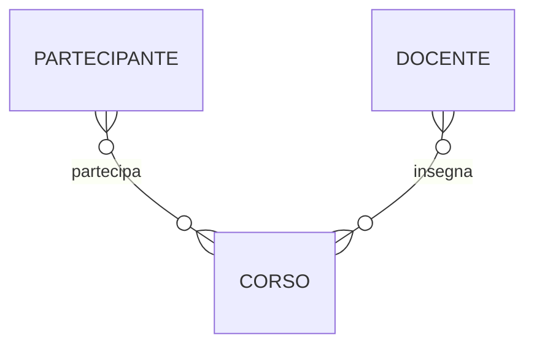
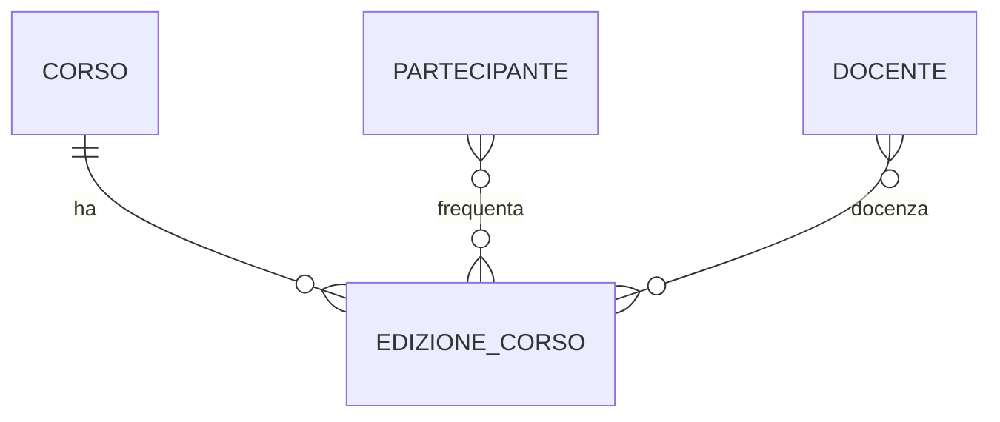
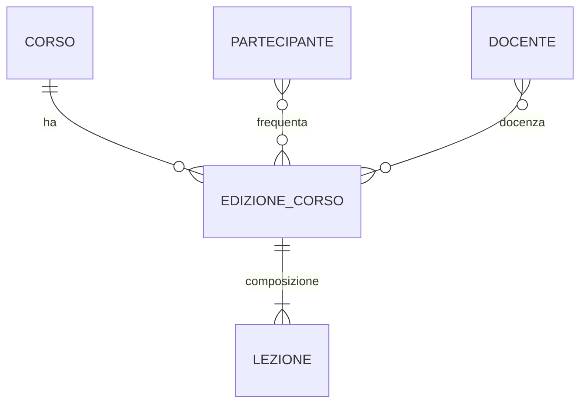
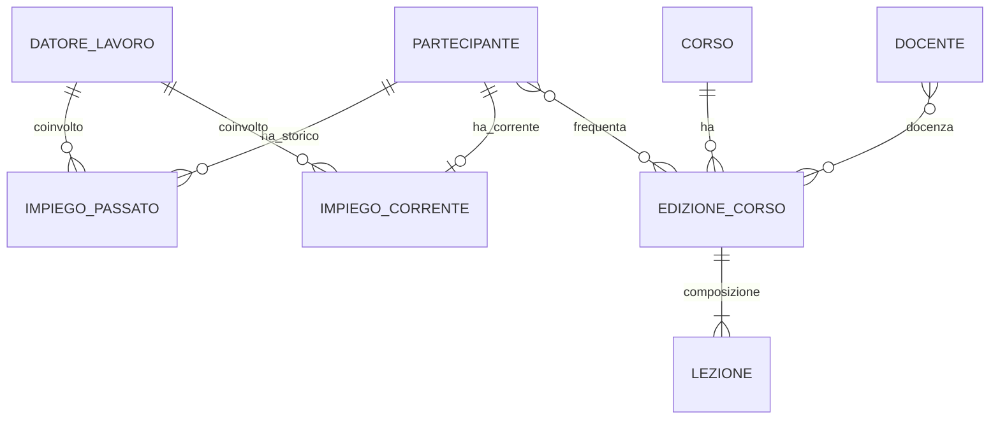
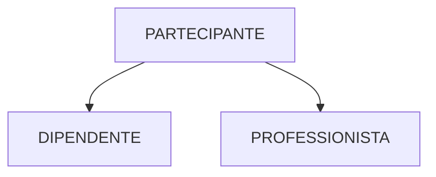
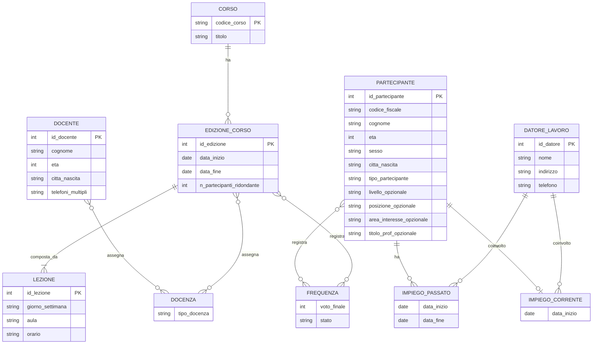

# Lab 8 - Progettazione database: dal testo al diagramma E-R finale

Questo laboratorio guida gli studenti nella costruzione di uno schema E-R che cresce per passi successivi, e poi viene ristrutturato secondo i principi della progettazione logica.

Riferimenti teorici usati per il laboratorio:
- L20_DB_Progettazione_Concettuale.pdf
- L21_DB_Progettazione_Logica.pdf

---

## 1) Obiettivi didattici

Al termine del laboratorio, lo studente sa:
- trasformare requisiti discorsivi in costrutti E-R (entita, attributi, relationship, generalizzazione);
- costruire uno schema E-R per iterazioni, partendo da uno schema scheletro;
- riconoscere ridondanze e discuterne il trade-off (spazio vs tempo);
- ristrutturare uno schema E-R per la traduzione al modello relazionale;
- scegliere identificatori principali coerenti con assenza di opzionalita, semplicita e frequenza d'uso.

---

## 2) Scenario del laboratorio

Scenario: societa di formazione.

Domanda iniziale agli studenti:
"Quali informazioni vogliamo memorizzare su corsi, partecipanti, docenti, edizioni e lezioni?"

Output atteso:
- uno schema E-R finale ristrutturato;
- una breve giustificazione delle scelte progettuali;
- una bozza di traduzione relazionale (solo elenco relazioni con chiavi).

---

## 3) Copione lezione passo-passo (diagramma che cresce)

Nota docente: in ogni passo, fai prima emergere le scelte dagli studenti e solo dopo mostra il diagramma del passo.

### Passo 0 - Dalle frasi ai concetti

Testo per spiegazione in aula:
"Partiamo dalle frasi dei requisiti. Ogni concetto con identita autonoma tende a diventare entita. Le proprieta semplici diventano attributi. I legami tra concetti diventano relationship. I casi particolari possono diventare generalizzazioni."

Checklist:
- concetti candidati a entita;
- possibili attributi identificativi;
- legami principali tra concetti;
- eventuali specializzazioni.

### Passo 1 - Schema scheletro

Testo per spiegazione in aula:
"Nel primo giro non inseguiamo tutti i dettagli: fissiamo lo scheletro con i concetti centrali e i legami principali."

Diagramma 1 (scheletro):

Domande guida:
- mancano le edizioni dei corsi?
- partecipa a cosa: al corso astratto o all'edizione?

### Passo 2 - Separare Corso da Edizione

Testo per spiegazione in aula:
"I requisiti parlano di date di inizio/fine e numero partecipanti per singola edizione. Quindi dobbiamo introdurre una entita EDIZIONE_CORSO distinta da CORSO."

Diagramma 2:

Punto didattico:
- quando una parte ha attributi propri e cardinalita proprie, conviene reificare quel concetto.

### Passo 3 - Introdurre Lezione (composizione)

Testo per spiegazione in aula:
"Le aule, gli orari e il giorno non descrivono il corso in generale, ma le singole lezioni di una edizione. Introduciamo LEZIONE come parte di EDIZIONE_CORSO."

Diagramma 3:

Attributi da discutere in aula:
- LEZIONE: giorno_settimana, ora_inizio, aula
- EDIZIONE_CORSO: data_inizio, data_fine, n_partecipanti

### Passo 4 - Partecipanti e datori di lavoro

Testo per spiegazione in aula:
"Il requisito distingue impiego corrente e impieghi passati con date. Un attributo multiplo non basta: serve una relazione strutturata con attributi temporali."

Diagramma 4:

Punto didattico:
- esempio di reificazione: una informazione che sembra attributo ma ha struttura propria.

### Passo 5 - Tipi di partecipante (generalizzazione)

Testo per spiegazione in aula:
"Il testo distingue DIPENDENTE e PROFESSIONISTA con attributi diversi. In concettuale e naturale usare una generalizzazione."

Diagramma 5 (concettuale ricco):

Punto didattico:
- questa scelta e valida in concettuale; in logica andra ristrutturata.

---

## 4) Fase di ristrutturazione (progettazione logica)

Testo ponte docente:
"Ora passiamo da uno schema concettuale espressivo a uno schema E-R ristrutturato, pensato per una traduzione relazionale piu semplice e con prestazioni ragionate."

Attivita (dalle slide di progettazione logica):
- analisi delle ridondanze;
- eliminazione delle generalizzazioni;
- partizionamento/accorpamento di entita e relationship;
- scelta degli identificatori principali.

### 4.1 Analisi ridondanze

Testo per spiegazione in aula:
"Una ridondanza e informazione derivabile da altre. Mantenerla puo aiutare le query ma pesa su aggiornamenti e spazio."

Esempio da discutere:
- mantenere n_partecipanti in EDIZIONE_CORSO oppure derivarlo contando FREQUENZA.

### 4.2 Eliminazione generalizzazioni

Testo per spiegazione in aula:
"Nel modello relazionale la generalizzazione non e un costrutto nativo. Va trasformata."

Tre opzioni da confrontare:
1. accorpare le figlie nel genitore;
2. accorpare il genitore nelle figlie;
3. sostituire con relationship.

Scelta didattica consigliata per questo lab:
- accorpare nel genitore PARTECIPANTE aggiungendo attributo tipo_partecipante e attributi opzionali.

### 4.3 Scelta identificatori principali

Testo per spiegazione in aula:
"La scelta dell'identificatore e indispensabile per tradurre in relazionale. I criteri: niente opzionalita, semplicita, uso frequente. Se non basta, introduciamo un codice artificiale."

Scelte suggerite:
- PARTECIPANTE(id_partecipante)
- DOCENTE(id_docente)
- CORSO(codice_corso)
- EDIZIONE_CORSO(id_edizione)
- LEZIONE(id_lezione)
- DATORE_LAVORO(id_datore)

---

## 5) Diagramma E-R finale ristrutturato

Nota docente:
- puoi mostrare due versioni finali: con e senza n_partecipanti_ridondante.
- chiedi agli studenti in quali operazioni conviene una o l'altra.

---

## 6) Testi pronti da leggere in classe

Testo A - Introduzione (2 minuti)
"Oggi non partiamo da SQL ma dai requisiti. Costruiremo uno schema E-R che cresce per iterazioni: prima lo scheletro, poi i dettagli, poi la ristrutturazione. Il nostro obiettivo non e solo disegnare, ma motivare ogni scelta con regole di progettazione."

Testo B - Momento di ristrutturazione (3 minuti)
"Uno schema concettuale puo essere corretto ma non ancora pronto alla traduzione relazionale. Per questo facciamo ristrutturazione: analizziamo ridondanze, eliminiamo generalizzazioni quando serve, accorpiamo o separiamo concetti, scegliamo identificatori robusti."

Testo C - Chiusura (2 minuti)
"Il valore del diagramma finale non sta nella grafica, ma nella qualita delle decisioni: cosa e stato modellato come entita, cosa come relazione, cosa e derivabile, quali chiavi useremo nel passaggio a tabelle. Questa e la vera competenza di progettazione."

---

## 7) Esercizi in aula

Esercizio 1 (base)
- Dato il testo dei requisiti, costruisci schema scheletro con massimo 5 concetti.
- Consegna: diagramma + 5 righe di motivazione.

Esercizio 2 (intermedio)
- Aggiungi EDIZIONE_CORSO e LEZIONE con cardinalita.
- Consegna: diagramma + spiegazione della scelta di reificazione.

Esercizio 3 (avanzato)
- Proponi due ristrutturazioni alternative per la generalizzazione PARTECIPANTE.
- Consegna: pro/contro su semplicita, ridondanza e query frequenti.

Esercizio 4 (ponte al relazionale)
- Traduci lo schema finale in relazioni con PK e FK.
- Consegna: elenco relazioni in forma R(Attributi), PK, FK.

---

## 8) Rubrica di valutazione rapida

- Correttezza semantica del modello: 0-10
- Coerenza cardinalita e identificatori: 0-10
- Qualita della ristrutturazione: 0-10
- Chiarezza della motivazione progettuale: 0-10

Totale: 40 punti

---

Materiale didattico - Fondamenti di Informatica per Ingegneria Biomedica - A.A. 2025/26
