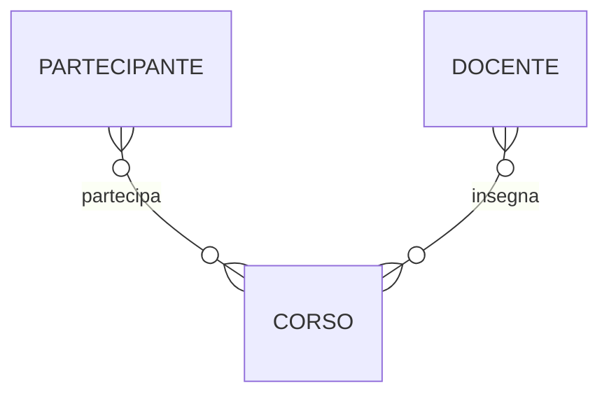
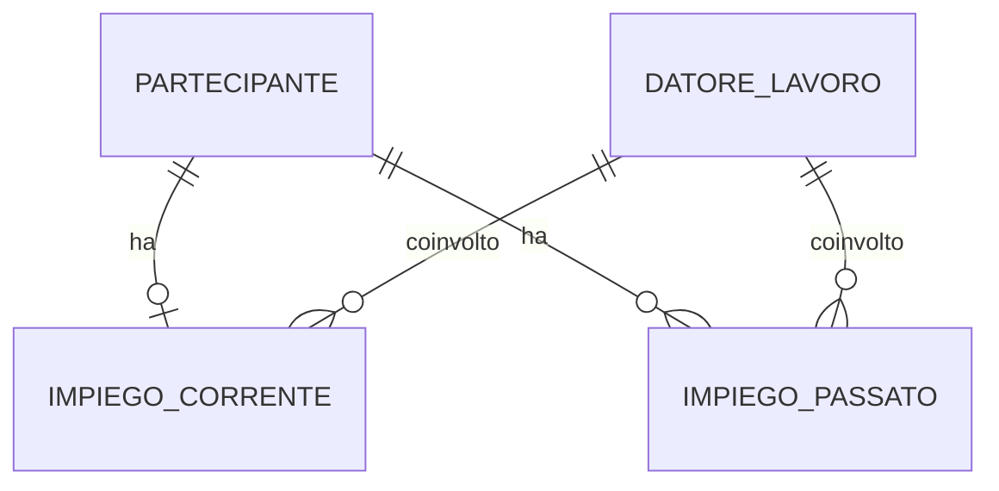
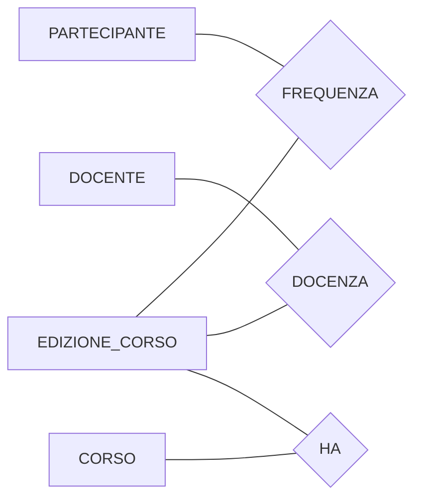
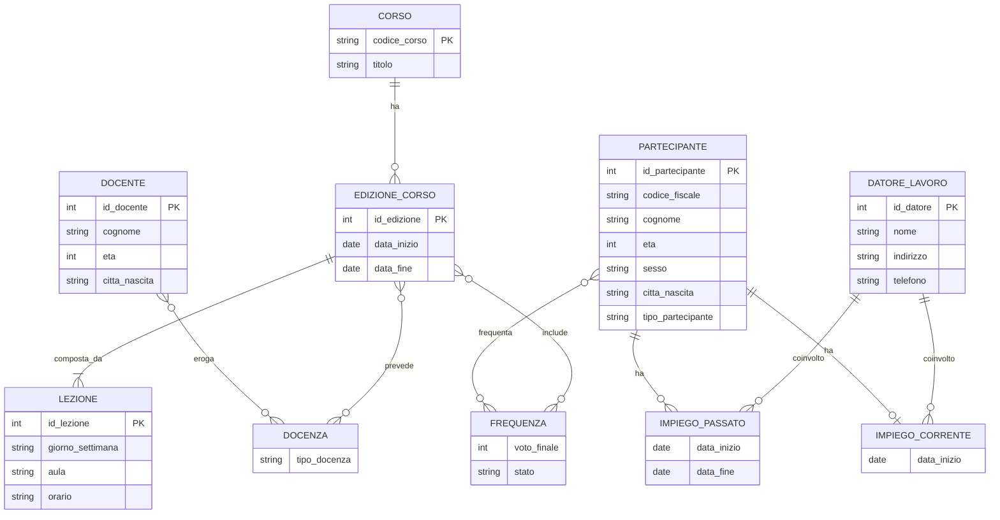

# Lab 8 - Progettazione basi di dati (flusso completo)

Laboratorio di progettazione database strutturato sulle 5 fasi classiche:
1. requisiti;
2. progettazione concettuale;
3. progettazione logica;
4. progettazione fisica;
5. implementazione.

Riferimenti teorici usati:
- L20_DB_Progettazione_Concettuale.pdf
- L21_DB_Progettazione_Logica.pdf

Il laboratorio adotta un flusso di lavoro completo in 5 fasi:
- requisiti;
- progettazione concettuale;
- progettazione logica;
- progettazione fisica;
- implementazione.

## Obiettivi

Al termine del laboratorio, lo studente e in grado di:
- passare da testo libero a requisiti strutturati;
- costruire uno schema E-R incrementale (dallo scheletro al modello completo);
- ristrutturare lo schema concettuale per la traduzione al relazionale;
- derivare schema logico con PK/FK e vincoli principali;
- definire scelte fisiche (tipi, indici, vincoli di dominio);
- scrivere una prima implementazione SQL.

## Scenario

Dominio: societa di formazione.

Concetti principali da modellare:
- partecipanti;
- docenti;
- corsi ed edizioni;
- lezioni;
- datori di lavoro e storico impieghi.

## Flusso operativo

### Fase 1 - Raccolta e analisi requisiti

Output atteso:
- glossario dei termini;
- requisiti dati;
- requisiti operazioni;
- vincoli aziendali;
- assunzioni esplicite.

Checklist minima:
- ogni requisito e non ambiguo;
- i sinonimi sono unificati;
- i volumi principali sono stimati;
- le operazioni frequenti sono identificate.

### Fase 2 - Progettazione concettuale (E-R)

Strategia consigliata (coerente con il flusso NARE):
- creare prima uno schema scheletro;
- dettagliare per iterazioni;
- integrare i sottoschemi in un E-R finale.

Schema scheletro:

Evoluzione con EDIZIONE_CORSO e LEZIONE:

Evoluzione con storico impieghi:

Rappresentazione alternativa (Chen semplificata, utile per una resa grafica piu vicina ai diagrammi da slide):

### Fase 3 - Progettazione logica

Attivita chiave:
- analisi ridondanze;
- eliminazione/trasformazione generalizzazioni;
- accorpamento o separazione di entita/relationship;
- scelta identificatori principali.

Criteri di scelta identificatori:
- assenza di opzionalita;
- semplicita;
- uso nelle operazioni frequenti.

Se nessun identificatore naturale e adatto, introdurre identificatore artificiale.

Traduzione base verso relazionale:
- le entita diventano relazioni;
- le relationship diventano relazioni sulle chiavi delle entita coinvolte (piu eventuali attributi propri);
- per relationship 1:N valutare anche accorpamento sul lato N.

### Fase 4 - Progettazione fisica

Output atteso:
- domini attributi;
- vincoli di dominio e integrita;
- scelta indici;
- convenzioni di naming.

Esempio di scelte fisiche:
- VARCHAR per attributi descrittivi;
- DATE per date inizio/fine;
- CHECK su valori enumerativi (es. sesso, stato);
- indici sulle FK e sugli attributi usati nelle ricerche frequenti.

### Fase 5 - Implementazione

Output atteso:
- script DDL (CREATE TABLE + vincoli);
- script DML iniziale (INSERT dati di test);
- query operative principali (SELECT/UPDATE);
- verifica minima con casi di test.

## Diagramma E-R finale (ristrutturato)

## Materiale esercizi

Cartella esercizi del Lab 8:
- esercizi/01-esercizio-palestra-riabilitativa.md
- esercizi/02-esercizio-laboratorio-analisi.md
- esercizi/03-esercizio-telemedicina.md
- esercizi/04-esercizio-farmacia-ospedaliera.md
- esercizi/05-esercizio-pronto-soccorso.md

File diagrammi:
- diagrammi-er.md

Materiale didattico - Fondamenti di Informatica per Ingegneria Biomedica - A.A. 2025/26
