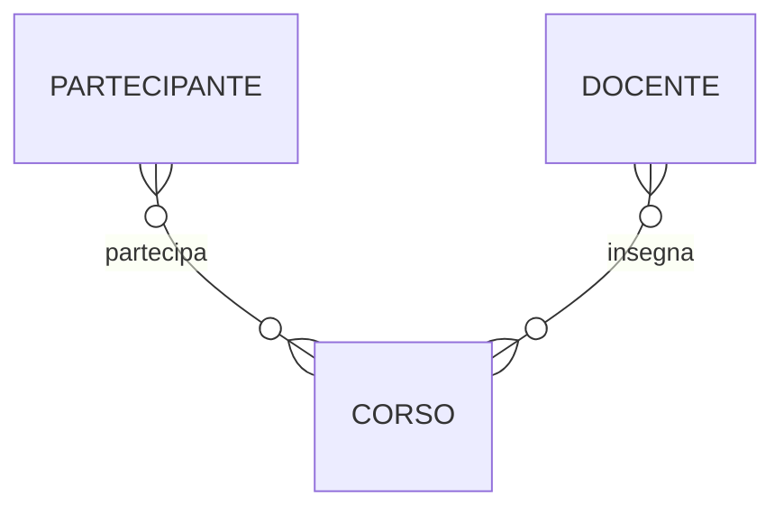
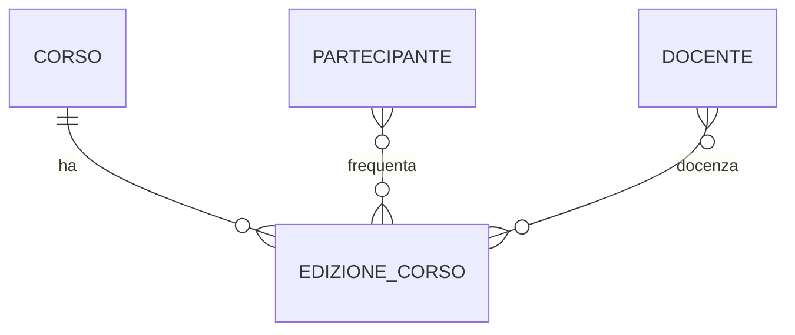
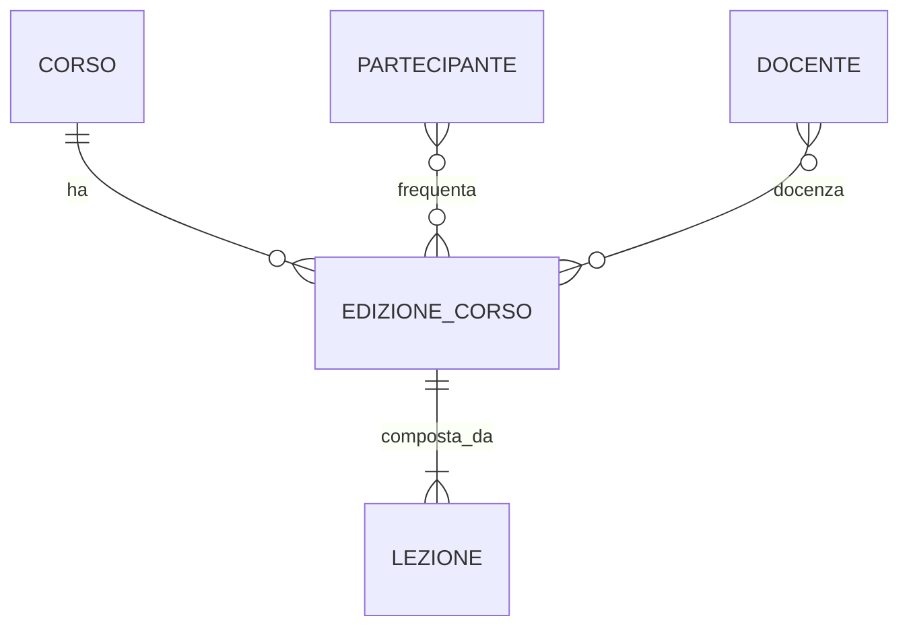
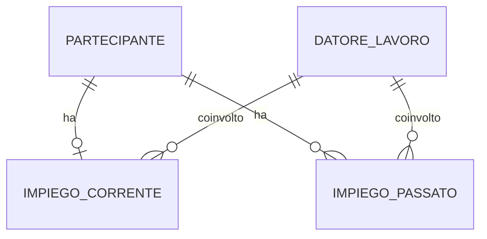
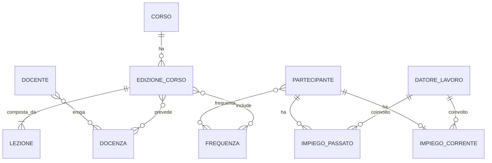
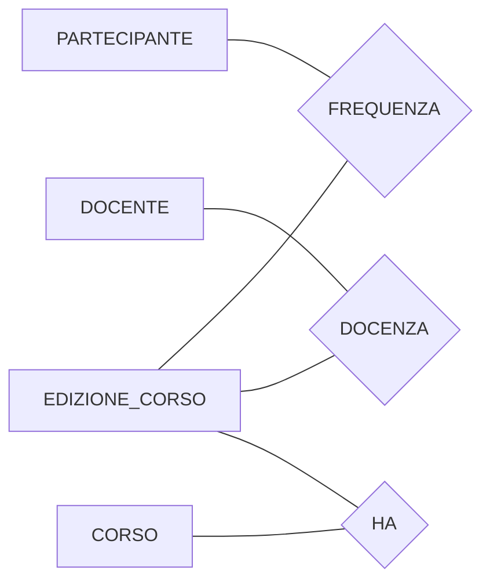

# Diagrammi E-R progressivi

Questo file raccoglie solo i diagrammi, in sequenza, per mostrare la crescita del modello.

## D0 - Schema scheletro

## D1 - Introduzione edizioni

## D2 - Composizione lezioni

## D3 - Storico impieghi

## D4 - Modello ristrutturato finale

## Variante Chen semplificata

