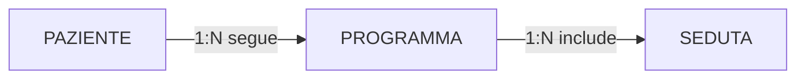
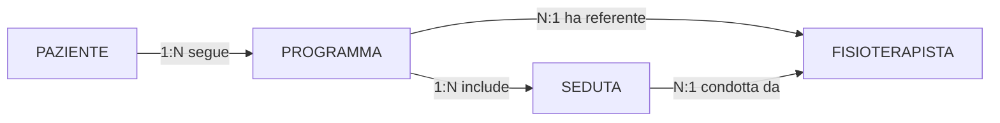
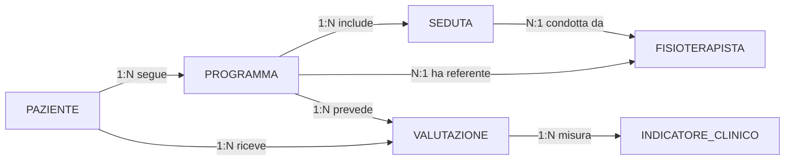
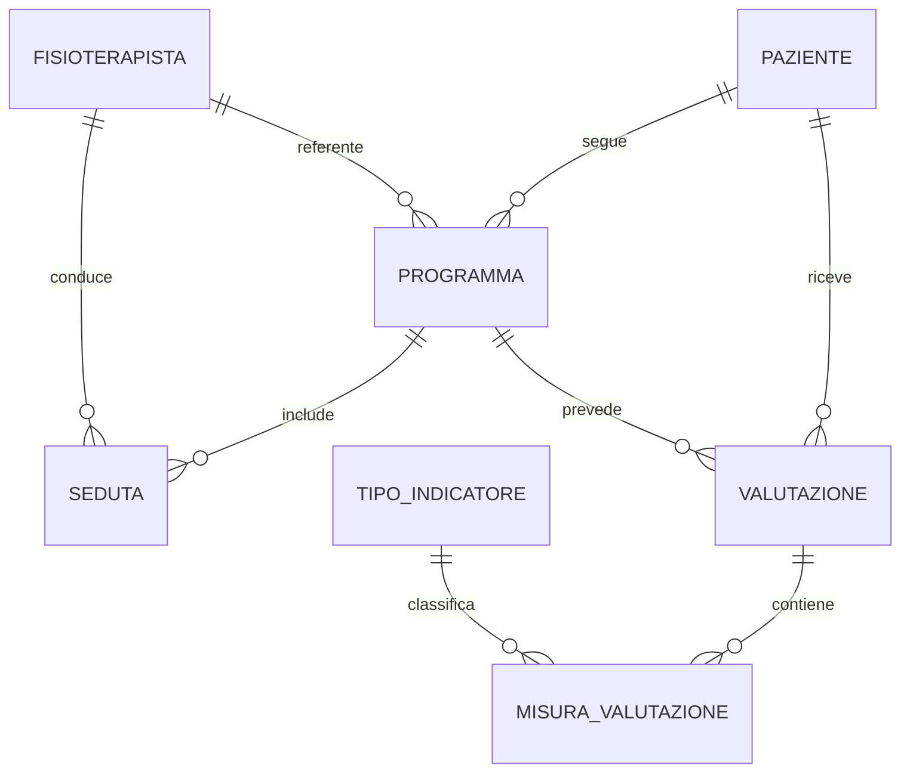

# Esercizio 1 - Sistema per palestra riabilitativa

## Caso di studio
Una palestra riabilitativa lavora con pazienti inviati da specialisti ortopedici, fisiatri o medici sportivi. Ogni paziente viene preso in carico da un fisioterapista referente, segue uno o piu programmi riabilitativi e svolge sedute distribuite nel tempo. Durante il percorso vengono registrate valutazioni iniziali, controlli intermedi e valutazioni finali. Alcuni programmi sono standard, altri sono personalizzati sul singolo paziente. La direzione vuole una base di dati che consenta sia la gestione operativa quotidiana sia il monitoraggio dell'efficacia dei programmi.

## Fase 1 - Raccolta e analisi dei requisiti

### Requisiti generali
La base di dati deve memorizzare:
- dati anagrafici dei pazienti;
- dati dei fisioterapisti e delle relative specializzazioni;
- programmi riabilitativi, con obiettivi clinici, durata prevista e tipologia;
- sedute effettuate, con data, orario, durata, sala e note;
- valutazioni cliniche periodiche, con indicatori misurati e giudizio sintetico.

### Requisiti informativi di dettaglio
1. Ogni paziente e identificato da un codice paziente.
2. Di ogni paziente si registrano nome, cognome, data di nascita, recapiti e diagnosi principale.
3. Ogni fisioterapista e identificato da un codice fisioterapista.
4. Di ogni fisioterapista si memorizzano dati anagrafici, area di specializzazione e data di assunzione.
5. Un paziente puo seguire piu programmi in momenti diversi.
6. Un programma puo essere standard oppure personalizzato.
7. Di ogni programma si registrano obiettivi, data inizio, data fine prevista, stato e numero di sedute previste.
8. Ogni programma comprende piu sedute.
9. Ogni seduta e svolta da un fisioterapista.
10. Ogni seduta riguarda un solo paziente e un solo programma.
11. Per ogni seduta si registrano durata, tipologia attivita, esito e note.
12. Ogni paziente deve avere almeno una valutazione iniziale per ogni programma avviato.
13. Una valutazione puo riportare piu indicatori clinici misurati.
14. Di ogni indicatore si registrano nome, valore, unita di misura e intervallo atteso.
15. Un programma puo chiudersi con esito completato, sospeso o interrotto.

### Requisiti sulle operazioni
Le operazioni richieste con maggiore frequenza sono:
1. registrare un nuovo paziente;
2. aprire un nuovo programma riabilitativo;
3. pianificare una seduta;
4. registrare l'esito di una seduta;
5. consultare il calendario di un fisioterapista;
6. visualizzare il percorso attivo di un paziente;
7. confrontare valutazione iniziale e finale;
8. cercare pazienti inattivi negli ultimi 30 giorni;
9. contare i programmi chiusi per tipologia;
10. misurare il carico di lavoro dei fisioterapisti.

### Assunzioni e volumi iniziali
- pazienti attivi: circa 800;
- fisioterapisti: circa 20;
- programmi aperti in un anno: circa 1500;
- sedute annue: circa 18000;
- valutazioni annue: circa 4000.

## Fase 2 - Progettazione concettuale

### Schema scheletro (D0)
Nel primo passo si costruisce uno schema scheletro che rappresenta il flusso minimo del dominio. L'obiettivo e capire quali sono gli oggetti principali del sistema e come si collegano prima di aggiungere aspetti organizzativi e clinici piu dettagliati.

Significato del passo D0:
- `PAZIENTE` rappresenta la persona che segue un percorso riabilitativo;
- `PROGRAMMA` rappresenta il percorso terapeutico, separato dalla singola esecuzione;
- `SEDUTA` viene modellata come entita distinta, perche il programma comprende piu sedute distribuite nel tempo.

### Evoluzione con il personale sanitario (D1)
Nel secondo passo si aggiunge il fisioterapista. Questa scelta e necessaria per distinguere la responsabilita clinica del percorso dalla conduzione concreta delle sedute. Se il fisioterapista fosse memorizzato come semplice attributo del programma o della seduta, si perderebbe la possibilita di rappresentare la partecipazione dello stesso operatore a molti casi diversi.

Significato del passo D1:
- compare l'entita `FISIOTERAPISTA`;
- la relationship `ha referente` collega il programma a un responsabile clinico;
- la relationship `condotta da` collega ogni seduta all'operatore che la svolge.

### Evoluzione con il monitoraggio clinico (D2)
Nel terzo passo si introduce la parte di monitoraggio. Le valutazioni non sono semplici attributi del paziente, perche hanno data, tipo, esito e una struttura interna articolata. Per lo stesso motivo gli indicatori clinici vengono separati, cosi una valutazione puo contenere piu misure senza ricorrere ad attributi multivalore o ripetuti.

Significato del passo D2:
- `VALUTAZIONE` viene reificata come evento clinico autonomo;
- `INDICATORE_CLINICO` viene separato dal contenitore `VALUTAZIONE`;
- il legame tra `PROGRAMMA` e `VALUTAZIONE` consente di confrontare lo stato del paziente nelle diverse fasi del percorso.

### Evoluzione finale del concettuale (D3)
Nel quarto passo si consolida il modello concettuale. Non si introducono necessariamente nuovi concetti, ma si verifica la coerenza globale del diagramma e si prepara il passaggio alla ristrutturazione logica.

Diagrammi Draw.io progressivi (ER Chen):

Sorgenti modificabili:
- [01-d0-concettuale.drawio](../diagrammi-drawio/esercizi/01-d0-concettuale.drawio)
- [01-d1-concettuale.drawio](../diagrammi-drawio/esercizi/01-d1-concettuale.drawio)
- [01-d2-concettuale.drawio](../diagrammi-drawio/esercizi/01-d2-concettuale.drawio)
- [01-d3-concettuale.drawio](../diagrammi-drawio/esercizi/01-d3-concettuale.drawio)

### Consegna concettuale
Produci uno schema E-R completo con:
- cardinalita minime e massime;
- attributi principali per ogni entita e relationship;
- identificatori candidati;
- indicazione esplicita delle reificazioni introdotte.

## Fase 3 - Progettazione logica

### Analisi delle operazioni e delle ridondanze
Prima della traduzione al relazionale, valuta almeno questi punti:
- il numero di sedute completate di un programma deve essere derivato oppure memorizzato?
- il referente clinico del programma coincide sempre con chi svolge tutte le sedute, oppure no?
- lo stato clinico finale del paziente deve essere derivato dalle valutazioni o registrato separatamente?

### Ristrutturazione richiesta
1. scegli gli identificatori principali;
2. stabilisci se tenere VALUTAZIONE come entita autonoma;
3. discuti se INDICATORE_CLINICO vada modellato come catalogo + occorrenze misurate;
4. traduci il modello in relazioni con PK e FK.

### Spiegazione della ristrutturazione logica
La ristrutturazione logica serve a trasformare il modello concettuale in una struttura piu adatta alla traduzione relazionale.

Passo L1 - Identificatori principali:
- `PAZIENTE(id_paziente)` e `FISIOTERAPISTA(id_fisioterapista)` diventano entita con chiavi semplici e non opzionali;
- `PROGRAMMA(id_programma)` e preferibile a una chiave composta, perche uno stesso paziente puo avere piu programmi in tempi diversi;
- `SEDUTA(id_seduta)` evita di usare data e orario come chiave naturale.

Passo L2 - Separazione catalogo/occorrenza:
- `INDICATORE_CLINICO` puo essere ristrutturato in un catalogo `TIPO_INDICATORE`;
- la singola misurazione viene spostata in una relazione associativa tra `VALUTAZIONE` e `TIPO_INDICATORE`.

Passo L3 - Ridondanze:
- il numero di sedute completate e derivabile dal conteggio delle sedute concluse;
- nel modello logico di base conviene non memorizzarlo, per evitare ridondanza e possibili incoerenze.

Passo L4 - Schema E-R ristrutturato:

Versione Draw.io (SVG):

Sorgente modificabile: [01-er-finale.drawio](../diagrammi-drawio/esercizi/01-er-finale.drawio)

### Output logico richiesto
Presenta:
- tabella dei volumi;
- tabella delle operazioni principali;
- schema E-R ristrutturato;
- schema relazionale finale in forma `Relazione(attributi)`.

## Fase 4 - Progettazione fisica

Per ogni relazione definisci:
- tipo di dato;
- nullabilita;
- eventuali `CHECK`;
- vincoli `UNIQUE`;
- chiavi esterne;
- indici utili alle operazioni frequenti.

Aspetti da discutere:
- indice su `seduta(data, fisioterapista_id)` per agenda operativa;
- indice su `programma(paziente_id, stato)` per percorsi attivi;
- indice su `valutazione(programma_id, data_valutazione)` per confronti temporali.

## Fase 5 - Implementazione

Consegna finale:
- `schema.sql` con DDL completo;
- `seed.sql` con un dataset minimo ma realistico;
- `query.sql` con almeno 8 query operative;
- breve report con test di correttezza.

### Query minime richieste
1. sedute per paziente in un intervallo di date;
2. carico sedute per fisioterapista e settimana;
3. ultimo stato valutativo di ciascun paziente attivo;
4. programmi con piu alto tasso di completamento;
5. confronto tra valutazione iniziale e finale;
6. pazienti inattivi da oltre 30 giorni;
7. numero medio di sedute per tipologia di programma;
8. fisioterapisti con piu programmi contemporaneamente aperti.

## Criteri di valutazione
- continuita e coerenza fra le 5 fasi;
- qualita semantica del modello concettuale;
- solidita della ristrutturazione logica;
- adeguatezza delle scelte fisiche;
- correttezza dell'implementazione SQL.