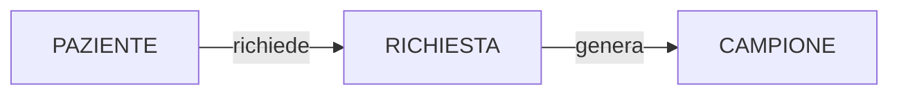
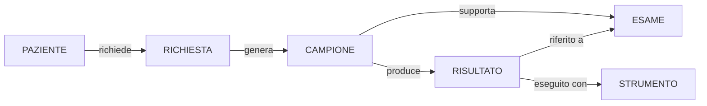
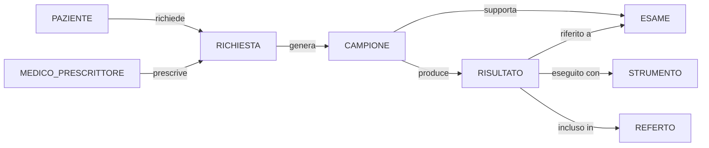
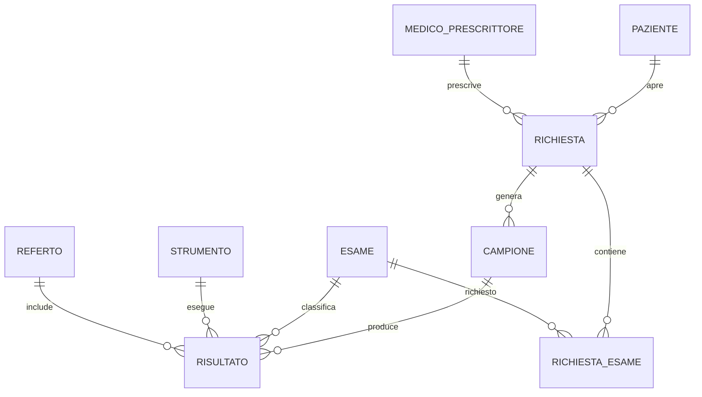

# Esercizio 2 - Laboratorio analisi cliniche

## Caso di studio
Un laboratorio analisi cliniche riceve richieste da medici prescrittori interni ed esterni. Ogni richiesta puo generare uno o piu campioni biologici, ciascun campione puo essere processato per piu esami e i risultati vengono poi raccolti in un referto finale. Il laboratorio vuole tracciare anche gli strumenti usati, i tempi di lavorazione e gli eventuali risultati critici fuori range.

## Fase 1 - Raccolta e analisi dei requisiti

### Requisiti generali
La base di dati deve supportare:
- gestione dei pazienti e delle richieste;
- tracciamento dei campioni;
- catalogo degli esami;
- registrazione dei risultati;
- emissione dei referti;
- monitoraggio dei tempi di esecuzione e del carico strumentale.

### Requisiti informativi di dettaglio
1. Ogni paziente e identificato da un codice paziente.
2. Ogni richiesta ha un codice univoco, data richiesta e medico prescrittore.
3. Una richiesta puo comprendere piu esami.
4. Un campione e identificato da barcode univoco.
5. Di ogni campione si registrano tipo, data prelievo, stato e conservazione.
6. Un campione puo essere utilizzato per piu esami compatibili.
7. Ogni esame appartiene a un catalogo con codice, nome, unita di misura e intervallo di riferimento.
8. Un risultato e associato a un campione, a un esame e a uno strumento.
9. Di ogni risultato si registrano valore, data/ora esecuzione, esito e note.
10. Un referto aggrega piu risultati relativi alla stessa richiesta.
11. Ogni referto ha data emissione e stato.
12. Un risultato puo essere marcato come critico.
13. Gli strumenti hanno matricola, modello, stato e data ultima manutenzione.
14. Un medico prescrittore puo emettere molte richieste.
15. I risultati devono rimanere storicizzati anche dopo l'emissione del referto.

### Requisiti sulle operazioni
1. inserire una nuova richiesta;
2. accettare un campione al banco;
3. associare gli esami al campione;
4. registrare i risultati;
5. emettere un referto;
6. cercare risultati critici;
7. monitorare il tempo medio di refertazione;
8. visualizzare il carico per strumento;
9. analizzare il volume esami per medico prescrittore;
10. recuperare lo storico esami di un paziente.

### Assunzioni e volumi iniziali
- pazienti unici annui: 12000;
- richieste annue: 30000;
- campioni annui: 45000;
- risultati annui: 220000;
- strumenti censiti: 35.

## Fase 2 - Progettazione concettuale

### Schema scheletro (D0)
Nel primo passo si definisce lo schema scheletro. L'obiettivo e distinguere chiaramente il paziente, la richiesta e il campione, cioe gli elementi minimi necessari a descrivere l'inizio del processo diagnostico.

Significato del passo D0:
- `PAZIENTE` e il soggetto clinico a cui si riferiscono i dati;
- `RICHIESTA` rappresenta l'atto prescrittivo/organizzativo;
- `CAMPIONE` rappresenta l'oggetto fisico su cui verranno svolte le analisi.

### Evoluzione con esami e strumenti (D1)
Nel secondo passo si distinguono il tipo di analisi e l'esecuzione concreta. Questa separazione e essenziale, perche uno stesso esame puo essere richiesto molte volte, mentre il risultato e sempre legato a una specifica occorrenza di campione e strumento.

Significato del passo D1:
- `ESAME` e il test di catalogo;
- `RISULTATO` e l'occorrenza reale prodotta su un campione;
- `STRUMENTO` garantisce tracciabilita tecnica e audit operativi.

### Evoluzione con referto e prescrittore (D2)
Nel terzo passo si completa il contesto clinico e documentale. Il medico prescrittore spiega l'origine della richiesta, mentre il referto aggrega piu risultati in un documento con un proprio ciclo di vita.

Significato del passo D2:
- si separa il livello della prescrizione clinica dal livello della refertazione;
- il referto non e un semplice attributo della richiesta, ma un'entita autonoma con data emissione e stato;
- il modello e pronto per l'assegnazione di cardinalita e attributi dettagliati.

### Consegna concettuale
Definisci:
- cardinalita min/max;
- attributi principali;
- vincoli semantici non esprimibili direttamente nel diagramma;
- eventuale distinzione tra catalogo esami e risultati di esame.

## Fase 3 - Progettazione logica

Analizza almeno queste scelte:
- `range_min` e `range_max` vanno nel catalogo esami o nel risultato refertato?
- il referto va modellato come entita autonoma oppure come aggregazione logica dei risultati?
- la relazione tra richiesta ed esami richiesti deve essere mantenuta separata dalla relazione tra campione ed esami eseguiti?

### Spiegazione della ristrutturazione logica
La ristrutturazione logica deve rendere il modello traducibile in tabelle senza perdere l'informazione clinica e operativa.

Passo L1 - Catalogo e occorrenze:
- `ESAME` resta catalogo dei test disponibili;
- `RISULTATO` rappresenta l'esecuzione concreta del test su un campione.

Passo L2 - Richiesto vs eseguito:
- una relazione `RICHIESTA_ESAME` puo rappresentare gli esami richiesti nella prescrizione;
- l'esecuzione reale puo restare separata, cosi si distingue chiaramente tra piano diagnostico e attivita effettivamente svolta.

Passo L3 - Referto come entita autonoma:
- il referto ha attributi propri, come data emissione, stato e responsabile;
- conviene quindi mantenerlo come relazione autonoma nel modello logico.

Passo L4 - Schema E-R ristrutturato:

### Output richiesto
- tabella dei volumi;
- tabella delle operazioni;
- schema E-R ristrutturato;
- schema relazionale con PK/FK e vincoli di integrita.

## Fase 4 - Progettazione fisica

Definisci per ogni tabella:
- tipo dei campi;
- nullabilita;
- `CHECK` su esiti e stati;
- chiavi uniche;
- indici su barcode, esami, data esecuzione, strumento e richiesta.

Discuti in particolare:
- indice su `risultato(esame_id, data_ora)`;
- indice su `campione(barcode)`;
- indice su `referto(data_emissione)`;
- indice su `richiesta(medico_prescrittore_id, data_richiesta)`.

## Fase 5 - Implementazione

Consegna:
- `schema.sql`;
- `seed.sql`;
- `query.sql` con almeno 8 query operative;
- report sintetico di test.

### Query minime richieste
1. turnaround time medio per tipo esame;
2. referti emessi per giorno;
3. esami critici fuori range;
4. carico strumenti per periodo;
5. top medici prescrittori per volume;
6. pazienti con piu di N esami in 12 mesi;
7. richieste ancora senza referto;
8. esami ripetuti sullo stesso paziente entro 7 giorni.

## Criteri di valutazione
- ricchezza e precisione dei requisiti;
- qualita del percorso di modellazione;
- coerenza logica e fisica;
- efficacia delle query finali.
