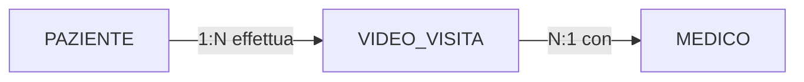
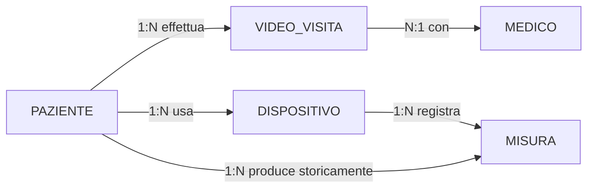
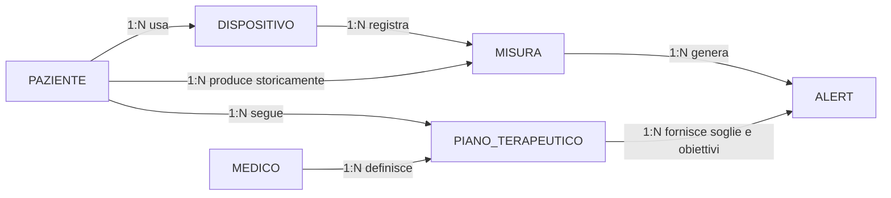
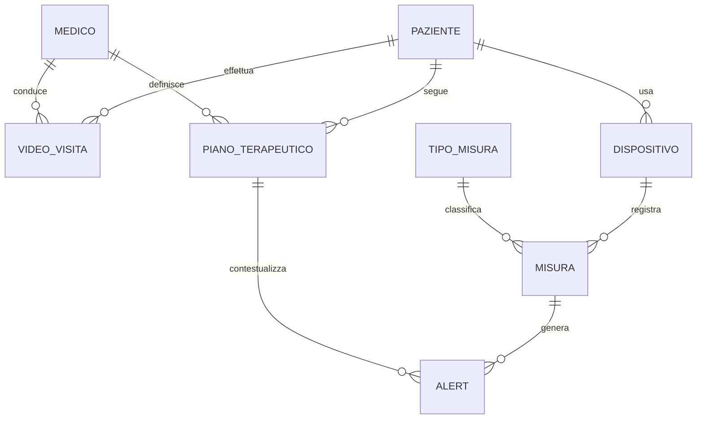

# Esercizio 3 - Piattaforma di telemedicina

## Caso di studio
Una piattaforma di telemedicina consente a pazienti cronici di effettuare video-visite, registrare misure domiciliari tramite dispositivi connessi e seguire piani terapeutici remoti. Il sistema deve gestire alert automatici quando i valori superano soglie cliniche e consentire ai medici di intervenire rapidamente. La base di dati deve sostenere sia l'operativita quotidiana sia l'analisi storica delle condizioni dei pazienti.

## Fase 1 - Raccolta e analisi dei requisiti

### Requisiti informativi
1. Ogni paziente e identificato da un codice paziente.
2. Ogni medico e identificato da un codice medico.
3. Ogni video-visita collega un paziente e un medico in una certa data/ora.
4. Di ogni video-visita si registrano durata, esito e note cliniche.
5. Ogni paziente puo essere associato a uno o piu dispositivi domiciliari.
6. Ogni dispositivo ha matricola, tipo e stato.
7. Una misura registrata e associata a paziente, dispositivo e tipo di parametro.
8. Di ogni misura si memorizzano data/ora, valore, unita e attendibilita.
9. Ogni piano terapeutico appartiene a un paziente e a un medico responsabile.
10. Un piano terapeutico puo prevedere piu obiettivi o prescrizioni.
11. Gli alert sono generati da regole sui valori misurati.
12. Un alert puo essere aperto, preso in carico o chiuso.
13. Ogni alert deve restare storicizzato.
14. Le modifiche cliniche rilevanti devono essere auditabili.
15. Un paziente puo avere piu video-visite nel tempo.

### Requisiti operativi
1. aprire un nuovo piano terapeutico;
2. registrare una video-visita;
3. ricevere una misura da dispositivo;
4. generare e visualizzare alert aperti;
5. vedere l'ultimo valore di un parametro;
6. analizzare i trend settimanali;
7. misurare l'aderenza al piano;
8. verificare i tempi di presa in carico degli alert;
9. visualizzare il carico di video-visite per medico;
10. ricostruire la storia clinica remota di un paziente.

### Volumi indicativi
- pazienti monitorati: 3000;
- medici: 80;
- misure giornaliere: 50000;
- video-visite mensili: 4000;
- alert mensili: 2500.

## Fase 2 - Progettazione concettuale

### Schema scheletro (D0)
Nel primo passo si rappresenta il servizio minimo della piattaforma: la video-visita. Si modellano solo paziente, medico e contatto clinico remoto, senza ancora introdurre monitoraggio continuo o gestione degli alert.

### Evoluzione con dispositivi e misure (D1)
Nel secondo passo la piattaforma evolve in sistema di monitoraggio. Le misure domiciliari non vengono trattate come attributi del paziente, perche sono eventi ad alta frequenza, con timestamp, valore e unita di misura.

### Evoluzione con piani terapeutici e alert (D2)
Nel terzo passo si aggiungono gli elementi decisionali del dominio. Il piano terapeutico fornisce il contesto clinico delle misure, mentre l'alert viene reificato come evento autonomo, perche deve essere gestito operativamente.

Diagrammi Draw.io progressivi (ER Chen):

Sorgenti modificabili:
- [03-d0-concettuale.drawio](../diagrammi-drawio/esercizi/03-d0-concettuale.drawio)
- [03-d1-concettuale.drawio](../diagrammi-drawio/esercizi/03-d1-concettuale.drawio)
- [03-d2-concettuale.drawio](../diagrammi-drawio/esercizi/03-d2-concettuale.drawio)

### Consegna concettuale
Definisci:
- cardinalita min/max;
- attributi principali delle entita;
- eventuali generalizzazioni motivate;
- vincoli semantici non rappresentabili direttamente nel diagramma.

## Fase 3 - Progettazione logica

Analizza e discuti:
- generalizzazione `UTENTE -> PAZIENTE / MEDICO`: mantenerla o eliminarla;
- ridondanza dell'ultimo valore misurato per parametro;
- opportunita di separare catalogo `TIPO_MISURA` dalle singole misure.

### Spiegazione della ristrutturazione logica
La ristrutturazione logica deve privilegiare chiarezza semantica e supporto alle operazioni piu frequenti.

Passo L1 - Generalizzazione utenti:
- se pazienti e medici condividono pochi attributi, la generalizzazione puo essere eliminata;
- in questo scenario conviene mantenere due entita separate, perche i ruoli applicativi sono molto diversi.

Passo L2 - Catalogo dei tipi di misura:
- le misure concrete vengono separate da un catalogo `TIPO_MISURA`;
- questo semplifica controlli, confronti storici e definizione di soglie.

Passo L3 - Alert come oggetto operativo:
- l'alert non e solo una conseguenza logica di una misura fuori soglia;
- deve essere un'entita autonoma, perche va preso in carico, assegnato e chiuso.

Passo L4 - Schema E-R ristrutturato:

Versione Draw.io (SVG):

Sorgente modificabile: [03-er-finale.drawio](../diagrammi-drawio/esercizi/03-er-finale.drawio)

### Output richiesto
- tabella volumi e tabella operazioni;
- schema E-R ristrutturato;
- schema relazionale finale con PK/FK;
- motivazione delle scelte rispetto alle operazioni piu frequenti.

## Fase 4 - Progettazione fisica

Definisci:
- tipi dati per misure numeriche e timestamp;
- indici per query tempo-serie;
- `CHECK` su stati alert e unita di misura;
- strategia minima di audit per modifiche cliniche;
- regole di retention o archiviazione per dati storici.

## Fase 5 - Implementazione

Consegna:
- `schema.sql`;
- `seed.sql`;
- `query.sql` con almeno 8 query;
- report di verifica.

### Query minime richieste
1. ultimo valore per tipo misura e paziente;
2. pazienti con alert aperti;
3. trend settimanale per parametro clinico;
4. medici con maggior numero di video-visite;
5. aderenza al piano terapeutico;
6. tempo medio di presa in carico alert;
7. pazienti con piu di N alert nel mese;
8. misure fuori soglia ancora senza intervento.

## Criteri di valutazione
- gestione corretta della dimensione temporale;
- chiarezza della ristrutturazione logica;
- qualita delle scelte fisiche e delle query.
