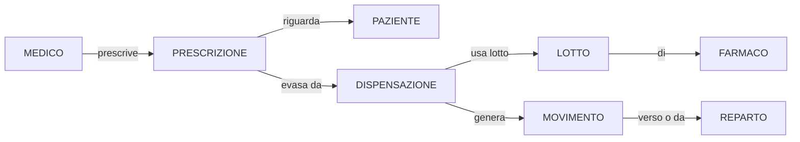
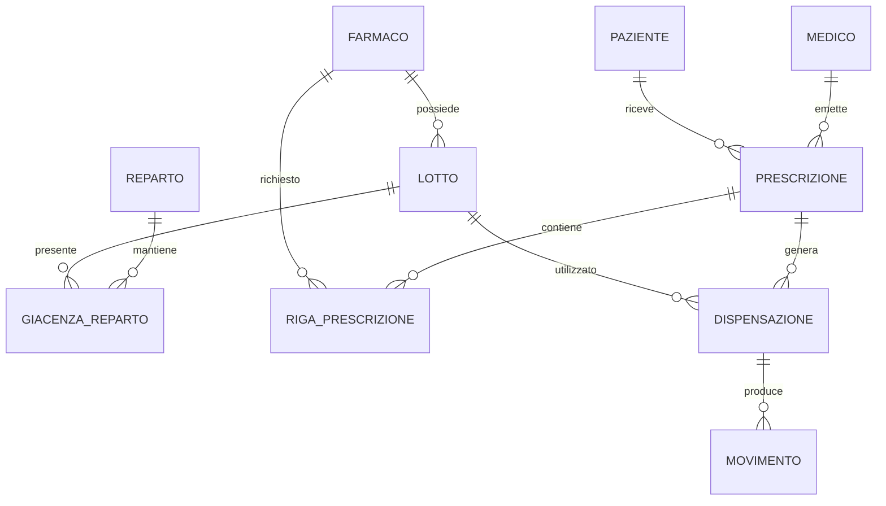

# Esercizio 4 - Farmacia ospedaliera

## Caso di studio
Una farmacia ospedaliera gestisce farmaci, lotti, scorte di reparto, prescrizioni e dispensazioni a pazienti ricoverati o ambulatoriali. Il sistema deve permettere tracciabilita completa dei lotti, controllo delle scadenze, monitoraggio delle giacenze e ricostruzione dei movimenti di magazzino. Inoltre la direzione vuole analizzare i consumi per reparto e individuare rapidamente anomalie inventariali.

## Fase 1 - Raccolta e analisi dei requisiti

### Requisiti informativi
1. Ogni farmaco ha codice, nome commerciale, principio attivo e forma farmaceutica.
2. Un farmaco puo essere disponibile in piu lotti.
3. Ogni lotto ha codice lotto, data scadenza e quantita disponibile.
4. I lotti sono distribuiti in uno o piu reparti.
5. Un reparto puo detenere piu farmaci e piu lotti.
6. Ogni prescrizione e emessa da un medico.
7. Ogni prescrizione riguarda un paziente e uno o piu farmaci.
8. Ogni dispensazione esegue totalmente o parzialmente una prescrizione.
9. Ogni dispensazione deve essere associata al lotto realmente usato.
10. Ogni movimento di magazzino deve restare tracciato.
11. I farmaci equivalenti devono poter essere correlati.
12. Una giacenza puo variare per carico, scarico, trasferimento o rettifica.
13. Ogni paziente puo ricevere piu dispensazioni.
14. Le scorte minime per reparto devono essere controllabili.
15. Le scadenze ravvicinate devono essere monitorate.

### Requisiti operativi
1. registrare l'arrivo di un lotto;
2. distribuire lotti ai reparti;
3. inserire una prescrizione;
4. registrare una dispensazione;
5. consultare i lotti in scadenza;
6. verificare le giacenze per reparto;
7. tracciare tutti i movimenti di un lotto;
8. analizzare il consumo per farmaco;
9. confrontare giacenza teorica e inventario;
10. trovare farmaci equivalenti disponibili.

### Volumi indicativi
- farmaci a catalogo: 2500;
- lotti attivi: 9000;
- reparti: 35;
- prescrizioni mensili: 18000;
- movimenti di magazzino mensili: 50000.

## Fase 2 - Progettazione concettuale

### Schema scheletro (D0)
Lo schema scheletro rappresenta il cuore logistico del dominio: farmaco, lotto e reparto. In questa fase si fissano le risorse materiali del sistema prima di introdurre i processi clinici e amministrativi.

### Evoluzione con prescrizioni (D1)
Nel secondo passo si introduce la prescrizione, che collega il processo logistico al processo clinico. Il farmaco resta distinto dal lotto, perche la prescrizione riguarda il medicinale, mentre il lotto sara necessario per la tracciabilita di cio che viene davvero dispensato.

### Evoluzione con paziente, dispensazione e movimenti (D2)
Nel terzo passo si completa la catena di tracciabilita. La dispensazione viene reificata come evento autonomo, perche ha attributi propri, puo essere parziale e deve collegare prescrizione, paziente, lotto e movimenti di magazzino.

### Consegna concettuale
Definisci:
- cardinalita min/max;
- attributi principali delle entita e delle relationship rilevanti;
- eventuali self-relationship o generalizzazioni;
- vincoli semantici non esprimibili direttamente nel diagramma.

## Fase 3 - Progettazione logica

Affronta almeno:
- ridondanza di giacenza corrente;
- traduzione delle prescrizioni composte da piu righe farmaco;
- scelta degli identificatori principali per lotto, movimento e dispensazione;
- eventuale accorpamento di alcune relationship 1:N.

### Spiegazione della ristrutturazione logica
La ristrutturazione logica deve rendere il modello traducibile in tabelle e, allo stesso tempo, garantire la tracciabilita completa richiesta dal dominio.

Passo L1 - Righe di prescrizione:
- una prescrizione che contiene piu farmaci richiede una relazione `RIGA_PRESCRIZIONE`;
- questa scelta evita gruppi ripetuti e consente una traduzione relazionale corretta.

Passo L2 - Giacenza corrente:
- la giacenza puo essere derivata dai movimenti;
- se si decide di materializzarla, conviene farlo in una relazione di stato distinta e controllata.

Passo L3 - Lotto e dispensazione:
- `LOTTO` deve restare distinto da `FARMACO`;
- la dispensazione deve referenziare esplicitamente il lotto usato, per soddisfare la tracciabilita.

Passo L4 - Schema E-R ristrutturato:

### Output richiesto
- tabella volumi;
- tabella operazioni;
- schema E-R ristrutturato;
- schema relazionale finale con PK/FK.

## Fase 4 - Progettazione fisica

Definisci:
- tipi numerici per quantita e dosi;
- `CHECK` su scadenze e quantita non negative;
- indici per inventario, scadenze e tracciabilita lotto;
- vincoli di referenzialita fra dispensazioni, lotti, farmaci e reparti.

## Fase 5 - Implementazione

Consegna:
- `schema.sql`;
- `seed.sql`;
- `query.sql` con almeno 8 query;
- report di test.

### Query minime richieste
1. lotti in scadenza entro 30 giorni;
2. consumo farmaco per reparto;
3. dispensazioni per paziente;
4. discrepanze inventariali;
5. top farmaci per rotazione;
6. tracciabilita completa di un lotto;
7. giacenze sotto scorta minima;
8. prescrizioni ancora non completamente evase.

## Criteri di valutazione
- completezza della catena di tracciabilita;
- correttezza delle scelte logiche;
- adeguatezza di indici e vincoli;
- qualita delle query operative.
