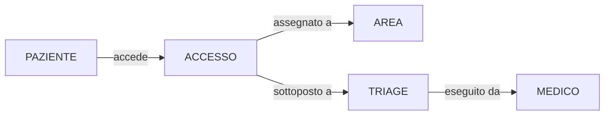
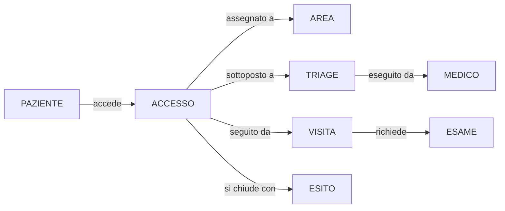
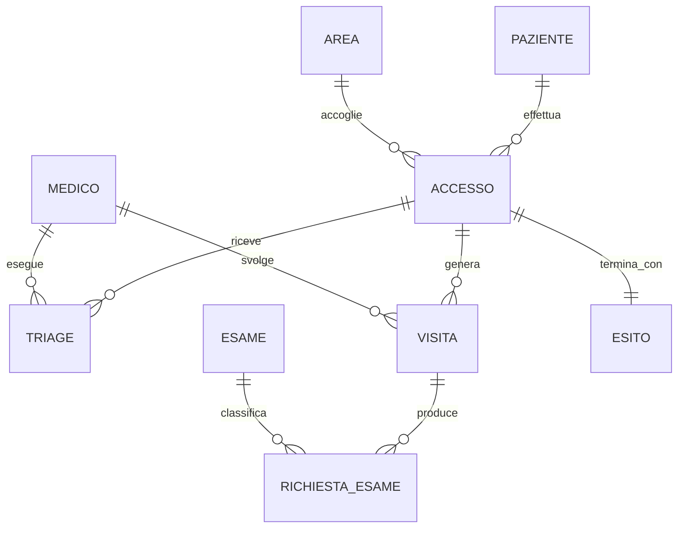

# Esercizio 5 - Gestione pronto soccorso

## Caso di studio
Il pronto soccorso di un ospedale deve gestire accessi in urgenza, triage iniziale e rivalutazioni, presa in carico medica, esami diagnostici, eventuale ricovero o dimissione. La direzione sanitaria vuole una base di dati che supporti il monitoraggio in tempo reale del backlog, la misura dei tempi di attesa e l'analisi dei ritorni in pronto soccorso entro pochi giorni.

## Fase 1 - Raccolta e analisi dei requisiti

### Requisiti informativi
1. Ogni paziente e identificato da un codice paziente.
2. Ogni accesso al pronto soccorso ha un codice accesso univoco.
3. Un paziente puo effettuare piu accessi nel tempo.
4. Di ogni accesso si registrano data/ora arrivo, modalita di arrivo e motivo.
5. Ogni accesso e sottoposto a triage iniziale.
6. Uno stesso accesso puo avere piu rivalutazioni di triage.
7. Ogni triage assegna un codice priorita e una descrizione clinica sintetica.
8. Ogni accesso viene preso in carico da un medico e assegnato a un'area.
9. Durante l'accesso possono essere richiesti piu esami.
10. Ogni accesso termina con un esito: dimissione, ricovero o trasferimento.
11. Devono essere tracciate data/ora di ogni fase significativa.
12. Le aree assistenziali sono identificate e descrivibili.
13. I medici possono operare in piu aree su turni diversi.
14. Lo storico accessi del paziente deve rimanere consultabile.
15. I tempi di attesa devono poter essere calcolati per codice triage.

### Requisiti operativi
1. registrare un nuovo accesso;
2. inserire il triage iniziale;
3. registrare una rivalutazione;
4. assegnare accesso a area e medico;
5. registrare esami richiesti;
6. chiudere un accesso con esito;
7. monitorare backlog per priorita;
8. misurare tempi medi di attesa;
9. individuare riammissioni entro 72 ore;
10. analizzare distribuzione esiti per fascia oraria.

### Volumi indicativi
- accessi giornalieri: 220;
- accessi mensili: 6500;
- rivalutazioni mensili: 2500;
- esami richiesti mensili: 9000;
- medici coinvolti: 70.

## Fase 2 - Progettazione concettuale

### Schema scheletro (D0)
Nel primo passo si rappresenta l'evento centrale del dominio: l'accesso. Tutte le fasi successive vengono viste come dettagli temporali e operativi che si sviluppano a partire da questa entita.

### Evoluzione con triage e aree (D1)
Nel secondo passo il triage viene separato dall'accesso, perche puo essere ripetuto e possiede attributi propri come codice priorita, orario e descrizione clinica. L'area viene introdotta per modellare la collocazione organizzativa del paziente.

### Evoluzione con visita, esami ed esito (D2)
Nel terzo passo si rappresenta l'intero percorso del paziente in pronto soccorso: ingresso, valutazione, presa in carico medica, richiesta di esami e chiusura del caso. L'esito viene trattato come elemento autonomo della conclusione del processo.

### Consegna concettuale
Definisci:
- cardinalita min/max;
- attributi principali delle entita;
- eventuali reificazioni introdotte;
- vincoli semantici non esprimibili direttamente nel diagramma.

## Fase 3 - Progettazione logica

Discuti almeno:
- ridondanza del tempo di attesa, che puo essere derivato dagli istanti registrati;
- gestione della storicita delle rivalutazioni;
- scelta identificatori principali per accesso, triage, visita ed esame richiesto;
- accorpamenti possibili nelle relazioni 1:N.

### Spiegazione della ristrutturazione logica
La ristrutturazione logica deve rendere il modello traducibile in tabelle e, al tempo stesso, preservare la dimensione temporale del percorso di pronto soccorso.

Passo L1 - Rivalutazioni di triage:
- il triage va trattato come entita con molte occorrenze per lo stesso accesso;
- questa scelta consente di memorizzare la storia dei cambi di priorita.

Passo L2 - Tempo di attesa:
- il tempo di attesa e derivabile dagli istanti registrati;
- nel modello logico base conviene non memorizzarlo, per evitare ridondanze.

Passo L3 - Esami richiesti:
- la visita puo generare piu richieste di esame;
- e utile separare il catalogo `ESAME` dalle singole richieste operative.

Passo L4 - Schema E-R ristrutturato:

### Output richiesto
- tabella dei volumi;
- tabella delle operazioni;
- schema E-R ristrutturato;
- schema relazionale finale.

## Fase 4 - Progettazione fisica

Definisci:
- tipi per timestamp e stati accesso;
- `CHECK` su codici triage ed esiti;
- indici per ricerche in tempo reale su accessi aperti;
- strategia minima di conservazione storico.

## Fase 5 - Implementazione

Consegna:
- `schema.sql`;
- `seed.sql`;
- `query.sql` con almeno 8 query;
- breve report di test.

### Query minime richieste
1. tempi medi di attesa per codice triage;
2. accessi in carico per area;
3. riammissioni entro 72 ore;
4. distribuzione esiti per fascia oraria;
5. pazienti con piu accessi in 30 giorni;
6. backlog corrente per priorita;
7. accessi aperti oltre la soglia obiettivo;
8. triage rivalutati almeno due volte.

## Criteri di valutazione
- correttezza del modello temporale;
- coerenza fra fasi;
- efficacia delle scelte logiche e fisiche;
- qualita delle query operative.