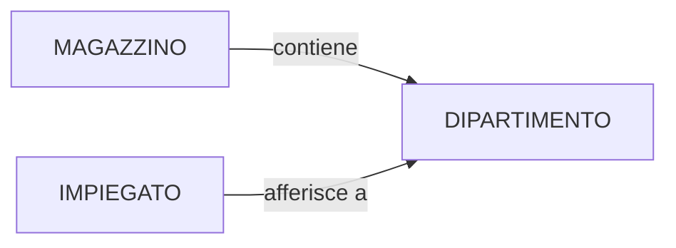
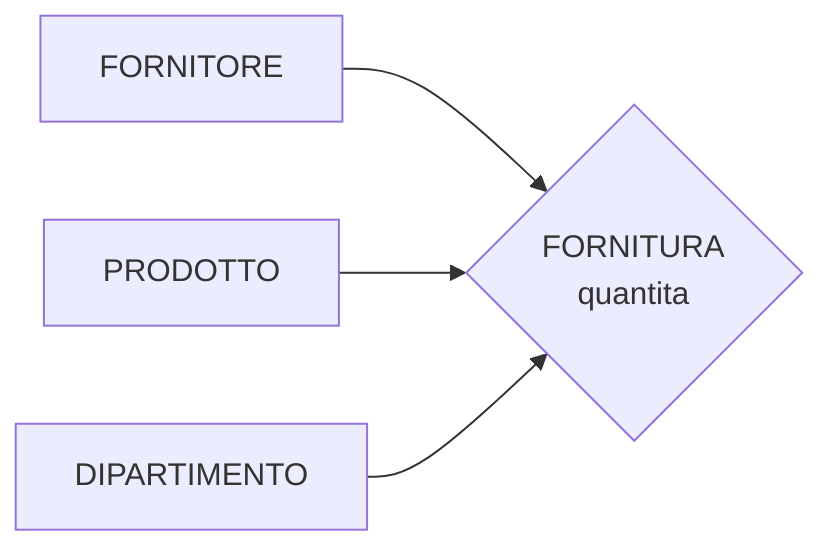
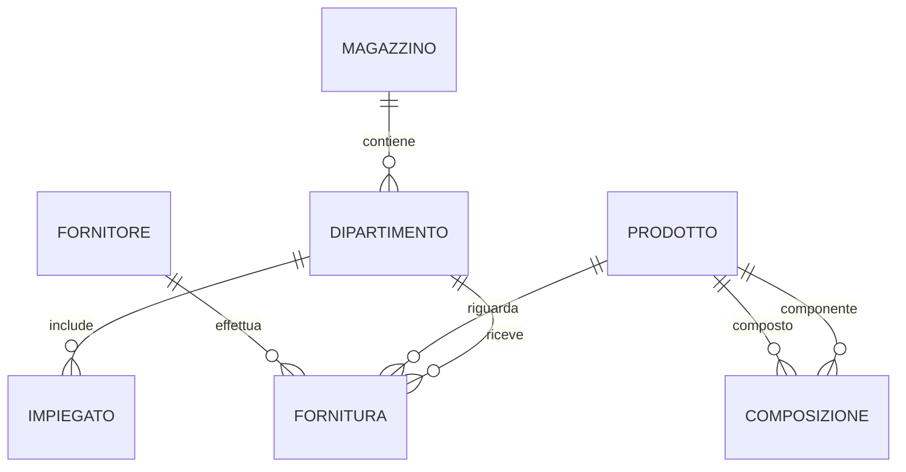

# Esercizio 6 - CityLogistics

## Caso di studio
La societa CityLogistics deve gestire consegne urbane tra magazzini e negozi. Il database deve rappresentare magazzini, dipartimenti interni, impiegati, prodotti, composizioni di prodotti complessi e forniture effettuate dai fornitori ai dipartimenti.

La realta da modellare e riassunta nei seguenti vincoli principali:
- ogni magazzino ha codice univoco, indirizzo (via, CAP) e citta;
- in ogni magazzino esistono piu dipartimenti, identificati per nome solo all'interno del magazzino;
- ogni impiegato appartiene a un solo dipartimento;
- un prodotto puo essere composto da altri prodotti (relazione ricorsiva);
- la fornitura collega contemporaneamente fornitore, prodotto e dipartimento, con quantita consegnata.

## Fase 1 - Raccolta e analisi dei requisiti

### Requisiti informativi
1. MAGAZZINO e identificato da `cod_magazzino`.
2. MAGAZZINO ha attributo composto `indirizzo = (via, cap)`.
3. MAGAZZINO ha `citta`.
4. DIPARTIMENTO ha `nome_dipartimento`.
5. DIPARTIMENTO non e identificabile globalmente solo con il nome.
6. DIPARTIMENTO e identificato esternamente da `(cod_magazzino, nome_dipartimento)`.
7. IMPIEGATO e identificato da `codice_fiscale`.
8. IMPIEGATO ha `cognome`.
9. IMPIEGATO ha `data_inizio_contratto`.
10. Ogni IMPIEGATO afferisce a un solo DIPARTIMENTO.
11. PRODOTTO e identificato da `cod_prodotto`.
12. PRODOTTO ha `nome_prodotto` e `costo`.
13. FORNITORE e identificato da `piva`.
14. FORNITORE ha `nome_fornitore`.
15. FORNITURA e una relazione ternaria fra FORNITORE, PRODOTTO e DIPARTIMENTO.
16. FORNITURA ha attributo proprio `quantita`.
17. COMPOSIZIONE e una relazione ricorsiva su PRODOTTO.
18. COMPOSIZIONE distingue i ruoli `composto` e `componente`.

### Requisiti operativi
1. inserire un nuovo magazzino;
2. censire dipartimenti per magazzino;
3. assegnare impiegati ai dipartimenti;
4. inserire e aggiornare il catalogo prodotti;
5. definire la composizione dei kit;
6. registrare una fornitura;
7. ricostruire tutte le forniture per dipartimento;
8. ottenere tutti i componenti di un prodotto kit;
9. analizzare fornitori per volume consegnato;
10. controllare dipartimenti senza personale.

### Volumi indicativi
- magazzini: 25;
- dipartimenti: 220;
- impiegati: 1500;
- prodotti: 12000;
- fornitori: 900;
- forniture annuali: 180000.

## Fase 2 - Progettazione concettuale

### Schema scheletro (D0)
Nel primo passo si individuano solo le entita principali e gli attributi chiave. Le chiavi primarie vanno evidenziate nella tua rappresentazione grafica finale con il simbolo di identificatore (nel tuo editor grafico puoi usare il punto pieno).

```mermaid
flowchart LR
    M[MAGAZZINO\nPK: cod_magazzino\nindirizzo(via, cap)\ncitta]
    D[DIPARTIMENTO\n(nome_dipartimento)]
    I[IMPIEGATO\nPK: codice_fiscale\ncognome\ndata_inizio_contratto]
    P[PRODOTTO\nPK: cod_prodotto\nnome\ncosto]
    F[FORNITORE\nPK: piva\nnome_fornitore]
```

Spiegazione D0:
- si riconoscono le entita autonome del dominio;
- si segnala l'attributo composto `indirizzo` del magazzino;
- si anticipa che `DIPARTIMENTO` ha identificazione esterna.

### Evoluzione relazioni base e identificazione esterna (D1)
Nel secondo passo si inseriscono le relazioni strutturali di appartenenza e afferenza. `DIPARTIMENTO` viene identificato nel contesto del magazzino.



Spiegazione D1:
- `MAGAZZINO` - `DIPARTIMENTO`: relazione 1:N;
- identificazione esterna del dipartimento: chiave logica `(cod_magazzino, nome_dipartimento)`;
- `IMPIEGATO` - `DIPARTIMENTO`: relazione N:1 (ogni impiegato in un solo dipartimento).

### Evoluzione con relazione ricorsiva su PRODOTTO (D2)
Nel terzo passo si inserisce la composizione dei prodotti complessi.

```mermaid
flowchart LR
    P1[PRODOTTO (composto)] -->|composizione| P2[PRODOTTO (componente)]
```

Spiegazione D2:
- la relazione e ricorsiva sulla stessa entita `PRODOTTO`;
- i ruoli sono essenziali: `composto` e `componente`;
- opzionalmente puoi aggiungere un attributo della relazione, ad esempio `qta_componente`.

### Evoluzione con relazione ternaria FORNITURA (D3)
Nel quarto passo si modella la fornitura come relazione n-aria, evitando di spezzarla in tre binarie indipendenti che perderebbero il significato congiunto dell'evento di consegna.



Spiegazione D3:
- FORNITURA collega contemporaneamente fornitore, prodotto e dipartimento;
- `quantita` appartiene alla relazione, non alle singole entita;
- il fatto elementare e: "quel fornitore ha consegnato quel prodotto a quel dipartimento in quella quantita".

### Consegna concettuale
Produci il diagramma ER finale completo con:
- attributi (incluso composto `indirizzo`);
- identificatori primari;
- identificazione esterna del dipartimento;
- relazione ricorsiva con ruoli;
- relazione ternaria FORNITURA con attributo `quantita`;
- cardinalita minime e massime su ogni ramo.

## Fase 3 - Progettazione logica

### Ristrutturazione richiesta
1. definisci le chiavi primarie relazionali;
2. traduci identificazione esterna del dipartimento;
3. traduci la relazione ricorsiva dei prodotti;
4. traduci la relazione ternaria FORNITURA;
5. specifica cardinalita min/max trasformate in vincoli di nullabilita e FK.

### Spiegazione della ristrutturazione logica
Passo L1 - Magazzino e dipartimento:
- `MAGAZZINO(cod_magazzino, via, cap, citta)`;
- `DIPARTIMENTO(cod_magazzino, nome_dipartimento, ...)` con PK composta `(cod_magazzino, nome_dipartimento)`.

Passo L2 - Impiegato:
- `IMPIEGATO(codice_fiscale, cognome, data_inizio_contratto, cod_magazzino, nome_dipartimento)`;
- FK composta verso `DIPARTIMENTO`.

Passo L3 - Composizione ricorsiva:
- `COMPOSIZIONE(cod_prodotto_composto, cod_prodotto_componente, qta_componente)`;
- entrambe le colonne sono FK verso `PRODOTTO`.

Passo L4 - Fornitura ternaria:
- `FORNITURA(piva, cod_prodotto, cod_magazzino, nome_dipartimento, quantita, data_fornitura)`;
- tutte le dimensioni dell'evento restano nella stessa relazione.

Passo L5 - Schema E-R ristrutturato:



### Output richiesto
- tabella dei volumi;
- tabella delle operazioni;
- schema E-R ristrutturato;
- schema relazionale finale con PK/FK.

## Fase 4 - Progettazione fisica

Definisci:
- domini dati (`VARCHAR`, `DATE`, `DECIMAL`, `INT`);
- `CHECK` su `quantita > 0` e `costo >= 0`;
- indici su FK principali;
- indici per query frequenti: forniture per dipartimento, forniture per fornitore, composizione prodotto;
- vincoli `NOT NULL` coerenti con cardinalita minime pari a 1.

## Fase 5 - Implementazione

Consegna:
- `schema.sql`;
- `seed.sql`;
- `query.sql` con almeno 8 query;
- breve report di test.

### Query minime richieste
1. elenco dipartimenti per magazzino;
2. impiegati per dipartimento;
3. componenti di un prodotto kit;
4. forniture ricevute da un dipartimento nel periodo;
5. totale quantita consegnata per fornitore;
6. totale quantita consegnata per prodotto;
7. dipartimenti senza impiegati;
8. prodotti mai forniti.

## Criteri di valutazione
- correttezza dei costrutti concettuali (composto, esterna, ricorsiva, ternaria);
- qualita della ristrutturazione logica;
- coerenza tra cardinalita e vincoli relazionali;
- efficacia delle query finali.
