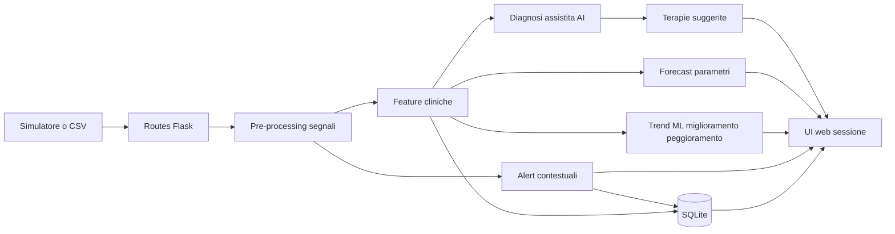
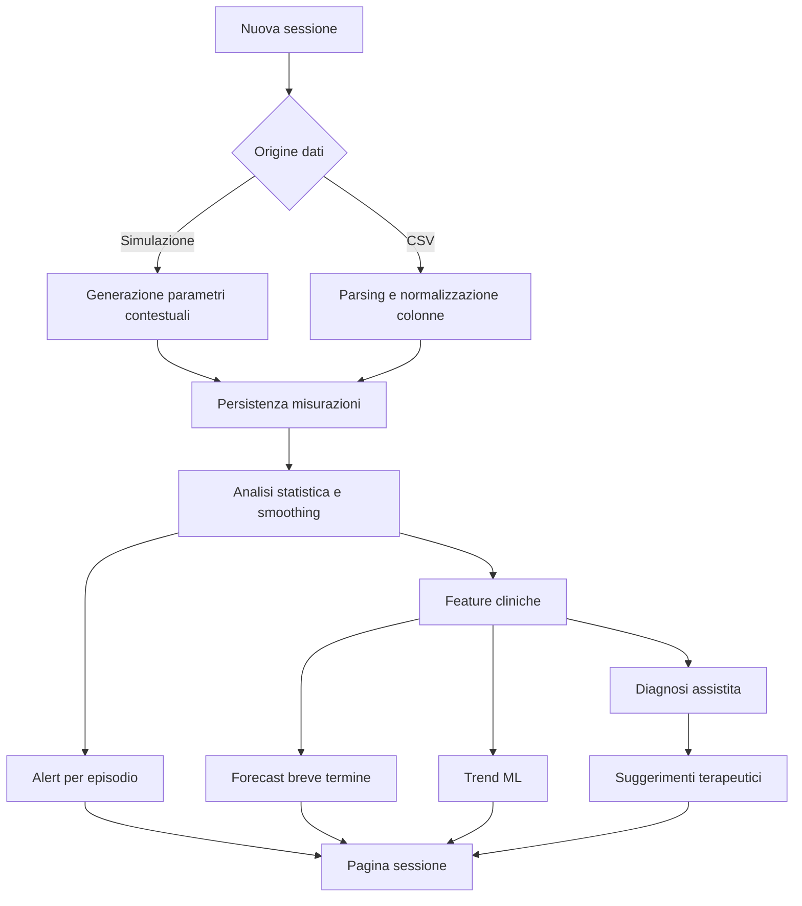
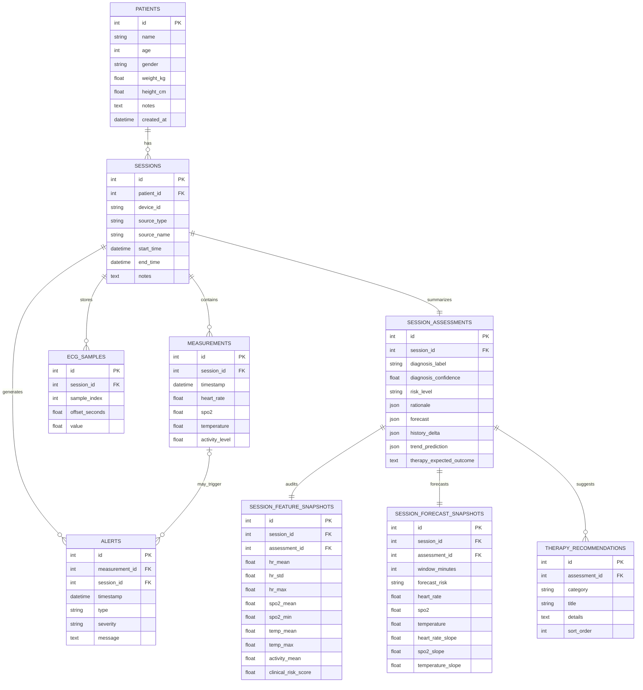
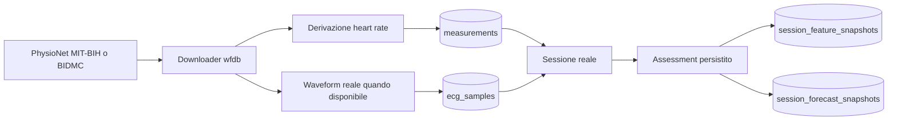

# HealthMonitor IoT

Applicazione web per telemonitoraggio biomedico con supporto decisionale clinico, sviluppata come elaborato progettuale per il corso di Informatica Biomedica.

Il sistema non si limita a visualizzare parametri simulati: acquisisce sessioni di monitoraggio da simulatori o CSV, le memorizza su database, esegue analisi dei segnali, produce alert contestuali, propone una diagnosi assistita, suggerisce azioni terapeutiche coerenti con il contesto clinico e stima l'evoluzione a breve termine con un componente di machine learning.

## Obiettivo del progetto

L'obiettivo è modellare un workflow realistico di telemedicina domiciliare o di follow-up post dimissione:

- acquisizione di segnali da dispositivi medicali differenti
- storicizzazione delle sessioni di uno stesso paziente
- analisi multimodale di frequenza cardiaca, SpO₂, temperatura, attività ed ECG sintetico
- generazione di alert clinicamente sensati a livello di episodio
- supporto alle decisioni tramite inferenza explainable e previsione ML di miglioramento o peggioramento

## Contesto scientifico

Il progetto si colloca nel filone del telemonitoraggio remoto del paziente e dei sistemi IoT sanitari, con attenzione a storicizzazione, analisi dei segnali e supporto alle decisioni cliniche.

## Funzionalità principali

| Area | Implementazione |
|---|---|
| Gestione pazienti | Anagrafica, BMI, note cliniche, storico sessioni |
| Acquisizione dati | Simulazione contestuale o upload CSV |
| Dispositivi | Catalogo device selezionabili con capacità diverse |
| Segnali | FC, SpO₂, temperatura, attività, ECG sintetico per device supportati |
| Analisi | Smoothing, statistiche, distribuzioni, confronto con baseline storico |
| Alert | Alert contestuali e aggregati per episodio, non per singolo campione |
| Diagnosi AI | Classificazione explainable del pattern clinico prevalente |
| Terapie suggerite | Raccomandazioni contestuali non prescrittive |
| Timeline terapeutica | Evoluzione longitudinale del paziente nel tempo |
| Forecast | Previsione a 30 minuti dei parametri e trend ML di esito |
| Visualizzazione | Dashboard, time series, box plot, pie chart, strip ECG |
| Database | SQLite relazionale con assessment persistiti, ECG e query di esempio |
| Audit completo | Feature estratte e forecast numerici persistiti in tabelle dedicate |
| Reportistica | Export PDF della timeline terapeutica e del report di sessione |
| API | Endpoint JSON per statistiche e dati di sessione |

## Stack tecnologico

- Python 3.9+
- Flask 3
- Flask-SQLAlchemy
- NumPy, SciPy, Pandas
- scikit-learn
- wfdb
- ReportLab
- Bootstrap 5
- Plotly.js
- SQLite

## Architettura applicativa



## Flusso logico del sistema



## Modello dati e database

Lo schema relazionale è progettato per supportare sia la storicizzazione delle sessioni sia l'analisi longitudinale del paziente, compreso l'audit completo delle feature cliniche estratte e dei forecast numerici.



Versione SQL documentata: [database/schema.sql](/Users/lucadagati/Progetto_Biomed/database/schema.sql)

## Catalogo dispositivi

Il sistema gestisce dispositivi medicali con caratteristiche diverse.

| Device | Segnali | ECG | Uso tipico |
|---|---|---|---|
| Smartwatch Vitals S2 | FC, SpO₂, temperatura, attività | No | wellness e monitoraggio domiciliare leggero |
| Chest Strap ECG Pro | FC, SpO₂, temperatura, attività, ECG | Sì | sospette aritmie e monitoraggio sportivo-clinico |
| Bedside Monitor M7 | FC, SpO₂, temperatura, attività, ECG | Sì | setting clinico o subacuto |
| Home Patch One | FC, temperatura, attività, ECG | Sì | telemonitoraggio continuativo domiciliare |
| PhysioNet MIT-BIH ECG | FC derivata + ECG reale | Sì | import da dataset pubblico reale |
| PhysioNet BIDMC Vitals | FC derivata da PPG + respirazione reale | No | import di vital signs reali |

## Analisi dei segnali

Il modulo di processamento implementa:

- smoothing con moving average
- statistiche descrittive per ogni canale
- estrazione di feature cliniche di sessione
- generazione di un tracciato ECG sintetico coerente con FC, variabilità e device
- confronto con il baseline storico del paziente

## Alert clinici

Gli alert non sono più generati per ogni campione fuori soglia. La logica corrente:

- usa soglie contestuali all'attività
- aggrega campioni consecutivi in episodi clinicamente significativi
- distingue warning e critical
- introduce rilevazione di pattern compatibili con sospetta aritmia

Questo rende il progetto più coerente con un caso d'uso reale di telemonitoraggio, dove il rumore fisiologico non deve trasformarsi in un'esplosione di falsi positivi.

## Diagnosi assistita e supporto terapeutico

Per ogni sessione il sistema calcola:

- classificazione prevalente del pattern clinico
- razionale testuale explainable
- forecast dei parametri a 30 minuti
- previsione ML del trend di esito: miglioramento, stabile o peggioramento
- suggerimenti terapeutici o di gestione coerenti con il contesto

Le principali etichette cliniche prodotte sono:

- stato fisiologico stabile
- risposta da esercizio
- stress autonomico
- sospetta aritmia
- rischio respiratorio
- rischio infettivo
- profilo sonno/riposo

I suggerimenti terapeutici sono intenzionalmente formulati come supporto non prescrittivo, utile ai fini didattici. Non sostituiscono una decisione clinica reale.

Inoltre il sistema salva nel database, per ogni sessione:

- diagnosi AI persistita
- trend prediction ML persistita
- outcome atteso persistito
- raccomandazioni terapeutiche persistite come entità separate
- feature estratte persistite come snapshot auditabile
- forecast numerici persistiti come snapshot auditabile

## Machine learning per il trend clinico

Il modulo AI usa due livelli:

1. inferenza clinica explainable basata su regole e feature fisiologiche
2. classificazione ML del trend clinico tramite RandomForestClassifier, addestrato sulle transizioni tra sessioni storiche del paziente

Se il paziente non ha abbastanza storico, il sistema usa un fallback rule-based basato su score di rischio clinico aggregato.

Quando invece sono disponibili abbastanza transizioni longitudinali nel dataset, il sistema allena un classificatore RandomForest sulle sessioni persistite e riutilizza il modello per stimare il trend atteso della sessione corrente.

## Dataset pubblici reali

Per ridurre la dipendenza dalla simulazione sintetica è stata aggiunta una pagina dedicata all'importazione di dataset pubblici reali.

Dataset attualmente integrato:

- PhysioNet MIT-BIH Arrhythmia Database
- PhysioNet BIDMC PPG and Respiration Dataset

La pagina dedicata consente di:

- selezionare un paziente già presente nel sistema
- scegliere un record reale del dataset ECG o di vital signs
- importare una finestra temporale del segnale
- persistire nel database sia le misurazioni derivate sia l'eventuale waveform disponibile
- riutilizzare lo stesso workflow di alert, diagnosi AI, terapie e trend ML



### Feature usate dal modello di trend

- media e deviazione standard della frequenza cardiaca
- media e minimo della saturazione
- media e massimo della temperatura
- attività media
- numero di alert warning e critical
- numerosità della sessione

### Output del modello

- etichetta predetta: miglioramento, stabile, peggioramento
- confidenza
- distribuzione delle probabilità per classe
- numero di transizioni storiche disponibili per l'addestramento

## Dataset demo

Il seed iniziale genera un dataset longitudinale utile per dimostrare la parte AI.

- 18 pazienti
- 58 sessioni
- 6 dispositivi differenti incluse 2 sorgenti PhysioNet
- oltre 12.000 misurazioni
- scenari misti: normale, stress, sonno, esercizio, aritmia

## Struttura del progetto

```text
Progetto_Biomed/
├── app/
│   ├── __init__.py
│   ├── ai.py
│   ├── devices.py
│   ├── models.py
│   ├── pdf_reports.py
│   ├── processing.py
│   ├── public_datasets.py
│   ├── routes.py
│   ├── simulator.py
│   ├── static/
│   │   ├── css/style.css
│   │   └── sample_data.csv
│   └── templates/
│       ├── base.html
│       ├── index.html
│       ├── patients.html
│       ├── add_patient.html
│       ├── patient_detail.html
│       ├── patient_timeline.html
│       ├── public_datasets.html
│       ├── simulate.html
│       ├── upload.html
│       └── session_analysis.html
├── database/
│   └── schema.sql
├── init_db.py
├── run.py
├── requirements.txt
└── README.md
```

## Installazione

### 1. Clona il repository

```bash
git clone https://github.com/<tuo-utente>/Progetto_Biomed.git
cd Progetto_Biomed
```

### 2. Crea e attiva l'ambiente virtuale

```bash
python3 -m venv .venv
source .venv/bin/activate
```

### 3. Installa le dipendenze

```bash
pip install -r requirements.txt
```

### 4. Inizializza il database demo

```bash
python3 init_db.py
```

### 5. Avvia il server

```bash
python3 run.py
```

Applicazione disponibile su `http://127.0.0.1:5001`

## Uso dell'applicazione

### Dashboard

Mostra:

- numeri globali del sistema
- sessioni recenti
- alert recenti
- distribuzione dei dispositivi

### Timeline terapeutica

Ogni paziente dispone di una pagina dedicata che mostra:

- evoluzione delle diagnosi AI nel tempo
- andamento di alert, rischio e confidenza
- trend ML longitudinali
- outcome terapeutico atteso sessione per sessione
- collegamenti rapidi a ogni analisi dettagliata
- export PDF della timeline terapeutica

### Simula dati

Permette di:

- scegliere il paziente
- scegliere lo scenario clinico
- selezionare il dispositivo medico
- definire durata e frequenza di campionamento

### Carica CSV

Permette di importare sessioni esterne. Le colonne riconosciute includono:

- `timestamp`, `time`, `date`, `ts`
- `heart_rate`, `hr`, `bpm`, `pulse`
- `spo2`, `oxygen`, `o2`, `saturation`
- `temperature`, `temp`, `body_temp`
- `activity`, `activity_level`, `steps`, `accel`

### Analisi sessione

La pagina sessione espone:

- classificazione clinica assistita
- trend forecast e trend ML
- suggerimenti terapeutici contestuali
- grafici interattivi dei segnali
- ECG sintetico se il device lo supporta
- ECG reale persistito quando la sessione deriva da dataset pubblico
- feature estratte e forecast numerici persistiti per audit completo
- tabella dettagliata degli alert
- export PDF del report clinico di sessione

### Dataset pubblici

La pagina dedicata ai dataset pubblici permette l'import diretto di sessioni ECG reali da PhysioNet MIT-BIH e di sessioni vital-sign reali da PhysioNet BIDMC, riducendo la dipendenza dalla simulazione sintetica.

### Export PDF

Il sistema espone due export server-side:

- `/sessions/<id>/report.pdf` per il report clinico di sessione
- `/patients/<id>/timeline.pdf` per la timeline terapeutica longitudinale

## API REST

| Endpoint | Metodo | Descrizione |
|---|---|---|
| `/api/session/<id>/data` | GET | restituisce le misurazioni della sessione |
| `/api/stats` | GET | restituisce statistiche aggregate del sistema |

## Query SQL di esempio

In [database/schema.sql](/Users/lucadagati/Progetto_Biomed/database/schema.sql) sono incluse query per:

- calcolare medie vitali per paziente
- elencare alert critici recenti
- trovare le sessioni con più anomalie
- misurare la percentuale di campioni fuori soglia
- calcolare il BMI dei pazienti con dati completi

## Limiti e note metodologiche

- i dati clinici sono sintetici o importati da CSV di test
- parte dei dataset pubblici include segnali reali, ma non copre ancora l'intero set di parametri vitali del dominio applicativo
- il motore AI è adatto a fini didattici e di prototipazione
- i suggerimenti terapeutici non hanno valore prescrittivo
- il sistema non è destinato all'uso clinico reale

## Sviluppi futuri consigliati

- addestramento su dataset reali di telemonitoraggio o ECG annotati
- aggiunta di feature HRV e morfologia ECG
- validazione sperimentale del classificatore ML
- autenticazione utenti e ruoli clinici
- aggiunta di waveform respiratori e PPG persistiti come entità dedicate

## Licenza

Progetto a scopo esclusivamente didattico.
