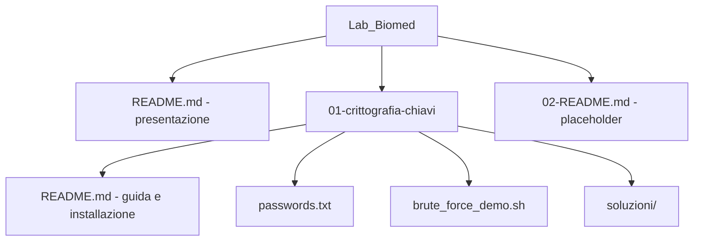

# Laboratori – Crittografia e sicurezza informatica

**Fondamenti di Informatica per Ingegneria Biomedica**  
Università degli Studi di Messina – Anno accademico 2025/26  

**Docente:** Luca D'Agati  

---

Questo repository contiene i laboratori su **crittografia e sicurezza informatica** per il corso. Ogni laboratorio è in una cartella numerata; all’interno trovi la guida, l’**installazione dei tool** e le istruzioni passo-passo.

---

## Struttura del repository



```
Lab_Biomed/
├── README.md                    ← Sei qui: presentazione
├── 01-crittografia-chiavi/      ← Lab 1: chiavi, AES, RSA, firma, crittoanalisi
│   ├── README.md                (guida + installazione + comandi spiegati)
│   ├── passwords.txt
│   ├── brute_force_demo.sh
│   └── soluzioni/
└── 02-README.md                 ← Placeholder per i prossimi lab
```

---

## Elenco laboratori

| Lab | Cartella | Argomento |
|-----|----------|-----------|
| 1 | [01-crittografia-chiavi](01-crittografia-chiavi/README.md) | Chiavi, crittografia simmetrica (AES) e asimmetrica (RSA), firma digitale, crittoanalisi e brute force |
| 2, 3, … | *(in arrivo)* | Saranno aggiunti nella stessa struttura (es. `02-nome-lab/`) |

Apri la cartella del laboratorio assegnato e segui il **README** al suo interno (installazione dei tool e svolgimento).

---

*Materiale didattico – Fondamenti di Informatica per Ingegneria Biomedica – Università degli Studi di Messina – A.A. 2025/26 – Docente: Luca D'Agati*
