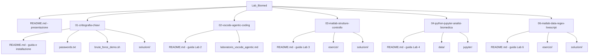

# Laboratori – Fondamenti di Informatica (Ingegneria Biomedica)

**Fondamenti di Informatica per Ingegneria Biomedica**  
Università degli Studi di Messina – Anno accademico 2025/26  

**Docente:** Luca D'Agati  

---

Questo repository raccoglie i **laboratori** del corso. Ogni laboratorio è in una cartella numerata; all’interno trovi la guida, l’**installazione dei tool** (quando serve) e le istruzioni passo-passo. Il **Lab 1** è dedicato a crittografia e sicurezza informatica; il **Lab 2** a VS Code, coding assistito in modalità agentica e un percorso fino a **Jupyter** con Python; il **Lab 3** a **MATLAB** e strutture di controllo con esercizi, hint e soluzioni; il **Lab 4** a Python in notebook Jupyter, riusando l’ambiente predisposto nel Lab 2; il **Lab 6** a MATLAB su file formattati, RegEx/Patterns, Live Scripts e grafici.

---

## Struttura del repository



```
Lab_Biomed/
├── README.md                         ← Sei qui: presentazione
├── 01-crittografia-chiavi/           ← Lab 1: chiavi, AES, RSA, firma, crittoanalisi
│   ├── README.md
│   ├── passwords.txt
│   ├── brute_force_demo.sh
│   └── soluzioni/
├── 02-vscode-agentic-coding/         ← Lab 2: VS Code, AI agentica, Python, Jupyter
    ├── README.md
    ├── laboratorio_vscode_agentic.md
    ├── esercizi/
    ├── progetti_piccoli/
    ├── jupyter/
    └── data/
├── 03-matlab-strutture-controllo/     ← Lab 3: MATLAB, if/for/while/switch
    ├── README.md
    ├── esercizi/
    └── soluzioni/
├── 04-python-jupyter-analisi-biomedica/  ← Lab 4: Python + Jupyter su dataset biomedico
    ├── README.md
    ├── data/
    ├── esercizi/
    ├── soluzioni/
    └── jupyter/
└── 06-matlab-data-regex-livescript/   ← Lab 6: MATLAB dati, regex, live script, grafici
    ├── README.md
    ├── dati/
    ├── esercizi/
    ├── soluzioni/
    └── live_scripts/
```

---

## Elenco laboratori

| Lab | Cartella | Argomento |
|-----|----------|-----------|
| 1 | [01-crittografia-chiavi](01-crittografia-chiavi/README.md) | Chiavi, crittografia simmetrica (AES) e asimmetrica (RSA), firma digitale, crittoanalisi e brute force |
| 2 | [02-vscode-agentic-coding](02-vscode-agentic-coding/README.md) | VS Code (o equivalente), assistenti in modalità agentica, Python da script a notebook Jupyter |
| 3 | [03-matlab-strutture-controllo](03-matlab-strutture-controllo/README.md) | MATLAB: script con strutture di controllo (`if`, `for`, `while`, `switch`) in formato esercizio + hint + soluzione |
| 4 | [04-python-jupyter-analisi-biomedica](04-python-jupyter-analisi-biomedica/README.md) | Python + Jupyter per analisi di parametri vitali, riusando l’ambiente del Lab 2 |
| 5 | *(in arrivo)* | Cartella riservata ai prossimi contenuti |
| 6 | [06-matlab-data-regex-livescript](06-matlab-data-regex-livescript/README.md) | MATLAB: CSV/XLS/XML, RegEx/Patterns, Live Scripts, grafici ed export |
| 7, … | *(in arrivo)* | Saranno aggiunti nella stessa struttura (es. `07-nome-lab/`) |

Apri la cartella del laboratorio assegnato e segui il **README** al suo interno (installazione dei tool e svolgimento).

---

*Materiale didattico – Fondamenti di Informatica per Ingegneria Biomedica – Università degli Studi di Messina – A.A. 2025/26 – Docente: Luca D'Agati*
